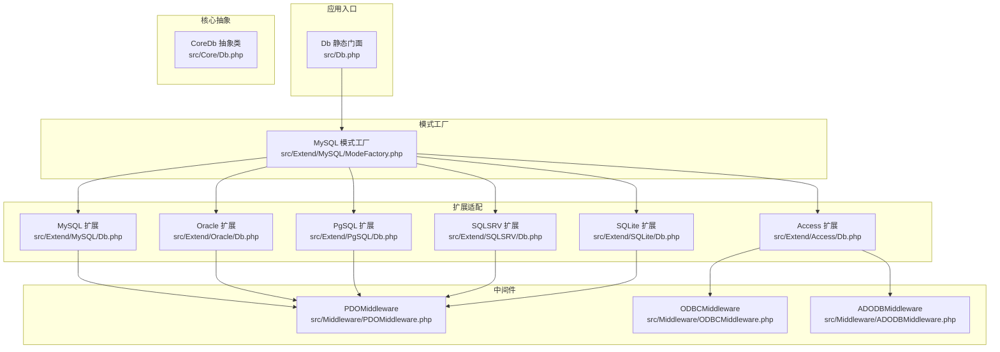
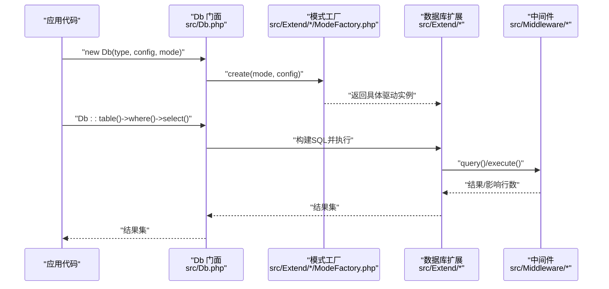
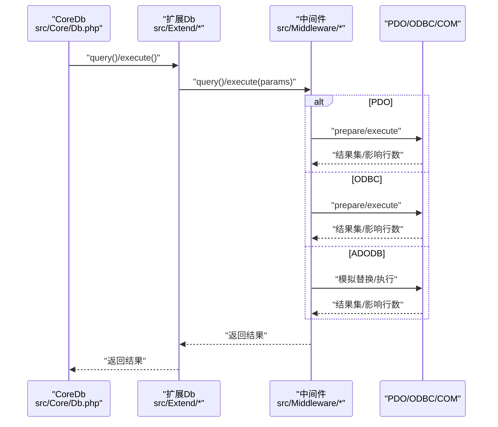
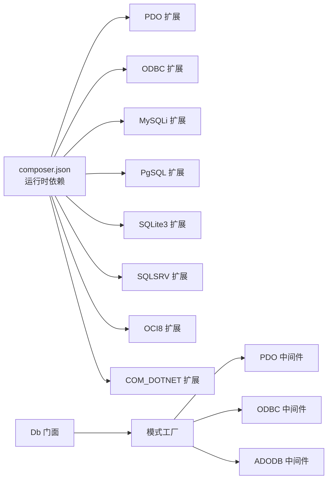

# 数据库支持

<cite>
**本文引用的文件**
- [composer.json](file://composer.json)
- [Db.php](file://src/Db.php)
- [Db.php](file://src/Core/Db.php)
- [Db.php](file://src/Extend/MySQL/Db.php)
- [ModeFactory.php](file://src/Extend/MySQL/ModeFactory.php)
- [Db.php](file://src/Extend/Access/Db.php)
- [Db.php](file://src/Extend/Oracle/Db.php)
- [Db.php](file://src/Extend/PgSQL/Db.php)
- [Db.php](file://src/Extend/SQLSRV/Db.php)
- [Db.php](file://src/Extend/SQLite/Db.php)
- [PDOMiddleware.php](file://src/Middleware/PDOMiddleware.php)
- [ODBCMiddleware.php](file://src/Middleware/ODBCMiddleware.php)
- [ADODBMiddleware.php](file://src/Middleware/ADODBMiddleware.php)
- [db_connect.php](file://examples/db_connect.php)
</cite>

## 目录
1. [简介](#简介)
2. [项目结构](#项目结构)
3. [核心组件](#核心组件)
4. [架构总览](#架构总览)
5. [详细组件分析](#详细组件分析)
6. [依赖关系分析](#依赖关系分析)
7. [性能考量](#性能考量)
8. [故障排查指南](#故障排查指南)
9. [结论](#结论)
10. [附录](#附录)

## 简介
本文件面向FizeDatabase项目，提供数据库支持概览与选型指导。内容覆盖：
- 已支持的数据库类型与对应连接模式（PDO、ODBC、ADODB）
- 各数据库的特点与适用场景
- 数据库兼容性矩阵与扩展性说明
- 基于代码结构的架构解读与最佳实践

## 项目结构
FizeDatabase采用“核心抽象 + 多数据库适配 + 模式工厂 + 中间件”的分层设计：
- 核心层：统一的查询构造与事务控制接口
- 扩展层：针对不同数据库类型的ORM扩展
- 模式层：通过模式工厂按需创建PDO/ODBC/ADODB驱动实例
- 中间件层：封装PDO/ODBC/ADODB的具体执行细节

图表来源
- [Db.php:32-56](file://src/Db.php#L32-L56)
- [ModeFactory.php:21-80](file://src/Extend/MySQL/ModeFactory.php#L21-L80)
- [Db.php:11-12](file://src/Extend/MySQL/Db.php#L11-L12)
- [Db.php:13-14](file://src/Extend/Oracle/Db.php#L13-L14)
- [Db.php:12-13](file://src/Extend/PgSQL/Db.php#L12-L13)
- [Db.php:12-13](file://src/Extend/SQLSRV/Db.php#L12-L13)
- [Db.php:12-13](file://src/Extend/SQLite/Db.php#L12-L13)
- [Db.php:13-14](file://src/Extend/Access/Db.php#L13-L14)
- [PDOMiddleware.php:12-128](file://src/Middleware/PDOMiddleware.php#L12-L128)
- [ODBCMiddleware.php:11-99](file://src/Middleware/ODBCMiddleware.php#L11-L99)
- [ADODBMiddleware.php:11-115](file://src/Middleware/ADODBMiddleware.php#L11-L115)

章节来源
- [Db.php:32-56](file://src/Db.php#L32-L56)
- [ModeFactory.php:21-80](file://src/Extend/MySQL/ModeFactory.php#L21-L80)

## 核心组件
- 门面与连接管理
  - 通过静态门面类便捷创建连接与执行SQL
  - 支持设置默认连接与获取新连接实例
- 核心抽象
  - 统一的查询构造器（字段、条件、联接、分组、排序、分页等）
  - 统一的事务接口与缓存查询机制
- 扩展适配
  - 针对不同数据库的ORM扩展，补充方言差异（如TOP/LIMIT、特殊JOIN、分页策略等）
- 模式工厂
  - 按模式创建具体驱动实例，支持默认模式与配置合并
- 中间件
  - 封装PDO/ODBC/ADODB的执行细节，屏蔽底层差异

章节来源
- [Db.php:13-140](file://src/Db.php#L13-L140)
- [Db.php:13-800](file://src/Core/Db.php#L13-L800)

## 架构总览
下图展示从应用到数据库的典型调用链路与适配关系：

图表来源
- [Db.php:32-56](file://src/Db.php#L32-L56)
- [ModeFactory.php:21-80](file://src/Extend/MySQL/ModeFactory.php#L21-L80)
- [Db.php:11-12](file://src/Extend/MySQL/Db.php#L11-L12)
- [PDOMiddleware.php:51-93](file://src/Middleware/PDOMiddleware.php#L51-L93)
- [ODBCMiddleware.php:48-74](file://src/Middleware/ODBCMiddleware.php#L48-L74)
- [ADODBMiddleware.php:53-90](file://src/Middleware/ADODBMiddleware.php#L53-L90)

## 详细组件分析

### 数据库类型与连接模式支持
- MySQL
  - 支持模式：PDO、ODBC、mysqli
  - 特点：广泛生态、性能稳定；支持TRUNCATE、REPLACE等扩展语法
- PostgreSQL
  - 支持模式：PDO、ODBC、PgSQL原生
  - 特点：标准SQL、强类型、复杂查询能力强
- Oracle
  - 支持模式：PDO、ODBC、OCI
  - 特点：企业级稳定性与高可用；支持多种JOIN变体
- SQL Server
  - 支持模式：PDO、ODBC、ADODB、SQLSRV
  - 特点：TOP/LIMIT模拟、OFFSET/FETCH新特性、分页策略多样
- SQLite
  - 支持模式：PDO、ODBC、SQLite3
  - 特点：轻量、嵌入式、无需服务端
- Access
  - 支持模式：ODBC、ADODB、PDOMode（通过PDO ODBC桥接）
  - 特点：Windows平台常用，需注意驱动与编码

章节来源
- [ModeFactory.php:36-77](file://src/Extend/MySQL/ModeFactory.php#L36-L77)
- [Db.php:11-12](file://src/Extend/MySQL/Db.php#L11-L12)
- [Db.php:12-13](file://src/Extend/PgSQL/Db.php#L12-L13)
- [Db.php:13-14](file://src/Extend/Oracle/Db.php#L13-L14)
- [Db.php:12-13](file://src/Extend/SQLSRV/Db.php#L12-L13)
- [Db.php:12-13](file://src/Extend/SQLite/Db.php#L12-L13)
- [Db.php:13-14](file://src/Extend/Access/Db.php#L13-L14)

### 兼容性矩阵（基于仓库实现）
说明：以下矩阵基于仓库中各数据库扩展与模式工厂的实现情况整理。

- MySQL
  - 模式：PDO ✅、ODBC ✅、mysqli ✅
  - 方言特性：TRUNCATE、REPLACE、LIMIT、锁表（LOCK）
- PostgreSQL
  - 模式：PDO ✅、ODBC ✅、PgSQL ✅
  - 方言特性：LIMIT
- Oracle
  - 模式：PDO ✅、ODBC ✅、OCI ✅
  - 方言特性：LIMIT、NATURAL JOIN系列
- SQL Server
  - 模式：PDO ✅、ODBC ✅、ADODB ✅、SQLSRV ✅
  - 方言特性：TOP、OFFSET/FETCH（新特性）、分页策略
- SQLite
  - 模式：PDO ✅、ODBC ✅、SQLite3 ✅
  - 方言特性：REPLACE、TRUNCATE、LIMIT
- Access
  - 模式：ODBC ✅、ADODB ✅、PDOMode ✅
  - 方言特性：TOP/LIMIT模拟、安全化值策略

章节来源
- [ModeFactory.php:36-77](file://src/Extend/MySQL/ModeFactory.php#L36-L77)
- [Db.php:129-152](file://src/Extend/MySQL/Db.php#L129-L152)
- [Db.php:27-35](file://src/Extend/PgSQL/Db.php#L27-L35)
- [Db.php:28-86](file://src/Extend/Oracle/Db.php#L28-L86)
- [Db.php:133-185](file://src/Extend/SQLSRV/Db.php#L133-L185)
- [Db.php:44-67](file://src/Extend/SQLite/Db.php#L44-L67)
- [Db.php:66-71](file://src/Extend/Access/Db.php#L66-L71)

### 连接配置与默认行为
- 默认模式：当未显式指定模式时，MySQL模式工厂默认使用PDO
- 配置合并：模式工厂对默认配置进行合并，支持主机、端口、字符集、前缀、驱动等参数
- 前缀设置：通过模式工厂设置表前缀，便于多租户或多库场景

章节来源
- [ModeFactory.php:23-35](file://src/Extend/MySQL/ModeFactory.php#L23-L35)
- [ModeFactory.php:78-80](file://src/Extend/MySQL/ModeFactory.php#L78-L80)

### 方言差异与扩展特性
- MySQL
  - TRUNCATE/REPLACE语句、LIMIT语法、锁表（LOCK）支持
- PostgreSQL
  - 仅LIMIT语法
- Oracle
  - NATURAL JOIN系列、LIMIT语法
- SQL Server
  - TOP、OFFSET/FETCH（新特性）、旧版分页（ROW_NUMBER）模拟
- SQLite
  - REPLACE/TRUNCATE、LIMIT
- Access
  - TOP/LIMIT模拟、安全化值策略与ODBC/ADODB中间件

章节来源
- [Db.php:129-152](file://src/Extend/MySQL/Db.php#L129-L152)
- [Db.php:27-35](file://src/Extend/PgSQL/Db.php#L27-L35)
- [Db.php:28-86](file://src/Extend/Oracle/Db.php#L28-L86)
- [Db.php:133-185](file://src/Extend/SQLSRV/Db.php#L133-L185)
- [Db.php:44-67](file://src/Extend/SQLite/Db.php#L44-L67)
- [Db.php:66-71](file://src/Extend/Access/Db.php#L66-L71)

### 中间件执行流程
- PDO中间件
  - 构造PDO连接、异常包装、预处理执行、事务控制、自增ID获取
- ODBC中间件
  - 构造ODBC驱动、结果集遍历、事务控制、资源释放
- ADODB中间件
  - COM组件封装、模拟参数替换、记录集遍历、事务控制

图表来源
- [Db.php:105-119](file://src/Core/Db.php#L105-L119)
- [PDOMiddleware.php:51-93](file://src/Middleware/PDOMiddleware.php#L51-L93)
- [ODBCMiddleware.php:48-74](file://src/Middleware/ODBCMiddleware.php#L48-L74)
- [ADODBMiddleware.php:53-90](file://src/Middleware/ADODBMiddleware.php#L53-L90)

## 依赖关系分析
- 运行时依赖
  - PHP版本要求与扩展建议由composer.json声明，涵盖PDO系列、ODBC、MySQLi、PgSQL、SQLite3、SQLSRV、OCI8、COM_DOTNET等
- 组件耦合
  - 门面类依赖模式工厂动态创建具体驱动
  - 扩展类复用核心抽象，通过中间件解耦底层差异
  - 中间件独立封装，便于替换与扩展

图表来源
- [composer.json:16-37](file://composer.json#L16-L37)
- [Db.php:32-56](file://src/Db.php#L32-L56)
- [PDOMiddleware.php:12-128](file://src/Middleware/PDOMiddleware.php#L12-L128)
- [ODBCMiddleware.php:11-99](file://src/Middleware/ODBCMiddleware.php#L11-L99)
- [ADODBMiddleware.php:11-115](file://src/Middleware/ADODBMiddleware.php#L11-L115)

章节来源
- [composer.json:16-37](file://composer.json#L16-L37)

## 性能考量
- 查询缓存
  - 核心抽象内置查询缓存，避免重复执行相同SQL
- 预处理与绑定
  - 统一使用问号占位符预处理，减少SQL拼接与注入风险
- 分页策略
  - 不同数据库采用最优分页方案（如MySQL的FOUND_ROWS、SQL Server的新旧特性分支）
- 事务嵌套
  - 门面类支持事务嵌套计数，避免重复提交/回滚

章节来源
- [Db.php:699-711](file://src/Core/Db.php#L699-L711)
- [Db.php:84-114](file://src/Db.php#L84-L114)

## 故障排查指南
- 常见问题定位
  - 模式错误：当传入未知模式时，模式工厂抛出异常
  - PDO/ODBC/ADODB异常：中间件捕获底层异常并包装为统一异常信息
  - SQL执行失败：异常包含原始SQL与绑定参数，便于调试
- 排查步骤
  - 确认所选模式与目标数据库匹配
  - 检查DSN/连接参数与扩展是否正确加载
  - 使用“获取最后SQL”功能输出真实SQL（谨慎用于日志）

章节来源
- [ModeFactory.php:75-77](file://src/Extend/MySQL/ModeFactory.php#L75-L77)
- [PDOMiddleware.php:69-71](file://src/Middleware/PDOMiddleware.php#L69-L71)
- [ODBCMiddleware.php:48-74](file://src/Middleware/ODBCMiddleware.php#L48-L74)
- [ADODBMiddleware.php:82-90](file://src/Middleware/ADODBMiddleware.php#L82-L90)
- [Db.php:199-206](file://src/Core/Db.php#L199-L206)

## 结论
FizeDatabase通过清晰的分层与模式工厂，实现了对主流数据库的统一接入与差异化适配。用户可依据部署环境与生态偏好选择合适模式（PDO/ODBC/ADODB），并在不改变上层调用的情况下切换数据库或驱动。扩展性方面，新增数据库类型只需在扩展目录下实现对应ORM扩展与模式工厂，并接入中间件即可。

## 附录

### 快速开始示例
- 示例展示了如何以PDO模式连接MySQL并执行查询

章节来源
- [db_connect.php:14-22](file://examples/db_connect.php#L14-L22)