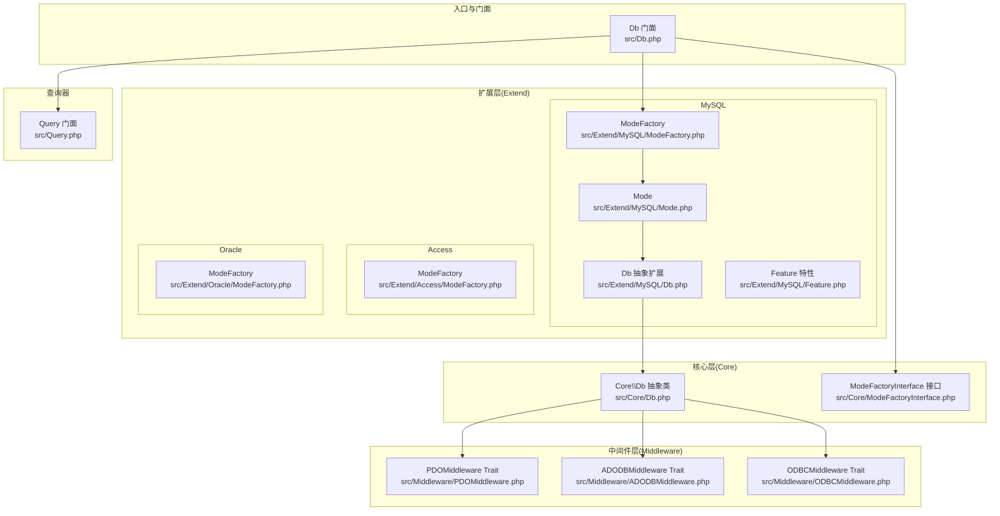
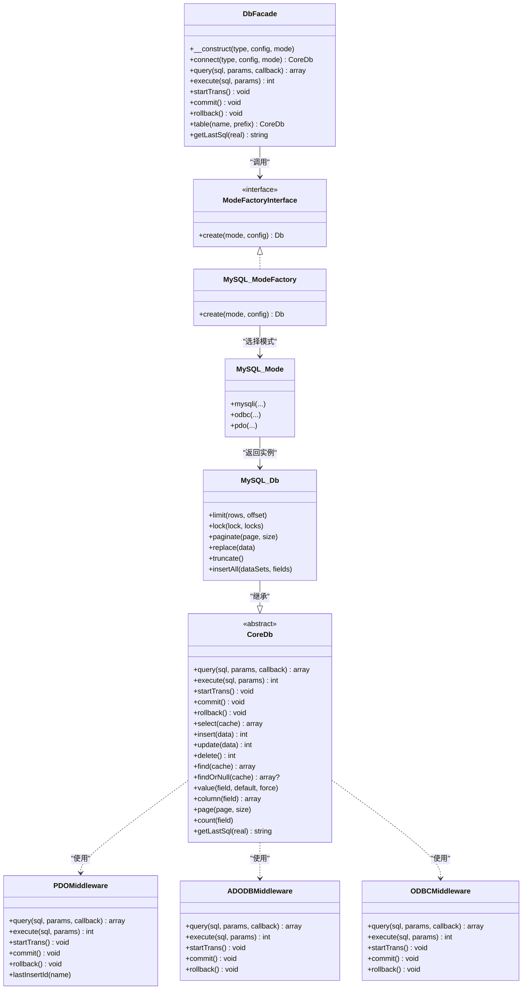
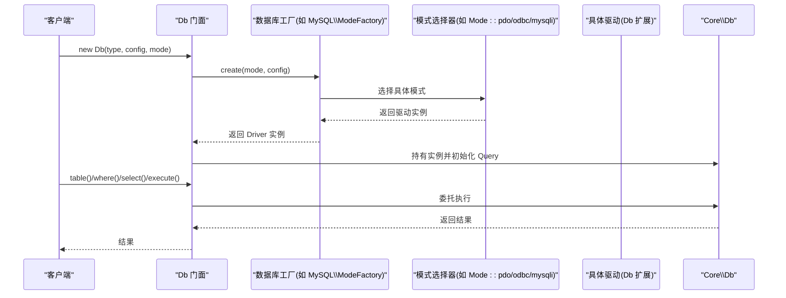
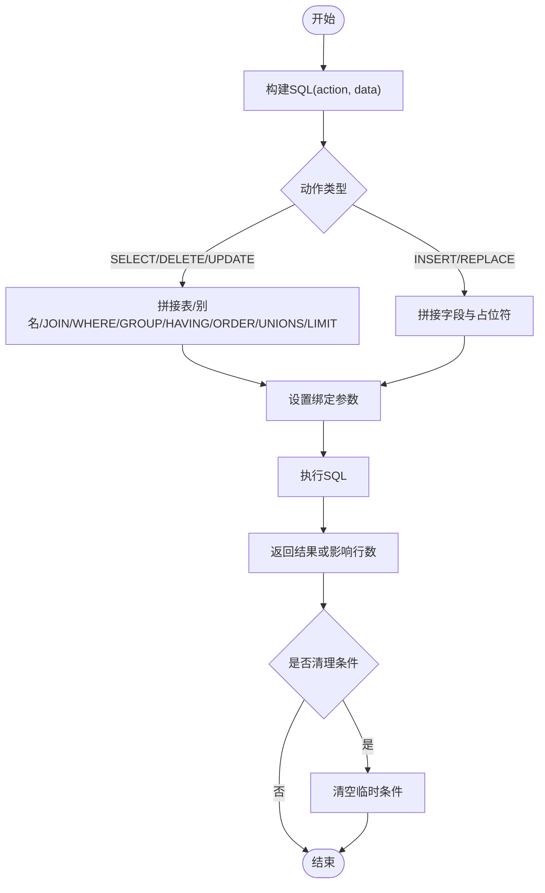
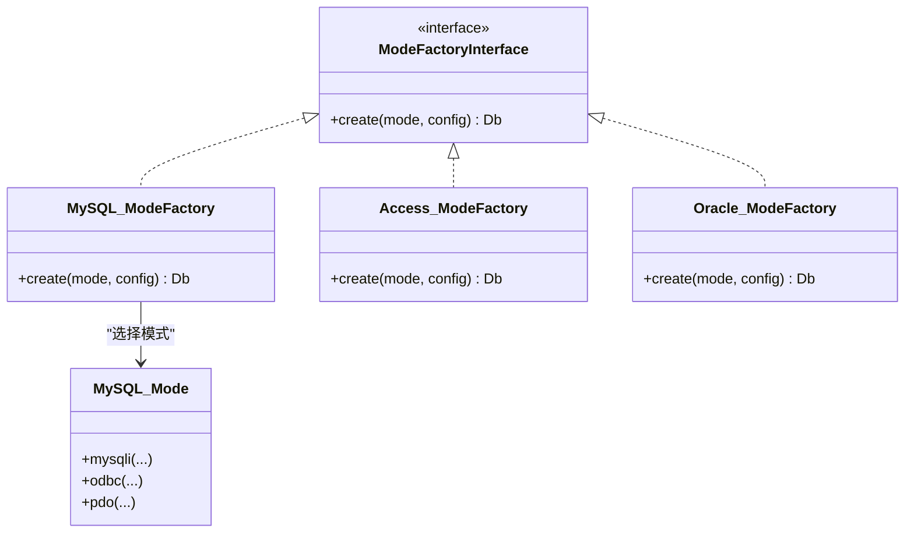
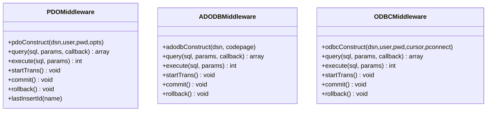
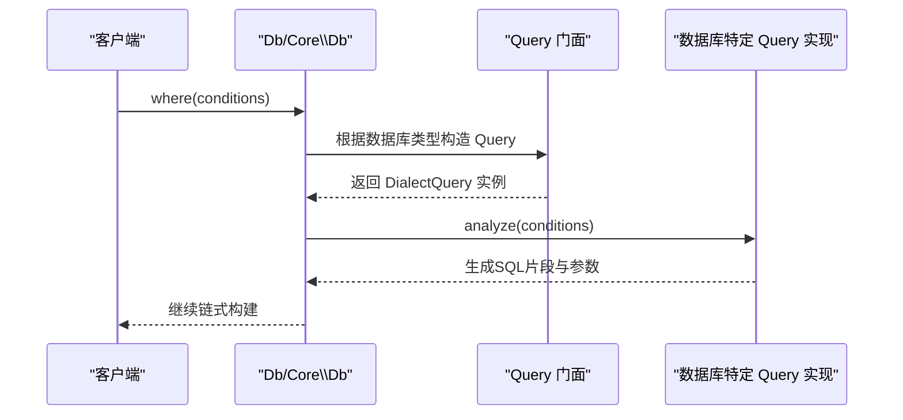
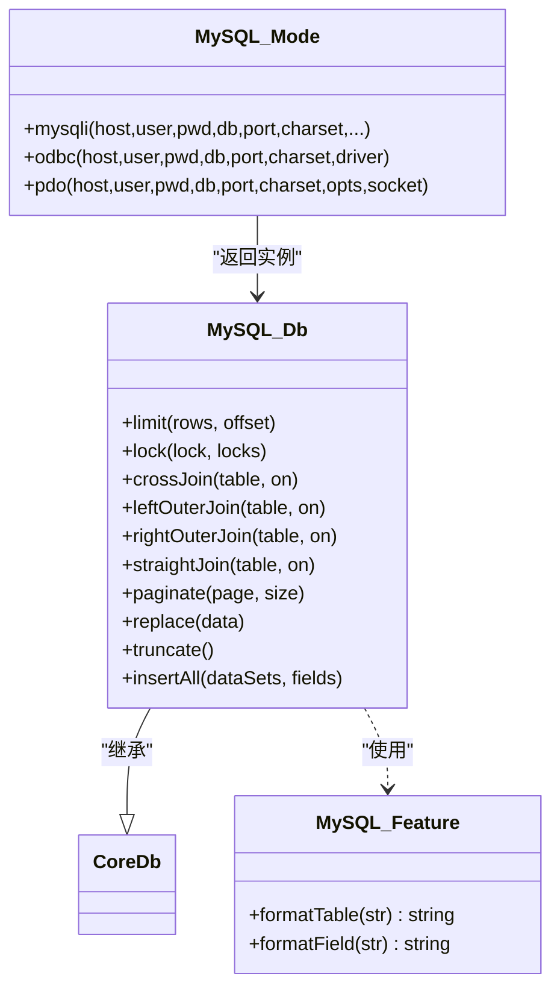
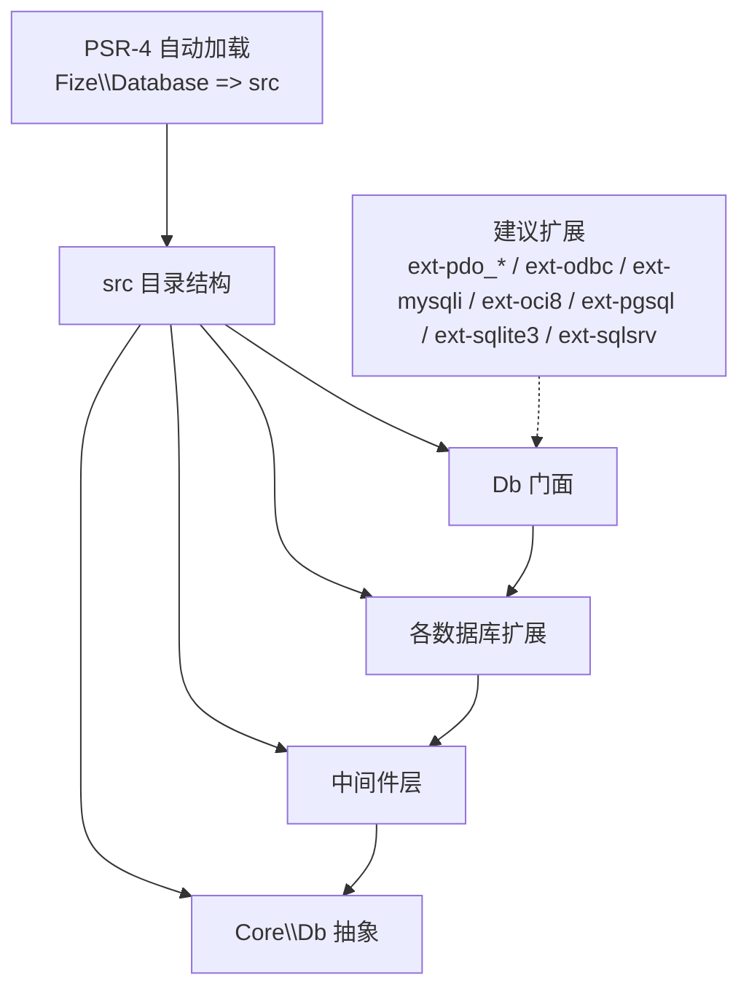

# 架构设计

<cite>
**本文引用的文件**
- [src/Db.php](file://src/Db.php)
- [src/Core/Db.php](file://src/Core/Db.php)
- [src/Core/ModeFactoryInterface.php](file://src/Core/ModeFactoryInterface.php)
- [src/Middleware/PDOMiddleware.php](file://src/Middleware/PDOMiddleware.php)
- [src/Middleware/ADODBMiddleware.php](file://src/Middleware/ADODBMiddleware.php)
- [src/Middleware/ODBCMiddleware.php](file://src/Middleware/ODBCMiddleware.php)
- [src/Extend/MySQL/ModeFactory.php](file://src/Extend/MySQL/ModeFactory.php)
- [src/Extend/MySQL/Mode.php](file://src/Extend/MySQL/Mode.php)
- [src/Extend/MySQL/Db.php](file://src/Extend/MySQL/Db.php)
- [src/Extend/MySQL/Feature.php](file://src/Extend/MySQL/Feature.php)
- [src/Extend/Access/ModeFactory.php](file://src/Extend/Access/ModeFactory.php)
- [src/Extend/Oracle/ModeFactory.php](file://src/Extend/Oracle/ModeFactory.php)
- [src/Query.php](file://src/Query.php)
- [composer.json](file://composer.json)
</cite>

## 目录
1. [引言](#引言)
2. [项目结构](#项目结构)
3. [核心组件](#核心组件)
4. [架构总览](#架构总览)
5. [详细组件分析](#详细组件分析)
6. [依赖分析](#依赖分析)
7. [性能考虑](#性能考虑)
8. [故障排查指南](#故障排查指南)
9. [结论](#结论)
10. [附录](#附录)

## 引言
本架构设计文档面向FizeDatabase项目，系统阐述框架的整体设计理念与分层架构，重点解析以下关键点：
- 分层架构：Core层（核心抽象）、Extend层（按数据库类型扩展）、Middleware层（按访问方式中间件）
- 工厂模式：通过抽象工厂接口与具体数据库工厂，统一创建不同数据库驱动实例
- 中间件模式：通过Trait封装PDO/ADODB/ODBC等底层访问能力，向上提供统一Db接口
- 策略模式：通过“模式”（Mode）选择不同的驱动实现（如PDO、ODBC、MySQLi），在工厂内按配置动态切换
- 事务与查询构建：统一的查询构建器与事务控制，支持链式调用与缓存优化

目标是帮助开发者快速理解框架的职责划分、组件交互与技术决策，并指导正确使用与扩展。

## 项目结构
项目采用“分层+按数据库类型扩展”的组织方式：
- Core层：提供数据库抽象、查询构建、事务控制与通用工具
- Extend层：按数据库类型（MySQL、Access、Oracle、PgSQL、SQLSRV、SQLite）细分，每类包含ModeFactory、Mode、Db、Query、Feature等
- Middleware层：按访问方式（PDO、ADODB、ODBC）提供Trait，封装底层连接与执行
- 入口与门面：Db门面类负责初始化、连接与静态代理调用

**图表来源**
- [src/Db.php:1-141](file://src/Db.php#L1-L141)
- [src/Core/Db.php:1-941](file://src/Core/Db.php#L1-L941)
- [src/Core/ModeFactoryInterface.php:1-18](file://src/Core/ModeFactoryInterface.php#L1-L18)
- [src/Extend/MySQL/ModeFactory.php:1-82](file://src/Extend/MySQL/ModeFactory.php#L1-L82)
- [src/Extend/MySQL/Mode.php:1-74](file://src/Extend/MySQL/Mode.php#L1-L74)
- [src/Extend/MySQL/Db.php:1-246](file://src/Extend/MySQL/Db.php#L1-L246)
- [src/Extend/MySQL/Feature.php:1-57](file://src/Extend/MySQL/Feature.php#L1-L57)
- [src/Extend/Access/ModeFactory.php:1-49](file://src/Extend/Access/ModeFactory.php#L1-L49)
- [src/Extend/Oracle/ModeFactory.php:1-76](file://src/Extend/Oracle/ModeFactory.php#L1-L76)
- [src/Middleware/PDOMiddleware.php:1-129](file://src/Middleware/PDOMiddleware.php#L1-L129)
- [src/Middleware/ADODBMiddleware.php:1-116](file://src/Middleware/ADODBMiddleware.php#L1-L116)
- [src/Middleware/ODBCMiddleware.php:1-100](file://src/Middleware/ODBCMiddleware.php#L1-L100)
- [src/Query.php:1-130](file://src/Query.php#L1-L130)

**章节来源**
- [src/Db.php:1-141](file://src/Db.php#L1-L141)
- [src/Core/Db.php:1-941](file://src/Core/Db.php#L1-L941)
- [src/Query.php:1-130](file://src/Query.php#L1-L130)
- [composer.json:1-47](file://composer.json#L1-L47)

## 核心组件
- Db门面：提供静态入口，负责根据数据库类型与模式创建连接，并代理查询、执行、事务等操作
- Core\\Db：数据库抽象基类，定义查询构建、事务控制、常用操作（select、insert、update、delete、find、value等），并提供通用SQL拼装与缓存机制
- ModeFactoryInterface：抽象工厂接口，约束各数据库类型的工厂实现
- 各数据库工厂（如MySQL/ModeFactory）：按配置选择具体模式（PDO/ODBC/MySQLi），并设置表前缀等
- Mode：按数据库类型聚合模式选择器，静态方法返回对应模式实例
- Middleware层：以Trait封装PDO/ADODB/ODBC的连接、执行、事务等能力，被Core\\Db或其扩展类使用
- Query门面：根据数据库类型动态定位并实例化对应的Query实现，支持条件数组解析与逻辑合并

**章节来源**
- [src/Db.php:1-141](file://src/Db.php#L1-L141)
- [src/Core/Db.php:1-941](file://src/Core/Db.php#L1-L941)
- [src/Core/ModeFactoryInterface.php:1-18](file://src/Core/ModeFactoryInterface.php#L1-L18)
- [src/Extend/MySQL/ModeFactory.php:1-82](file://src/Extend/MySQL/ModeFactory.php#L1-L82)
- [src/Extend/MySQL/Mode.php:1-74](file://src/Extend/MySQL/Mode.php#L1-L74)
- [src/Extend/MySQL/Db.php:1-246](file://src/Extend/MySQL/Db.php#L1-L246)
- [src/Extend/MySQL/Feature.php:1-57](file://src/Extend/MySQL/Feature.php#L1-L57)
- [src/Middleware/PDOMiddleware.php:1-129](file://src/Middleware/PDOMiddleware.php#L1-L129)
- [src/Middleware/ADODBMiddleware.php:1-116](file://src/Middleware/ADODBMiddleware.php#L1-L116)
- [src/Middleware/ODBCMiddleware.php:1-100](file://src/Middleware/ODBCMiddleware.php#L1-L100)
- [src/Query.php:1-130](file://src/Query.php#L1-L130)

## 架构总览
框架采用“门面 + 抽象 + 工厂 + 中间件”的分层设计：
- 门面层（Db）：对外提供统一静态API，隐藏工厂与模式选择细节
- 抽象层（Core\\Db）：定义通用查询构建、事务与常用操作，确保跨数据库一致性
- 工厂层（ModeFactoryInterface + 各数据库工厂）：按配置选择具体模式（PDO/ODBC/MySQLi），并完成连接初始化
- 中间件层（PDOMiddleware/ADODBMiddleware/ODBCMiddleware）：封装底层驱动差异，向上暴露一致的方法签名
- 查询器（Query）：按数据库类型映射到对应实现，支持复杂条件的数组解析与逻辑合并

**图表来源**
- [src/Db.php:1-141](file://src/Db.php#L1-L141)
- [src/Core/ModeFactoryInterface.php:1-18](file://src/Core/ModeFactoryInterface.php#L1-L18)
- [src/Extend/MySQL/ModeFactory.php:1-82](file://src/Extend/MySQL/ModeFactory.php#L1-L82)
- [src/Extend/MySQL/Mode.php:1-74](file://src/Extend/MySQL/Mode.php#L1-L74)
- [src/Extend/MySQL/Db.php:1-246](file://src/Extend/MySQL/Db.php#L1-L246)
- [src/Core/Db.php:1-941](file://src/Core/Db.php#L1-L941)
- [src/Middleware/PDOMiddleware.php:1-129](file://src/Middleware/PDOMiddleware.php#L1-L129)
- [src/Middleware/ADODBMiddleware.php:1-116](file://src/Middleware/ADODBMiddleware.php#L1-L116)
- [src/Middleware/ODBCMiddleware.php:1-100](file://src/Middleware/ODBCMiddleware.php#L1-L100)

## 详细组件分析

### 门面与连接流程（Db）
- Db门面负责根据数据库类型与模式参数，动态定位对应数据库的ModeFactory并创建连接
- 创建后，Db门面持有Core\\Db实例，后续的查询、执行、事务均委托给该实例
- Db门面还提供静态代理方法，便于在无需显式持有实例的情况下进行操作

**图表来源**
- [src/Db.php:1-141](file://src/Db.php#L1-L141)
- [src/Extend/MySQL/ModeFactory.php:1-82](file://src/Extend/MySQL/ModeFactory.php#L1-L82)
- [src/Extend/MySQL/Mode.php:1-74](file://src/Extend/MySQL/Mode.php#L1-L74)
- [src/Extend/MySQL/Db.php:1-246](file://src/Extend/MySQL/Db.php#L1-L246)
- [src/Core/Db.php:1-941](file://src/Core/Db.php#L1-L941)

**章节来源**
- [src/Db.php:1-141](file://src/Db.php#L1-L141)

### 抽象数据库（Core\\Db）
- 定义统一的查询构建流程：where/group/having/join/order/limit/unions 等条件的拼装
- 提供 select/find/value/column/page/count 等常用操作，并内置查询缓存
- 事务控制：startTrans/commit/rollback 支持嵌套计数
- SQL安全：提供参数化执行与日志用真实SQL生成（注意：日志用真实SQL不应用于执行）

**图表来源**
- [src/Core/Db.php:583-637](file://src/Core/Db.php#L583-L637)

**章节来源**
- [src/Core/Db.php:1-941](file://src/Core/Db.php#L1-L941)

### 工厂与模式（抽象工厂 + 策略）
- 抽象工厂接口约束：create(mode, config) 返回Db实例
- MySQL/Access/Oracle等数据库各自提供工厂，内部根据mode（pdo/odbc/mysqli/oci等）选择具体实现
- Mode作为策略选择器，静态方法返回对应模式实例，屏蔽底层差异

**图表来源**
- [src/Core/ModeFactoryInterface.php:1-18](file://src/Core/ModeFactoryInterface.php#L1-L18)
- [src/Extend/MySQL/ModeFactory.php:1-82](file://src/Extend/MySQL/ModeFactory.php#L1-L82)
- [src/Extend/Access/ModeFactory.php:1-49](file://src/Extend/Access/ModeFactory.php#L1-L49)
- [src/Extend/Oracle/ModeFactory.php:1-76](file://src/Extend/Oracle/ModeFactory.php#L1-L76)
- [src/Extend/MySQL/Mode.php:1-74](file://src/Extend/MySQL/Mode.php#L1-L74)

**章节来源**
- [src/Core/ModeFactoryInterface.php:1-18](file://src/Core/ModeFactoryInterface.php#L1-L18)
- [src/Extend/MySQL/ModeFactory.php:1-82](file://src/Extend/MySQL/ModeFactory.php#L1-L82)
- [src/Extend/Access/ModeFactory.php:1-49](file://src/Extend/Access/ModeFactory.php#L1-L49)
- [src/Extend/Oracle/ModeFactory.php:1-76](file://src/Extend/Oracle/ModeFactory.php#L1-L76)
- [src/Extend/MySQL/Mode.php:1-74](file://src/Extend/MySQL/Mode.php#L1-L74)

### 中间件层（PDO/ADODB/ODBC）
- 三种中间件分别封装PDO、COM ADODB、ODBC驱动的连接、执行、事务与游标处理
- Core\\Db或其扩展类通过use引入相应Trait，获得统一的query/execute/startTrans/commit/rollback等能力
- 错误处理：捕获底层异常并包装为统一的DatabaseException，便于上层处理

**图表来源**
- [src/Middleware/PDOMiddleware.php:1-129](file://src/Middleware/PDOMiddleware.php#L1-L129)
- [src/Middleware/ADODBMiddleware.php:1-116](file://src/Middleware/ADODBMiddleware.php#L1-L116)
- [src/Middleware/ODBCMiddleware.php:1-100](file://src/Middleware/ODBCMiddleware.php#L1-L100)

**章节来源**
- [src/Middleware/PDOMiddleware.php:1-129](file://src/Middleware/PDOMiddleware.php#L1-L129)
- [src/Middleware/ADODBMiddleware.php:1-116](file://src/Middleware/ADODBMiddleware.php#L1-L116)
- [src/Middleware/ODBCMiddleware.php:1-100](file://src/Middleware/ODBCMiddleware.php#L1-L100)

### 查询器（Query）
- Db/Query门面根据数据库类型动态定位对应Query实现，支持条件数组解析与AND/OR合并
- Db在where/having中自动选择对应数据库的Query类，保证条件解析与参数绑定的一致性

**图表来源**
- [src/Query.php:1-130](file://src/Query.php#L1-L130)
- [src/Core/Db.php:335-359](file://src/Core/Db.php#L335-L359)
- [src/Core/Db.php:369-393](file://src/Core/Db.php#L369-L393)

**章节来源**
- [src/Query.php:1-130](file://src/Query.php#L1-L130)
- [src/Core/Db.php:335-393](file://src/Core/Db.php#L335-L393)

### MySQL扩展示例（Db/Feature/Mode）
- MySQL_Db在Core\\Db基础上扩展了LIMIT、LOCK、多种JOIN、REPLACE、TRUNCATE、分页等MySQL特性
- Feature提供表名与字段名格式化，避免SQL注入风险
- Mode提供mysqli/odbc/pdo三种模式的静态工厂方法，简化实例化

**图表来源**
- [src/Extend/MySQL/Db.php:1-246](file://src/Extend/MySQL/Db.php#L1-L246)
- [src/Extend/MySQL/Mode.php:1-74](file://src/Extend/MySQL/Mode.php#L1-L74)
- [src/Extend/MySQL/Feature.php:1-57](file://src/Extend/MySQL/Feature.php#L1-L57)
- [src/Core/Db.php:1-941](file://src/Core/Db.php#L1-L941)

**章节来源**
- [src/Extend/MySQL/Db.php:1-246](file://src/Extend/MySQL/Db.php#L1-L246)
- [src/Extend/MySQL/Mode.php:1-74](file://src/Extend/MySQL/Mode.php#L1-L74)
- [src/Extend/MySQL/Feature.php:1-57](file://src/Extend/MySQL/Feature.php#L1-L57)

## 依赖分析
- Composer自动加载：PSR-4映射Fize\Database到src目录，确保门面、核心、扩展与中间件可按命名空间自动加载
- 外部扩展建议：根据所选模式与数据库类型，建议安装对应PHP扩展（PDO、ODBC、MySQLi、Oracle、SQLite、SQLSRV等）
- 组件耦合：Db门面依赖ModeFactory接口；各数据库工厂依赖对应Mode；Core\\Db通过use中间件Trait实现对底层差异的解耦

**图表来源**
- [composer.json:11-37](file://composer.json#L11-L37)

**章节来源**
- [composer.json:1-47](file://composer.json#L1-L47)

## 性能考虑
- 查询缓存：Core\\Db在select中提供基于最终SQL的简单缓存，减少重复查询开销
- fetch vs select：Core\\Db提供fetch遍历回调，避免中间转换，适合高性能场景
- 参数化执行：统一使用问号占位符与绑定参数，降低SQL注入风险并提升执行效率
- 事务嵌套：Db门面的事务计数避免重复提交/回滚，减少无效操作

[本节为通用性能建议，不直接分析具体文件]

## 故障排查指南
- 统一异常：中间件层在执行失败时抛出DatabaseException，包含原始SQL与参数，便于定位问题
- 日志SQL：getLastSql(real=true)可生成最终SQL（仅用于日志，不建议直接执行）
- 模式选择：若出现连接或驱动相关错误，检查工厂配置的mode与对应扩展是否安装

**章节来源**
- [src/Middleware/PDOMiddleware.php:69-71](file://src/Middleware/PDOMiddleware.php#L69-L71)
- [src/Middleware/ADODBMiddleware.php:84-89](file://src/Middleware/ADODBMiddleware.php#L84-L89)
- [src/Core/Db.php:199-206](file://src/Core/Db.php#L199-L206)
- [src/Db.php:136-139](file://src/Db.php#L136-L139)

## 结论
FizeDatabase通过清晰的分层架构与模式化设计，实现了对多数据库、多访问方式的统一抽象与扩展。Db门面简化了使用，Core\\Db保证了跨数据库一致性，工厂与模式策略灵活切换底层实现，中间件层隔离了驱动差异。该架构既便于维护，又利于扩展新的数据库类型与访问方式。

## 附录
- 使用建议：优先选择PDO模式；根据部署环境选择合适的数据库扩展；合理使用查询缓存与回调遍历以提升性能
- 扩展新数据库：新增数据库类型时，遵循现有结构在Extend下创建对应目录，实现ModeFactory与Mode，并在Core层扩展Db以补充方言特性

[本节为概念性内容，不直接分析具体文件]