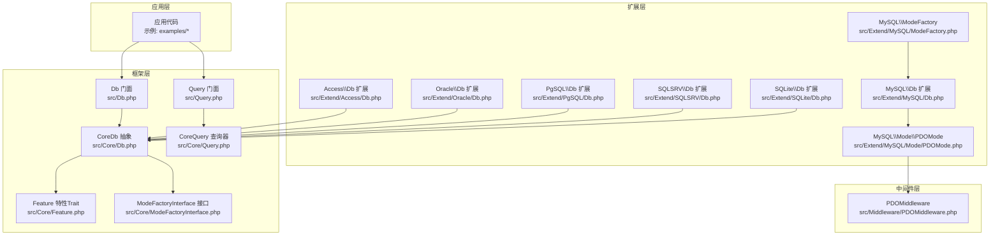
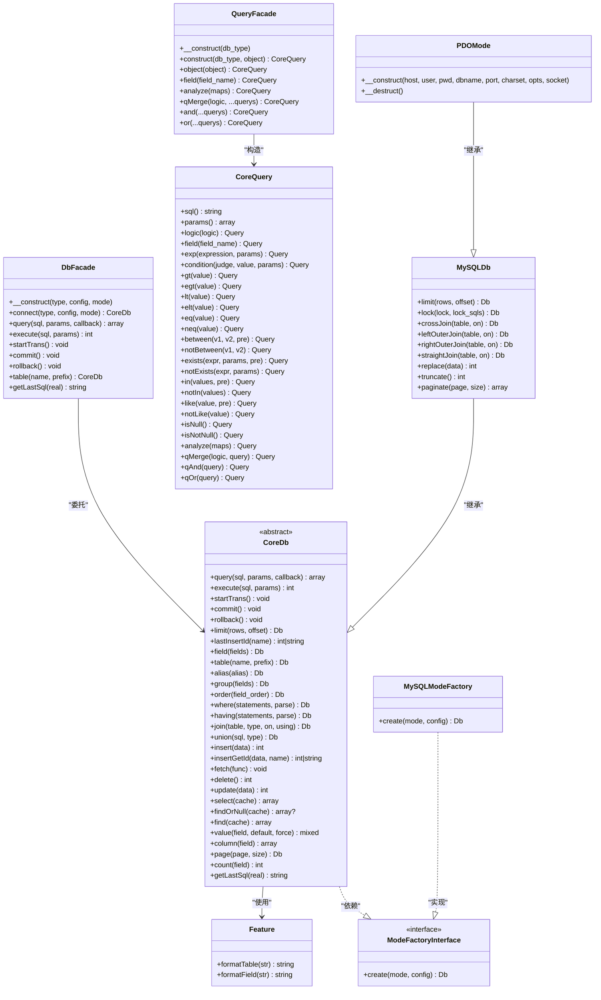
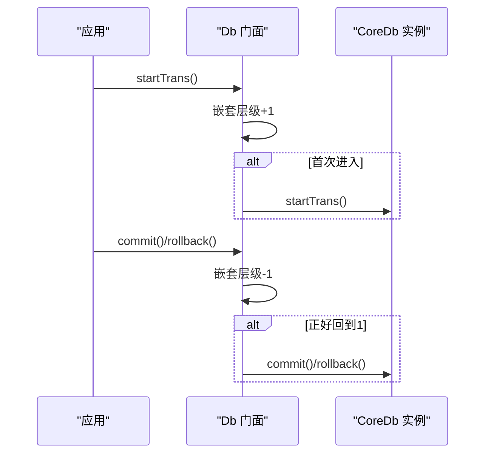
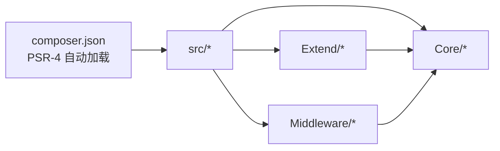

# 核心特性

<cite>
**本文引用的文件**
- [src/Db.php](file://src/Db.php)
- [src/Query.php](file://src/Query.php)
- [src/Core/Db.php](file://src/Core/Db.php)
- [src/Core/Query.php](file://src/Core/Query.php)
- [src/Core/Feature.php](file://src/Core/Feature.php)
- [src/Core/ModeFactoryInterface.php](file://src/Core/ModeFactoryInterface.php)
- [src/Extend/MySQL/Db.php](file://src/Extend/MySQL/Db.php)
- [src/Extend/MySQL/ModeFactory.php](file://src/Extend/MySQL/ModeFactory.php)
- [src/Extend/MySQL/Mode/PDOMode.php](file://src/Extend/MySQL/Mode/PDOMode.php)
- [src/Extend/Access/Db.php](file://src/Extend/Access/Db.php)
- [src/Extend/Oracle/Db.php](file://src/Extend/Oracle/Db.php)
- [src/Extend/PgSQL/Db.php](file://src/Extend/PgSQL/Db.php)
- [src/Extend/SQLSRV/Db.php](file://src/Extend/SQLSRV/Db.php)
- [src/Extend/SQLite/Db.php](file://src/Extend/SQLite/Db.php)
- [src/Middleware/PDOMiddleware.php](file://src/Middleware/PDOMiddleware.php)
- [src/Model.php](file://src/Model.php)
- [examples/db_connect.php](file://examples/db_connect.php)
- [examples/db_select.php](file://examples/db_select.php)
- [composer.json](file://composer.json)
</cite>

## 目录
1. [简介](#简介)
2. [项目结构](#项目结构)
3. [核心组件](#核心组件)
4. [架构总览](#架构总览)
5. [详细组件分析](#详细组件分析)
6. [依赖关系分析](#依赖关系分析)
7. [性能考量](#性能考量)
8. [故障排查指南](#故障排查指南)
9. [结论](#结论)
10. [附录](#附录)

## 简介
本文件面向希望快速掌握 FizeDatabase 项目能力边界的开发者，系统梳理框架的核心特性与使用场景，包括统一数据库抽象层、多数据库支持、多连接模式、链式查询构建、事务管理、ORM 功能等。通过图示与示例路径说明，帮助读者在最短时间内理解框架如何简化复杂数据库操作，并明确其适用范围与扩展点。

## 项目结构
FizeDatabase 采用“核心层 + 扩展层 + 中间件”的分层组织方式：
- 核心层（Core）：定义统一的 Db 抽象、Query 查询器、Feature 特性与 Mode 工厂接口，屏蔽具体驱动差异。
- 扩展层（Extend）：按数据库类型划分目录，如 MySQL、Access、Oracle、PgSQL、SQLSRV、SQLite，每个类型包含 Db、Query、Mode、ModeFactory 等。
- 中间件层（Middleware）：封装通用的底层交互能力，例如 PDO、ODBC、ADODB 的适配。
- 示例与测试：examples 展示典型用法；tests 提供单元测试骨架。

图表来源
- [src/Db.php:1-141](file://src/Db.php#L1-L141)
- [src/Query.php:1-130](file://src/Query.php#L1-L130)
- [src/Core/Db.php:1-800](file://src/Core/Db.php#L1-L800)
- [src/Core/Query.php:1-621](file://src/Core/Query.php#L1-L621)
- [src/Core/Feature.php:1-33](file://src/Core/Feature.php#L1-L33)
- [src/Core/ModeFactoryInterface.php:1-18](file://src/Core/ModeFactoryInterface.php#L1-L18)
- [src/Extend/MySQL/Db.php:1-200](file://src/Extend/MySQL/Db.php#L1-L200)
- [src/Extend/MySQL/ModeFactory.php:1-82](file://src/Extend/MySQL/ModeFactory.php#L1-L82)
- [src/Extend/MySQL/Mode/PDOMode.php:1-53](file://src/Extend/MySQL/Mode/PDOMode.php#L1-L53)
- [src/Middleware/PDOMiddleware.php](file://src/Middleware/PDOMiddleware.php)

章节来源
- [composer.json:1-47](file://composer.json#L1-L47)
- [src/Db.php:1-141](file://src/Db.php#L1-L141)
- [src/Query.php:1-130](file://src/Query.php#L1-L130)
- [src/Core/Db.php:1-800](file://src/Core/Db.php#L1-L800)
- [src/Core/Query.php:1-621](file://src/Core/Query.php#L1-L621)

## 核心组件
- 统一数据库抽象层（Core）
  - CoreDb 抽象类定义了查询构建、执行、事务、分页、计数等通用能力，屏蔽不同驱动差异。
  - CoreQuery 查询器提供链式条件拼装、数组解析、逻辑合并等能力。
  - Feature Trait 提供表名/字段名格式化钩子，便于各驱动定制。
  - ModeFactoryInterface 规范连接模式工厂的创建流程。
- 门面层（Facade）
  - Db 门面提供静态入口，负责根据数据库类型与模式创建具体连接，并代理常用操作（查询、执行、事务、表选择、SQL 日志）。
  - Query 门面提供跨数据库类型的查询器构造与组合能力。
- 扩展层（Extend）
  - 按数据库类型拆分，如 MySQL、Access、Oracle、PgSQL、SQLSRV、SQLite，每个类型包含 Db、Query、Mode、ModeFactory。
  - MySQL 扩展提供 LIMIT、LOCK、REPLACE、TRUNCATE、分页等增强能力。
- 中间件层（Middleware）
  - 以 PDO 为例，PDOMiddleware 封装 PDO 连接、执行、事务等通用逻辑，被具体模式类复用。

章节来源
- [src/Core/Db.php:1-800](file://src/Core/Db.php#L1-L800)
- [src/Core/Query.php:1-621](file://src/Core/Query.php#L1-L621)
- [src/Core/Feature.php:1-33](file://src/Core/Feature.php#L1-L33)
- [src/Core/ModeFactoryInterface.php:1-18](file://src/Core/ModeFactoryInterface.php#L1-L18)
- [src/Db.php:1-141](file://src/Db.php#L1-L141)
- [src/Query.php:1-130](file://src/Query.php#L1-L130)
- [src/Extend/MySQL/Db.php:1-200](file://src/Extend/MySQL/Db.php#L1-L200)
- [src/Middleware/PDOMiddleware.php](file://src/Middleware/PDOMiddleware.php)

## 架构总览
下面的类图展示了核心抽象与扩展层的关系，以及门面与扩展之间的映射机制。

图表来源
- [src/Db.php:1-141](file://src/Db.php#L1-L141)
- [src/Query.php:1-130](file://src/Query.php#L1-L130)
- [src/Core/Db.php:1-800](file://src/Core/Db.php#L1-L800)
- [src/Core/Query.php:1-621](file://src/Core/Query.php#L1-L621)
- [src/Core/Feature.php:1-33](file://src/Core/Feature.php#L1-L33)
- [src/Core/ModeFactoryInterface.php:1-18](file://src/Core/ModeFactoryInterface.php#L1-L18)
- [src/Extend/MySQL/Db.php:1-200](file://src/Extend/MySQL/Db.php#L1-L200)
- [src/Extend/MySQL/ModeFactory.php:1-82](file://src/Extend/MySQL/ModeFactory.php#L1-L82)
- [src/Extend/MySQL/Mode/PDOMode.php:1-53](file://src/Extend/MySQL/Mode/PDOMode.php#L1-L53)

## 详细组件分析

### 统一数据库抽象层（CoreDb）
- 能力概述
  - 查询构建：支持 DISTINCT、字段、表、别名、JOIN、GROUP BY、HAVING、ORDER BY、UNION、LIMIT 等。
  - CRUD 操作：insert、insertGetId、update、delete、select、find/findOrNull、value/column、count。
  - 结果遍历：fetch 支持回调式遍历，减少中间数组转换开销。
  - 分页与计数：page、count、column、select 带缓存。
  - SQL 日志：getLastSql 支持返回预处理 SQL 或真实 SQL。
- 复杂度与性能
  - 查询构建为 O(n)（n 为条件片段数），参数绑定避免 SQL 注入。
  - select 带缓存命中时避免重复查询，适合重复查询相同条件的场景。
- 错误处理
  - 非法 SQL 类型抛出异常；find 未找到记录时抛出“记录不存在”异常。

章节来源
- [src/Core/Db.php:1-800](file://src/Core/Db.php#L1-L800)

### 链式查询构建（CoreQuery）
- 能力概述
  - 条件表达式：支持 EXP、比较运算符（=、!=、<>、<、<=、>、>=）、BETWEEN/NOT BETWEEN、IN/NOT IN、LIKE/NOT LIKE、IS NULL/IS NOT NULL。
  - 数组解析：analyze 支持多种紧凑数组语法，自动推断组合逻辑与参数绑定策略。
  - 逻辑合并：qMerge/qAnd/qOr 支持多条件对象合并。
  - 组合逻辑：logic 控制 AND/OR 组合，支持在数组解析中灵活切换。
- 复杂度与性能
  - 条件解析与参数收集为 O(n)（n 为条件项数）。
  - 自动参数绑定策略避免字符串拼接带来的注入风险与性能损耗。
- 使用场景
  - 动态搜索、权限过滤、报表筛选等复杂条件组合。

章节来源
- [src/Core/Query.php:1-621](file://src/Core/Query.php#L1-L621)

### 多数据库支持与扩展
- 支持数据库类型
  - MySQL、Access、Oracle、PgSQL、SQLSRV、SQLite。
- 扩展组织
  - 每个数据库类型在 src/Extend/<Type>/ 下提供 Db、Query、Mode、ModeFactory。
  - MySQL 扩展额外提供 LIMIT、LOCK、REPLACE、TRUNCATE、分页等增强。
- 价值与边界
  - 通过统一抽象屏蔽差异，新增数据库只需实现 ModeFactoryInterface 与对应 Db/Query。
  - 本仓库已实现的数据库类型覆盖主流关系型数据库，适合作为基础 ORM/DBAL 使用。

章节来源
- [src/Extend/MySQL/Db.php:1-200](file://src/Extend/MySQL/Db.php#L1-L200)
- [src/Extend/Access/Db.php](file://src/Extend/Access/Db.php)
- [src/Extend/Oracle/Db.php](file://src/Extend/Oracle/Db.php)
- [src/Extend/PgSQL/Db.php](file://src/Extend/PgSQL/Db.php)
- [src/Extend/SQLSRV/Db.php](file://src/Extend/SQLSRV/Db.php)
- [src/Extend/SQLite/Db.php](file://src/Extend/SQLite/Db.php)

### 多连接模式（PDO/ODBC/MySQLi）
- 模式工厂
  - ModeFactoryInterface 规范 create(mode, config)。
  - MySQL/ModeFactory 支持 mysqli、odbc、pdo 三种模式，按需选择。
- PDO 模式
  - PDOMode 通过 DSN 构建连接，复用 PDOMiddleware 的执行与事务能力。
- 价值与场景
  - 在不同环境（容器、Windows、Linux）与部署形态（扩展可用性）下灵活切换连接方式。
  - 通过配置集中管理端口、字符集、Socket 等参数。

章节来源
- [src/Core/ModeFactoryInterface.php:1-18](file://src/Core/ModeFactoryInterface.php#L1-L18)
- [src/Extend/MySQL/ModeFactory.php:1-82](file://src/Extend/MySQL/ModeFactory.php#L1-L82)
- [src/Extend/MySQL/Mode/PDOMode.php:1-53](file://src/Extend/MySQL/Mode/PDOMode.php#L1-L53)
- [src/Middleware/PDOMiddleware.php](file://src/Middleware/PDOMiddleware.php)

### 事务管理
- 门面级事务
  - Db 提供 startTrans、commit、rollback，并维护嵌套层级，避免重复提交/回滚。
- 使用场景
  - 批量写入、订单与库存联动、幂等写入等强一致需求。
- 注意事项
  - 嵌套事务仅在第一层开启/提交/回滚，其余层仅计数递减。

图表来源
- [src/Db.php:84-114](file://src/Db.php#L84-L114)
- [src/Core/Db.php:122-134](file://src/Core/Db.php#L122-L134)

章节来源
- [src/Db.php:84-114](file://src/Db.php#L84-L114)
- [src/Core/Db.php:122-134](file://src/Core/Db.php#L122-L134)

### ORM 功能现状与扩展点
- 现状
  - Model 类预留关联关系方法（hasOne、hasMany、belongsTo、belongsToMany），但当前未实现具体 ORM 映射与懒加载。
- 价值与边界
  - 作为 ORM 的“壳”存在，适合在现有 Db/Query 能力之上扩展实体映射、关联查询与生命周期钩子。
- 建议扩展方向
  - 在具体项目中结合 CoreDb 的 select/find/value/column 与 CoreQuery 的 analyze/qMerge，实现实体类与表的映射。
  - 通过扩展层为特定数据库实现更丰富的 ORM 能力（如延迟加载、变更追踪）。

章节来源
- [src/Model.php:1-39](file://src/Model.php#L1-L39)

### 示例路径与使用场景
- 连接与基本查询
  - 示例：设置默认连接、表选择、条件查询、限制返回条数。
  - 路径：[examples/db_connect.php:1-39](file://examples/db_connect.php#L1-L39)
- 查询器与 SQL 日志
  - 示例：使用数组条件构建查询、打印最终 SQL。
  - 路径：[examples/db_select.php:1-22](file://examples/db_select.php#L1-L22)

章节来源
- [examples/db_connect.php:1-39](file://examples/db_connect.php#L1-L39)
- [examples/db_select.php:1-22](file://examples/db_select.php#L1-L22)

## 依赖关系分析
- Composer 自动加载
  - PSR-4 命名空间映射至 src 目录，确保扩展层与核心层无缝接入。
- 运行时依赖
  - PHP >= 7.1；建议 PHP >= 7.2。
  - 各数据库扩展依赖相应 PHP 扩展（如 pdo_mysql、pdo_pgsql、pdo_sqlite、pdo_sqlsrv、mysqli、oci8、odbc、sqlite3、sqlsrv 等）。
- 框架内依赖
  - Db/Query 门面依赖扩展层的 Db/Query 实现；CoreDb 依赖 Feature 与 ModeFactoryInterface；MySQL 模式依赖 PDOMiddleware。

图表来源
- [composer.json:11-18](file://composer.json#L11-L18)
- [src/Db.php:1-141](file://src/Db.php#L1-L141)
- [src/Query.php:1-130](file://src/Query.php#L1-L130)

章节来源
- [composer.json:1-47](file://composer.json#L1-L47)
- [src/Db.php:1-141](file://src/Db.php#L1-L141)
- [src/Query.php:1-130](file://src/Query.php#L1-L130)

## 性能考量
- 查询缓存
  - CoreDb 的 select 支持基于“真实 SQL 字符串”缓存，避免重复查询相同条件的结果集。
- 参数绑定
  - 通过占位符与参数数组绑定，避免字符串拼接，降低注入风险并提升执行效率。
- 遍历式取数
  - fetch 使用回调遍历，减少中间数组转换，适合大数据量流式处理。
- LIMIT 与分页
  - MySQL 扩展提供 paginate，结合 SQL_CALC_FOUND_ROWS 与 FOUND_ROWS() 实现高效分页统计。
- 建议
  - 对高频查询开启 select 缓存；对大结果集优先使用 fetch；合理使用索引与字段投影。

章节来源
- [src/Core/Db.php:700-711](file://src/Core/Db.php#L700-L711)
- [src/Core/Db.php:668-672](file://src/Core/Db.php#L668-L672)
- [src/Extend/MySQL/Db.php:187-200](file://src/Extend/MySQL/Db.php#L187-L200)

## 故障排查指南
- 事务相关
  - 嵌套事务未正确提交/回滚：检查嵌套层级与调用顺序，确保首层与末层匹配。
  - 事务中执行 TRUNCATE：MySQL 的 TRUNCATE 不允许带 WHERE 条件，需在 CoreDb.build 中规避。
- SQL 注入与日志
  - getLastSql(real=true) 仅用于日志输出，请勿直接执行，避免注入风险。
- 查询异常
  - 非法 SQL 类型：确认 build 中 action 限定为 INSERT/SELECT/UPDATE/DELETE/REPLACE/TRUNCATE。
  - 记录不存在：find 未找到时抛出异常，使用 findOrNull 或捕获异常。
- 连接问题
  - 模式不支持：ModeFactory.create 仅支持已实现的模式，检查配置与扩展安装。
  - PDO/ODBC/MySQLi 扩展缺失：根据 composer.suggest 安装对应扩展。

章节来源
- [src/Db.php:84-114](file://src/Db.php#L84-L114)
- [src/Core/Db.php:583-610](file://src/Core/Db.php#L583-L610)
- [src/Core/Db.php:733-740](file://src/Core/Db.php#L733-L740)
- [src/Extend/MySQL/Db.php:170-177](file://src/Extend/MySQL/Db.php#L170-L177)
- [src/Extend/MySQL/ModeFactory.php:75-77](file://src/Extend/MySQL/ModeFactory.php#L75-L77)

## 结论
FizeDatabase 通过统一抽象层与扩展模式，实现了“一处编写、多库适配”的目标；借助链式查询器与门面入口，显著降低了复杂 SQL 的构建成本；事务管理与查询缓存提升了可靠性与性能。尽管当前 ORM 能力尚在起步阶段，但其清晰的扩展点与模块化设计，使其成为构建企业级数据访问层的理想基础。

## 附录
- 快速开始
  - 安装：通过 Composer 引入 fize/database，并按需安装数据库扩展。
  - 连接：使用 Db 门面设置默认连接或通过 Db::connect 获取新连接。
  - 查询：使用 Db::table()->where()->limit()->select() 构建查询；或使用 Query 门面构造复杂条件。
  - 事务：围绕业务块包裹 startTrans/commit/rollback，支持嵌套。
  - ORM：在现有 Db/Query 能力基础上扩展实体映射与关联查询。

章节来源
- [composer.json:16-37](file://composer.json#L16-L37)
- [examples/db_connect.php:14-22](file://examples/db_connect.php#L14-L22)
- [examples/db_select.php:15-21](file://examples/db_select.php#L15-L21)
- [src/Db.php:32-56](file://src/Db.php#L32-L56)
- [src/Query.php:24-40](file://src/Query.php#L24-L40)