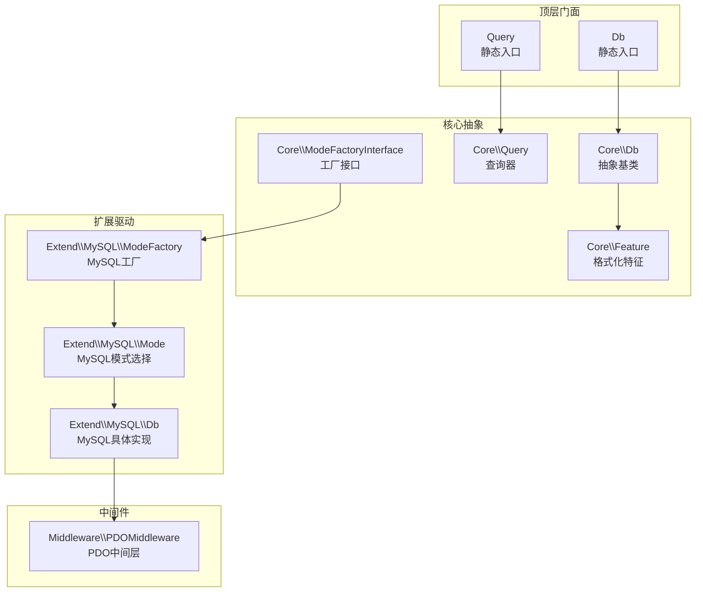
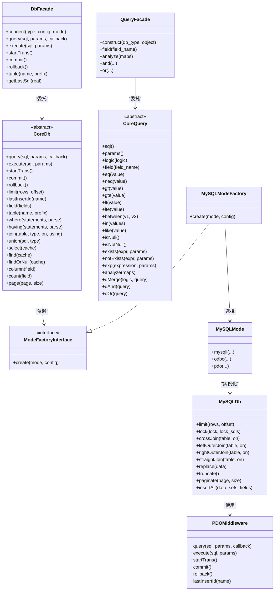
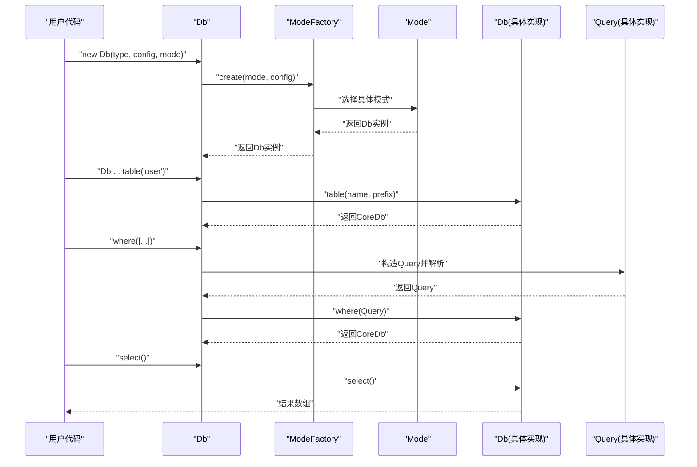
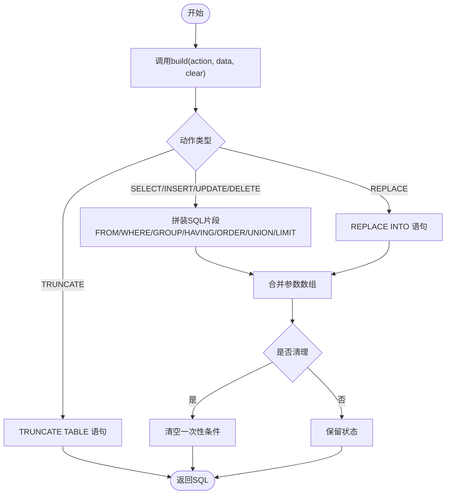
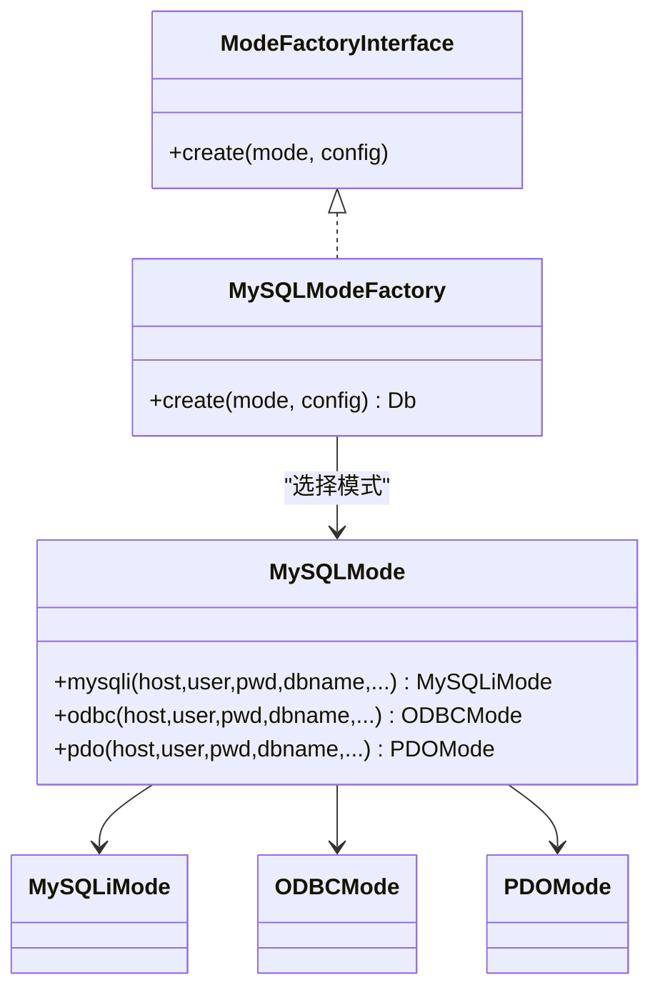
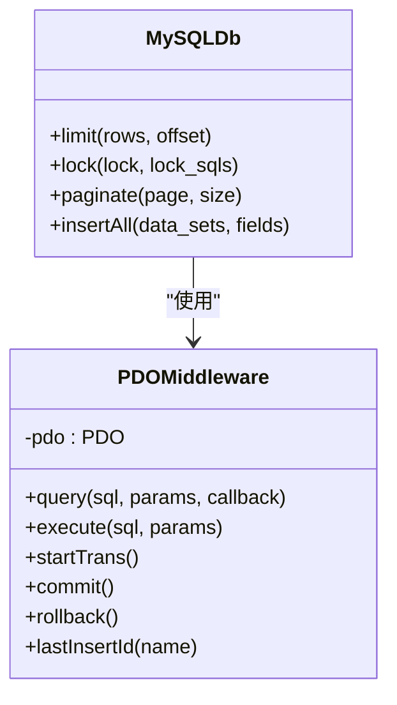
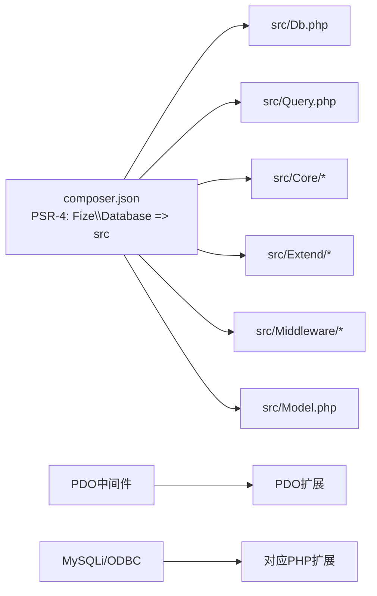

# 设计理念

<cite>
**本文引用的文件**
- [composer.json](file://composer.json)
- [src/Db.php](file://src/Db.php)
- [src/Query.php](file://src/Query.php)
- [src/Core/Db.php](file://src/Core/Db.php)
- [src/Core/Query.php](file://src/Core/Query.php)
- [src/Core/Feature.php](file://src/Core/Feature.php)
- [src/Core/ModeFactoryInterface.php](file://src/Core/ModeFactoryInterface.php)
- [src/Middleware/PDOMiddleware.php](file://src/Middleware/PDOMiddleware.php)
- [src/Extend/MySQL/ModeFactory.php](file://src/Extend/MySQL/ModeFactory.php)
- [src/Extend/MySQL/Mode.php](file://src/Extend/MySQL/Mode.php)
- [src/Extend/MySQL/Db.php](file://src/Extend/MySQL/Db.php)
- [src/Model.php](file://src/Model.php)
- [examples/db_connect.php](file://examples/db_connect.php)
</cite>

## 目录
1. [引言](#引言)
2. [项目结构](#项目结构)
3. [核心组件](#核心组件)
4. [架构总览](#架构总览)
5. [详细组件分析](#详细组件分析)
6. [依赖关系分析](#依赖关系分析)
7. [性能考量](#性能考量)
8. [故障排查指南](#故障排查指南)
9. [结论](#结论)
10. [附录](#附录)

## 引言
本设计理念文档面向FizeDatabase项目，系统阐述框架的设计哲学与核心原则，重点解释API设计一致性、易用性优先、可扩展性与性能优化之间的平衡，以及链式调用、工厂模式、中间件模式等设计思想在框架中的落地方式。通过高层概览与代码级分析相结合，帮助开发者快速理解并高效使用框架。

## 项目结构
FizeDatabase采用“门面+核心抽象+扩展驱动+中间件”的分层组织方式：
- 顶层门面：Db、Query对外提供静态便捷入口，屏蔽底层差异
- 核心抽象：Core层定义Db、Query、Feature、ModeFactoryInterface等抽象与通用能力
- 扩展驱动：Extend目录按数据库类型划分，每种类型包含ModeFactory、Mode、Db、Query等实现
- 中间件：Middleware提供对不同驱动（如PDO）的封装与复用
- 示例与测试：examples展示典型用法；tests覆盖各驱动与模式

图表来源
- [src/Db.php:1-141](file://src/Db.php#L1-L141)
- [src/Query.php:1-130](file://src/Query.php#L1-L130)
- [src/Core/Db.php:1-800](file://src/Core/Db.php#L1-L800)
- [src/Core/Query.php:1-621](file://src/Core/Query.php#L1-L621)
- [src/Core/Feature.php:1-33](file://src/Core/Feature.php#L1-L33)
- [src/Core/ModeFactoryInterface.php:1-18](file://src/Core/ModeFactoryInterface.php#L1-L18)
- [src/Extend/MySQL/ModeFactory.php:1-82](file://src/Extend/MySQL/ModeFactory.php#L1-L82)
- [src/Extend/MySQL/Mode.php:1-74](file://src/Extend/MySQL/Mode.php#L1-L74)
- [src/Extend/MySQL/Db.php:1-246](file://src/Extend/MySQL/Db.php#L1-L246)
- [src/Middleware/PDOMiddleware.php:1-129](file://src/Middleware/PDOMiddleware.php#L1-L129)

章节来源
- [composer.json:1-47](file://composer.json#L1-L47)
- [src/Db.php:1-141](file://src/Db.php#L1-L141)
- [src/Query.php:1-130](file://src/Query.php#L1-L130)
- [src/Core/Db.php:1-800](file://src/Core/Db.php#L1-L800)
- [src/Core/Query.php:1-621](file://src/Core/Query.php#L1-L621)
- [src/Core/Feature.php:1-33](file://src/Core/Feature.php#L1-L33)
- [src/Core/ModeFactoryInterface.php:1-18](file://src/Core/ModeFactoryInterface.php#L1-L18)
- [src/Extend/MySQL/ModeFactory.php:1-82](file://src/Extend/MySQL/ModeFactory.php#L1-L82)
- [src/Extend/MySQL/Mode.php:1-74](file://src/Extend/MySQL/Mode.php#L1-L74)
- [src/Extend/MySQL/Db.php:1-246](file://src/Extend/MySQL/Db.php#L1-L246)
- [src/Middleware/PDOMiddleware.php:1-129](file://src/Middleware/PDOMiddleware.php#L1-L129)

## 核心组件
- 门面层（Db、Query）
  - 提供静态便捷入口，隐藏底层差异，统一API风格，便于快速上手
  - Db负责连接、事务、表级操作；Query负责条件构建与组合
- 核心抽象层（Core）
  - Core\Db：定义SQL构建、执行、事务、常用查询方法等抽象契约
  - Core\Query：提供条件表达式、数组解析、AND/OR组合等查询构建能力
  - Core\Feature：提供表名/字段名格式化钩子，便于扩展驱动定制
  - Core\ModeFactoryInterface：约束工厂创建行为，确保不同驱动的一致性
- 扩展驱动层（Extend）
  - 以数据库类型为单位组织，如MySQL、PgSQL、Oracle、SQLSRV、SQLite、Access
  - 每类驱动包含ModeFactory、Mode、Db、Query等实现，遵循统一接口
- 中间件层（Middleware）
  - 将具体驱动细节（如PDO）封装为可复用能力，降低重复实现成本

章节来源
- [src/Db.php:1-141](file://src/Db.php#L1-L141)
- [src/Query.php:1-130](file://src/Query.php#L1-L130)
- [src/Core/Db.php:1-800](file://src/Core/Db.php#L1-L800)
- [src/Core/Query.php:1-621](file://src/Core/Query.php#L1-L621)
- [src/Core/Feature.php:1-33](file://src/Core/Feature.php#L1-L33)
- [src/Core/ModeFactoryInterface.php:1-18](file://src/Core/ModeFactoryInterface.php#L1-L18)
- [src/Middleware/PDOMiddleware.php:1-129](file://src/Middleware/PDOMiddleware.php#L1-L129)

## 架构总览
框架通过“门面+核心+扩展+中间件”的分层，实现了API一致性与可扩展性的统一：
- 门面层统一入口，屏蔽底层差异
- 核心抽象定义契约，确保行为一致
- 工厂模式解耦连接创建，支持多种驱动与模式
- 中间件模式封装驱动细节，提升复用度
- 链式调用贯穿查询构建，提升易用性

图表来源
- [src/Db.php:1-141](file://src/Db.php#L1-L141)
- [src/Query.php:1-130](file://src/Query.php#L1-L130)
- [src/Core/Db.php:1-800](file://src/Core/Db.php#L1-L800)
- [src/Core/Query.php:1-621](file://src/Core/Query.php#L1-L621)
- [src/Core/ModeFactoryInterface.php:1-18](file://src/Core/ModeFactoryInterface.php#L1-L18)
- [src/Extend/MySQL/ModeFactory.php:1-82](file://src/Extend/MySQL/ModeFactory.php#L1-L82)
- [src/Extend/MySQL/Mode.php:1-74](file://src/Extend/MySQL/Mode.php#L1-L74)
- [src/Extend/MySQL/Db.php:1-246](file://src/Extend/MySQL/Db.php#L1-L246)
- [src/Middleware/PDOMiddleware.php:1-129](file://src/Middleware/PDOMiddleware.php#L1-L129)

## 详细组件分析

### 门面层：Db与Query
- Db
  - 提供静态入口，统一连接、事务、表级操作
  - 通过工厂创建具体驱动实例，并代理核心Db能力
  - 支持链式调用（如table），返回CoreDb实例
- Query
  - 提供静态入口，按数据库类型动态定位具体Query实现
  - 提供field、analyze、and/or等便捷方法，支持数组条件解析与组合

图表来源
- [src/Db.php:1-141](file://src/Db.php#L1-L141)
- [src/Query.php:1-130](file://src/Query.php#L1-L130)
- [src/Extend/MySQL/ModeFactory.php:1-82](file://src/Extend/MySQL/ModeFactory.php#L1-L82)
- [src/Extend/MySQL/Mode.php:1-74](file://src/Extend/MySQL/Mode.php#L1-L74)
- [src/Extend/MySQL/Db.php:1-246](file://src/Extend/MySQL/Db.php#L1-L246)

章节来源
- [src/Db.php:1-141](file://src/Db.php#L1-L141)
- [src/Query.php:1-130](file://src/Query.php#L1-L130)

### 核心抽象：Db与Query
- Core\Db
  - 抽象出query/execute/事务/limit/lastInsertId等通用能力
  - 提供select/find/fetch/value/column/count/page等高层查询方法
  - 通过build方法统一组装SQL，支持缓存与清理策略
- Core\Query
  - 提供条件表达式（eq/neq/gt/lt/between/in/like/isNull等）
  - 支持数组解析与AND/OR组合，兼容EXISTS/NOT EXISTS等复杂条件
  - 提供sql()/params()输出，便于与Db集成

图表来源
- [src/Core/Db.php:583-637](file://src/Core/Db.php#L583-L637)

章节来源
- [src/Core/Db.php:1-800](file://src/Core/Db.php#L1-L800)
- [src/Core/Query.php:1-621](file://src/Core/Query.php#L1-L621)

### 工厂模式：ModeFactory与Mode
- ModeFactoryInterface
  - 统一工厂接口，约束create(mode, config)行为
- MySQL\ModeFactory
  - 根据mode选择mysqli/odbc/pdo三种模式
  - 合并默认配置，设置表前缀
- MySQL\Mode
  - 提供mysqli/odbc/pdo静态工厂方法，便于集中管理

图表来源
- [src/Core/ModeFactoryInterface.php:1-18](file://src/Core/ModeFactoryInterface.php#L1-L18)
- [src/Extend/MySQL/ModeFactory.php:1-82](file://src/Extend/MySQL/ModeFactory.php#L1-L82)
- [src/Extend/MySQL/Mode.php:1-74](file://src/Extend/MySQL/Mode.php#L1-L74)

章节来源
- [src/Core/ModeFactoryInterface.php:1-18](file://src/Core/ModeFactoryInterface.php#L1-L18)
- [src/Extend/MySQL/ModeFactory.php:1-82](file://src/Extend/MySQL/ModeFactory.php#L1-L82)
- [src/Extend/MySQL/Mode.php:1-74](file://src/Extend/MySQL/Mode.php#L1-L74)

### 中间件模式：PDOMiddleware
- 将PDO的具体实现封装为trait，统一query/execute/事务/lastInsertId等行为
- 在异常时包装为统一的DatabaseException，便于上层捕获与处理
- 通过组合方式被具体驱动类使用，避免重复实现

图表来源
- [src/Middleware/PDOMiddleware.php:1-129](file://src/Middleware/PDOMiddleware.php#L1-L129)
- [src/Extend/MySQL/Db.php:1-246](file://src/Extend/MySQL/Db.php#L1-L246)

章节来源
- [src/Middleware/PDOMiddleware.php:1-129](file://src/Middleware/PDOMiddleware.php#L1-L129)
- [src/Extend/MySQL/Db.php:1-246](file://src/Extend/MySQL/Db.php#L1-L246)

### 链式调用与使用模式
- 易用性优先
  - Db::table()->where()->limit()->select()形成自然的查询链
  - Query::field()->eq()->and()->or()直观表达条件组合
- 清晰的使用模式
  - 通过Db门面快速建立连接与表上下文
  - 通过Query静态入口按数据库类型定位实现，保证一致性
  - 通过Feature trait提供格式化钩子，扩展驱动可按需定制

章节来源
- [src/Db.php:124-127](file://src/Db.php#L124-L127)
- [src/Query.php:60-63](file://src/Query.php#L60-L63)
- [src/Core/Feature.php:18-31](file://src/Core/Feature.php#L18-L31)

## 依赖关系分析
- 自动加载与包信息
  - PSR-4映射Fize\Database到src目录，便于按命名空间访问
  - 依赖fize/exception用于统一异常模型
- 驱动依赖
  - 通过composer建议列出各数据库扩展，按需安装
- 运行时依赖
  - PDO中间件依赖PDO扩展
  - MySQLi/ODBC等模式依赖对应PHP扩展

图表来源
- [composer.json:11-47](file://composer.json#L11-L47)
- [src/Middleware/PDOMiddleware.php:1-129](file://src/Middleware/PDOMiddleware.php#L1-L129)

章节来源
- [composer.json:1-47](file://composer.json#L1-L47)

## 性能考量
- 查询缓存
  - Core\Db::select支持缓存，基于最终SQL文本作为键，减少重复查询
- 流式遍历
  - Core\Db::fetch支持回调遍历，避免一次性加载全部结果，降低内存占用
- 参数绑定
  - 统一使用问号占位符与参数数组绑定，避免字符串拼接带来的性能与安全问题
- LIMIT与分页
  - MySQLDb::paginate使用SQL_CALC_FOUND_ROWS与FOUND_ROWS配合，减少二次COUNT开销

章节来源
- [src/Core/Db.php:700-711](file://src/Core/Db.php#L700-L711)
- [src/Core/Db.php:668-672](file://src/Core/Db.php#L668-L672)
- [src/Extend/MySQL/Db.php:187-203](file://src/Extend/MySQL/Db.php#L187-L203)

## 故障排查指南
- 异常处理
  - 中间件在执行失败时抛出统一的DatabaseException，包含SQL与参数信息，便于定位
- 事务嵌套
  - Db维护事务嵌套层级，commit/rollback仅在最外层生效，避免误提交
- SQL安全
  - Core\Db::getLastSql支持返回真实SQL（仅用于日志），避免直接执行造成安全风险

章节来源
- [src/Middleware/PDOMiddleware.php:69-71](file://src/Middleware/PDOMiddleware.php#L69-L71)
- [src/Db.php:84-114](file://src/Db.php#L84-L114)
- [src/Core/Db.php:199-206](file://src/Core/Db.php#L199-L206)

## 结论
FizeDatabase以“门面+核心+扩展+中间件”为核心架构，通过工厂模式与中间件模式实现跨驱动的一致性与可扩展性，借助链式调用与查询器抽象提升易用性与表达力。在保证功能完整性的同时，强调API一致性与使用简便性，既满足灵活需求又提供清晰的使用模式，适合在多数据库场景下快速构建稳定可靠的持久层。

## 附录
- 快速示例路径
  - [examples/db_connect.php:1-39](file://examples/db_connect.php#L1-L39)
- 关键实现路径
  - [src/Db.php:1-141](file://src/Db.php#L1-L141)
  - [src/Query.php:1-130](file://src/Query.php#L1-L130)
  - [src/Core/Db.php:1-800](file://src/Core/Db.php#L1-L800)
  - [src/Core/Query.php:1-621](file://src/Core/Query.php#L1-L621)
  - [src/Extend/MySQL/ModeFactory.php:1-82](file://src/Extend/MySQL/ModeFactory.php#L1-L82)
  - [src/Extend/MySQL/Mode.php:1-74](file://src/Extend/MySQL/Mode.php#L1-L74)
  - [src/Extend/MySQL/Db.php:1-246](file://src/Extend/MySQL/Db.php#L1-L246)
  - [src/Middleware/PDOMiddleware.php:1-129](file://src/Middleware/PDOMiddleware.php#L1-L129)