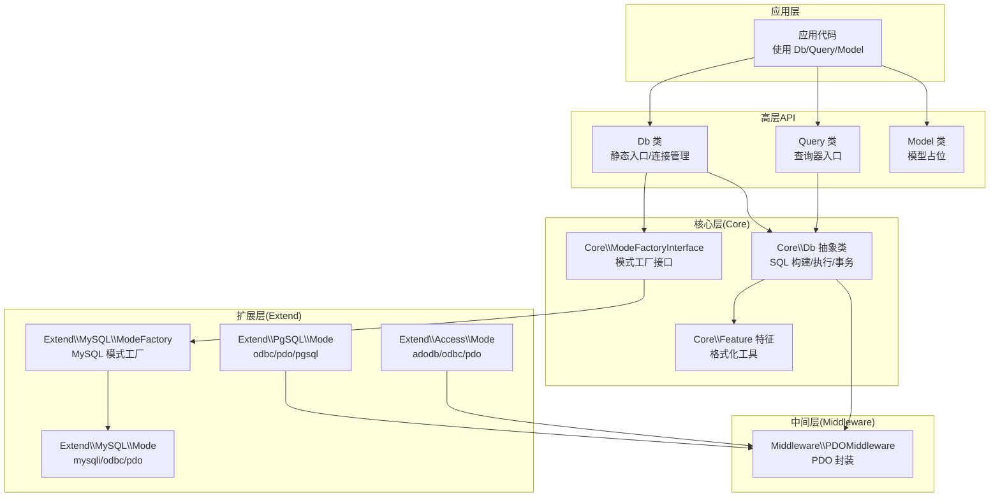
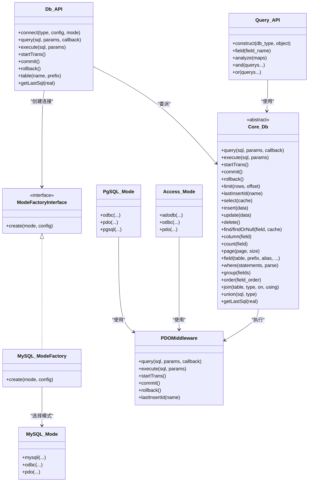
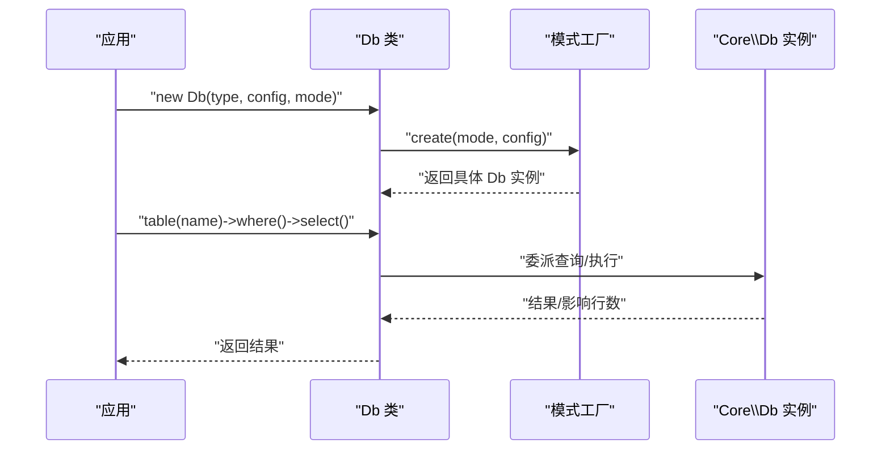
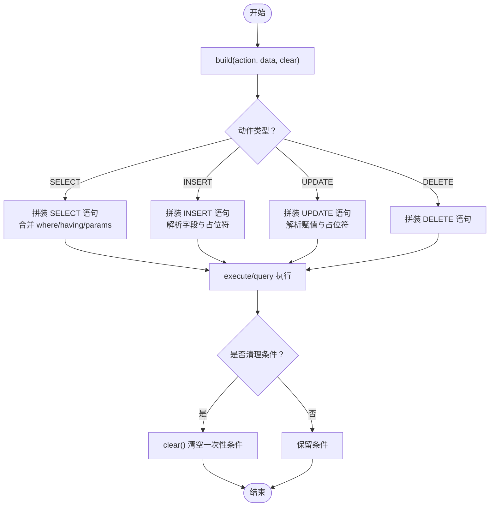
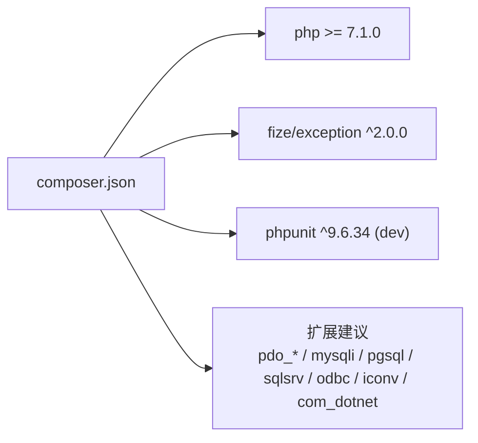

# 项目介绍

<cite>
**本文引用的文件**
- [composer.json](file://composer.json)
- [README.md](file://README.md)
- [src/Db.php](file://src/Db.php)
- [src/Model.php](file://src/Model.php)
- [src/Query.php](file://src/Query.php)
- [src/Core/Db.php](file://src/Core/Db.php)
- [src/Core/Feature.php](file://src/Core/Feature.php)
- [src/Core/ModeFactoryInterface.php](file://src/Core/ModeFactoryInterface.php)
- [src/Extend/MySQL/ModeFactory.php](file://src/Extend/MySQL/ModeFactory.php)
- [src/Extend/MySQL/Mode.php](file://src/Extend/MySQL/Mode.php)
- [src/Extend/PgSQL/Mode.php](file://src/Extend/PgSQL/Mode.php)
- [src/Extend/Access/Mode.php](file://src/Extend/Access/Mode.php)
- [src/Middleware/PDOMiddleware.php](file://src/Middleware/PDOMiddleware.php)
- [examples/db_connect.php](file://examples/db_connect.php)
- [examples/db_select.php](file://examples/db_select.php)
- [tests/TestDb.php](file://tests/TestDb.php)
- [tests/Extend/MySQL/TestDb.php](file://tests/Extend/MySQL/TestDb.php)
</cite>

## 目录
1. [引言](#引言)
2. [项目结构](#项目结构)
3. [核心组件](#核心组件)
4. [架构总览](#架构总览)
5. [详细组件分析](#详细组件分析)
6. [依赖关系分析](#依赖关系分析)
7. [性能考量](#性能考量)
8. [故障排查指南](#故障排查指南)
9. [结论](#结论)
10. [附录](#附录)

## 引言
FizeDatabase 是一个全功能、易于扩展的数据库类库与 ORM 框架，旨在提供统一的数据库抽象层，屏蔽不同数据库与连接模式之间的差异，让开发者以一致的方式编写数据访问逻辑。它通过“核心层-中间层-扩展层”的 CME（Core-Middleware-Extend）架构设计，支持多种数据库（如 MySQL、PostgreSQL、Oracle、SQL Server、SQLite、Access 等）与多种连接模式（PDO、ODBC、特定驱动如 mysqli、pgsql、sqlsrv 等），使应用在不同数据库与部署环境下具备良好的可移植性与可维护性。

本项目强调：
- 统一抽象：对 SQL 查询、事务、连接、字段/表名格式化等进行统一封装
- 易于扩展：通过模式工厂与中间层机制，快速适配新的数据库或连接方式
- 简洁易用：提供链式 API 与直观的查询器（Query）语法，降低学习成本
- 安全可靠：内置参数绑定、预处理语句、异常封装与日志辅助能力

## 项目结构
仓库采用按“功能/层次+数据库类型”的组织方式，核心目录与职责如下：
- src/Core：核心抽象与通用能力（Db 抽象类、Feature 特征、模式工厂接口）
- src/Extend/{DBType}：各数据库的扩展实现（含 Mode 工厂、具体模式类、Query 扩展等）
- src/Middleware：中间层（如 PDO 中间层）封装底层驱动细节
- src/Db.php、src/Query.php、src/Model.php：对外暴露的高层 API 入口
- examples：示例，展示如何初始化连接、执行查询与事务
- tests：单元测试与集成测试骨架

图表来源
- [src/Db.php:1-141](file://src/Db.php#L1-L141)
- [src/Query.php:1-130](file://src/Query.php#L1-L130)
- [src/Core/Db.php:1-800](file://src/Core/Db.php#L1-L800)
- [src/Core/Feature.php:1-33](file://src/Core/Feature.php#L1-L33)
- [src/Core/ModeFactoryInterface.php:1-18](file://src/Core/ModeFactoryInterface.php#L1-L18)
- [src/Extend/MySQL/ModeFactory.php:1-82](file://src/Extend/MySQL/ModeFactory.php#L1-L82)
- [src/Extend/MySQL/Mode.php:1-74](file://src/Extend/MySQL/Mode.php#L1-L74)
- [src/Extend/PgSQL/Mode.php:1-59](file://src/Extend/PgSQL/Mode.php#L1-L59)
- [src/Extend/Access/Mode.php:1-51](file://src/Extend/Access/Mode.php#L1-L51)
- [src/Middleware/PDOMiddleware.php:1-129](file://src/Middleware/PDOMiddleware.php#L1-L129)

章节来源
- [README.md:1-23](file://README.md#L1-L23)
- [composer.json:1-47](file://composer.json#L1-L47)

## 核心组件
- Db 类（高层入口）
  - 提供静态方法进行连接、查询、执行、事务与表级操作，内部委派给核心 Db 实例
  - 支持多连接与事务嵌套计数
- Core\Db 抽象类（核心）
  - 统一 SQL 构建（SELECT/INSERT/UPDATE/DELETE）、条件拼装（where/group/order/join/union 等）、参数绑定与执行
  - 提供缓存查询、分页、聚合、列提取等常用方法
- Query 类（查询器）
  - 以静态工厂方式获取对应数据库类型的 Query 实现，支持数组条件解析、AND/OR 合并、链式构建
- Model 类（模型）
  - 当前为占位，预留关联关系等 ORM 能力
- Feature 特征
  - 提供表名/字段名格式化钩子，便于扩展层定制
- 模式工厂接口与实现
  - 通过 ModeFactoryInterface 统一创建不同数据库与模式的连接实例
- 中间层（以 PDO 为例）
  - 封装 PDO 的 prepare/execute/fetch、事务与异常转换，屏蔽底层差异

章节来源
- [src/Db.php:1-141](file://src/Db.php#L1-L141)
- [src/Core/Db.php:1-800](file://src/Core/Db.php#L1-L800)
- [src/Query.php:1-130](file://src/Query.php#L1-L130)
- [src/Model.php:1-39](file://src/Model.php#L1-L39)
- [src/Core/Feature.php:1-33](file://src/Core/Feature.php#L1-L33)
- [src/Core/ModeFactoryInterface.php:1-18](file://src/Core/ModeFactoryInterface.php#L1-L18)
- [src/Middleware/PDOMiddleware.php:1-129](file://src/Middleware/PDOMiddleware.php#L1-L129)

## 架构总览
FizeDatabase 的 CME 架构将“抽象”“实现”“适配”解耦：
- 核心层（Core）：定义统一的数据库操作契约与通用逻辑
- 中间层（Middleware）：封装具体驱动细节（如 PDO、ODBC、特定扩展）
- 扩展层（Extend）：针对不同数据库提供模式工厂与模式类，按需组合核心与中间层

图表来源
- [src/Db.php:1-141](file://src/Db.php#L1-L141)
- [src/Core/Db.php:1-800](file://src/Core/Db.php#L1-L800)
- [src/Query.php:1-130](file://src/Query.php#L1-L130)
- [src/Core/ModeFactoryInterface.php:1-18](file://src/Core/ModeFactoryInterface.php#L1-L18)
- [src/Extend/MySQL/ModeFactory.php:1-82](file://src/Extend/MySQL/ModeFactory.php#L1-L82)
- [src/Extend/MySQL/Mode.php:1-74](file://src/Extend/MySQL/Mode.php#L1-L74)
- [src/Extend/PgSQL/Mode.php:1-59](file://src/Extend/PgSQL/Mode.php#L1-L59)
- [src/Extend/Access/Mode.php:1-51](file://src/Extend/Access/Mode.php#L1-L51)
- [src/Middleware/PDOMiddleware.php:1-129](file://src/Middleware/PDOMiddleware.php#L1-L129)

## 详细组件分析

### Db 类（高层入口）
- 职责
  - 作为静态入口，负责创建/持有核心 Db 实例，并提供便捷的查询、执行、事务与表级操作
  - 支持多连接与事务嵌套计数，避免重复开启事务
- 关键点
  - 通过命名空间 + 数据库类型 + 模式工厂类名动态创建连接
  - 将查询器与核心 Db 的能力统一暴露给上层
- 使用场景
  - 快速初始化默认连接
  - 多库并存时创建独立连接
  - 事务控制与链式查询

图表来源
- [src/Db.php:1-141](file://src/Db.php#L1-L141)
- [src/Extend/MySQL/ModeFactory.php:1-82](file://src/Extend/MySQL/ModeFactory.php#L1-L82)
- [src/Core/Db.php:1-800](file://src/Core/Db.php#L1-L800)

章节来源
- [src/Db.php:1-141](file://src/Db.php#L1-L141)

### Core\Db 抽象类（核心）
- 职责
  - 统一 SQL 构建与执行流程，支持链式条件拼装（field/where/group/order/join/union）
  - 提供 select/find/column/count/page 等常用方法，内置查询缓存与参数绑定
  - 提供事务抽象与 lastInsertId 抽出点，便于扩展层实现
- 关键点
  - build 方法按动作类型生成 SQL 并合并参数
  - clear 与缓存策略减少重复计算
  - getRealSql 与 getLastSql 便于调试与日志
- 适用场景
  - 任何数据库/模式下的通用查询与写入逻辑
  - 作为扩展层实现的基础基类

图表来源
- [src/Core/Db.php:583-637](file://src/Core/Db.php#L583-L637)
- [src/Core/Db.php:644-711](file://src/Core/Db.php#L644-L711)

章节来源
- [src/Core/Db.php:1-800](file://src/Core/Db.php#L1-L800)

### Query 类（查询器）
- 职责
  - 以静态工厂方式获取对应数据库类型的 Query 实现
  - 支持数组条件解析、AND/OR 合并、链式构建
- 关键点
  - analyze 将数组条件映射为 SQL 片段与参数
  - qMerge 支持多条件组合
- 适用场景
  - 复杂条件的声明式构建
  - 与 Db::where 协同工作

章节来源
- [src/Query.php:1-130](file://src/Query.php#L1-L130)
- [src/Core/Db.php:335-359](file://src/Core/Db.php#L335-L359)

### 模式工厂与扩展层
- 模式工厂接口
  - 统一 create(mode, config) 签名，屏蔽不同数据库/模式差异
- MySQL 扩展
  - ModeFactory 支持 mysqli/odbc/pdo 三种模式
  - Mode 提供 mysqli/odbc/pdo 构造方法
- PostgreSQL 扩展
  - Mode 支持 odbc/pdo/pgsql 三种模式
- Access 扩展
  - Mode 支持 adodb/odbc/pdo 三种模式
- 优势
  - 可按环境/需求灵活切换模式
  - 保持上层 API 不变

章节来源
- [src/Core/ModeFactoryInterface.php:1-18](file://src/Core/ModeFactoryInterface.php#L1-L18)
- [src/Extend/MySQL/ModeFactory.php:1-82](file://src/Extend/MySQL/ModeFactory.php#L1-L82)
- [src/Extend/MySQL/Mode.php:1-74](file://src/Extend/MySQL/Mode.php#L1-L74)
- [src/Extend/PgSQL/Mode.php:1-59](file://src/Extend/PgSQL/Mode.php#L1-L59)
- [src/Extend/Access/Mode.php:1-51](file://src/Extend/Access/Mode.php#L1-L51)

### 中间层（以 PDO 为例）
- 职责
  - 封装 PDO 的 prepare/execute/fetch、事务与异常转换
- 关键点
  - query 支持回调逐行遍历，降低内存占用
  - execute 返回受影响行数
  - 异常统一包装为数据库异常
- 适用场景
  - 作为多种数据库模式的通用执行层

章节来源
- [src/Middleware/PDOMiddleware.php:1-129](file://src/Middleware/PDOMiddleware.php#L1-L129)

### 示例与用法
- 初始化与查询
  - 通过 Db 构造函数设置默认连接
  - 通过 Db::connect 创建新连接
  - 使用 table/where/limit/select 等链式 API
- 日志与调试
  - getLastSql(real=true) 输出最终 SQL，便于日志与排错

章节来源
- [examples/db_connect.php:1-39](file://examples/db_connect.php#L1-L39)
- [examples/db_select.php:1-22](file://examples/db_select.php#L1-L22)
- [src/Db.php:136-139](file://src/Db.php#L136-L139)
- [src/Core/Db.php:199-206](file://src/Core/Db.php#L199-L206)

## 依赖关系分析
- Composer 依赖
  - PHP >= 7.1.0
  - fize/exception ^2.0.0（异常封装）
  - 开发依赖 phpunit/phpunit ^9.6.34
- 扩展建议
  - 根据所选模式与数据库，建议启用相应扩展（如 pdo_mysql、pdo_pgsql、pdo_sqlsrv、mysqli、pgsql、sqlsrv、odbc、iconv、com_dotnet 等）

图表来源
- [composer.json:16-45](file://composer.json#L16-L45)

章节来源
- [composer.json:1-47](file://composer.json#L1-L47)

## 性能考量
- 查询缓存
  - Core\Db 内置 select 结果缓存，相同最终 SQL 可复用结果，减少重复查询
- 分页与遍历
  - page 提供基于 LIMIT 的简易分页；fetch 支持回调逐行遍历，适合大数据量场景
- 参数绑定
  - 统一使用预处理与参数绑定，避免拼接带来的性能与安全问题
- 中间层优化
  - PDO 中间层使用 prepare/execute，配合 fetch 回调，降低内存峰值

章节来源
- [src/Core/Db.php:700-711](file://src/Core/Db.php#L700-L711)
- [src/Core/Db.php:668-672](file://src/Core/Db.php#L668-L672)
- [src/Middleware/PDOMiddleware.php:51-72](file://src/Middleware/PDOMiddleware.php#L51-L72)

## 故障排查指南
- 常见问题
  - 连接失败：检查配置项（host/user/password/dbname/port/charset/socket/driver 等）与对应扩展是否启用
  - 模式错误：确认传入的 mode 是否受支持（如 MySQL 支持 mysqli/odbc/pdo）
  - SQL 注入风险：避免直接拼接 SQL，优先使用参数绑定或 Query 分析器
  - 事务嵌套：注意嵌套事务计数，确保正确提交/回滚
- 排查步骤
  - 使用 getLastSql(true) 输出最终 SQL 与参数，核对条件与占位符
  - 在开发环境开启异常堆栈，结合中间层异常包装定位问题
  - 逐步缩小范围：先验证连接，再验证 SQL 构建，最后验证执行
- 测试参考
  - 单测骨架位于 tests 目录，可据此补充断言与用例

章节来源
- [src/Db.php:136-139](file://src/Db.php#L136-L139)
- [src/Core/Db.php:199-206](file://src/Core/Db.php#L199-L206)
- [src/Middleware/PDOMiddleware.php:69-71](file://src/Middleware/PDOMiddleware.php#L69-L71)
- [tests/TestDb.php:1-51](file://tests/TestDb.php#L1-L51)
- [tests/Extend/MySQL/TestDb.php:1-70](file://tests/Extend/MySQL/TestDb.php#L1-L70)

## 结论
FizeDatabase 通过“核心-中间-扩展”的分层设计，提供了统一、简洁、可扩展的数据库抽象层。它不仅屏蔽了不同数据库与连接模式的差异，还提供了完善的查询器、事务与调试能力，适合在多数据库、多模式、多团队协作的复杂项目中使用。对于初学者而言，从 Db 与 Query 的链式 API 入手即可快速上手；对于进阶用户，可通过扩展层与中间层深入定制，满足更高性能与兼容性的需求。

## 附录
- 项目背景与定位
  - 目标：提供统一数据库抽象层，简化跨数据库迁移与多模式适配
  - 价值：降低学习成本、提升可移植性、增强安全性与可维护性
- 发展历程与版本
  - 项目名称与描述见 composer.json
  - 文档与手册参见 README 中的链接
- 许可证
  - MIT 许可证，详见 README 与源码头部注释
- 作者信息
  - 作者：FizeChan（chenfengzhan@qq.com），见 composer.json

章节来源
- [README.md:1-23](file://README.md#L1-L23)
- [composer.json:1-47](file://composer.json#L1-L47)