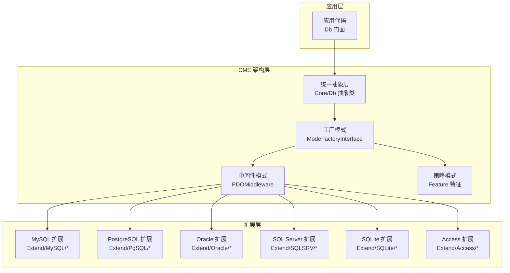
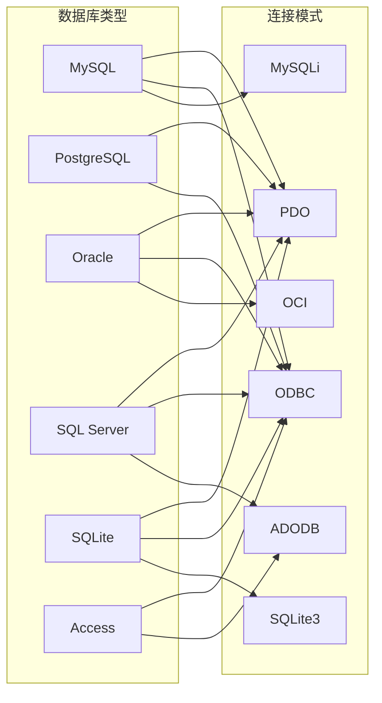
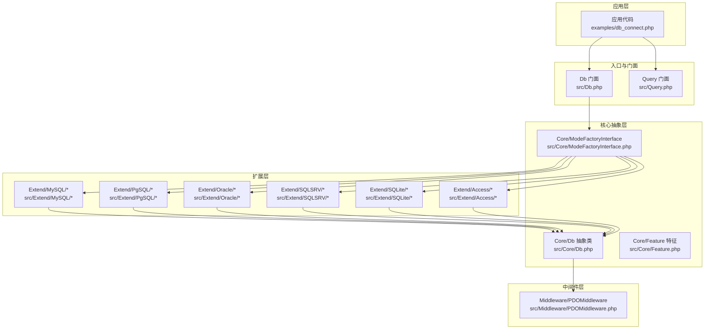
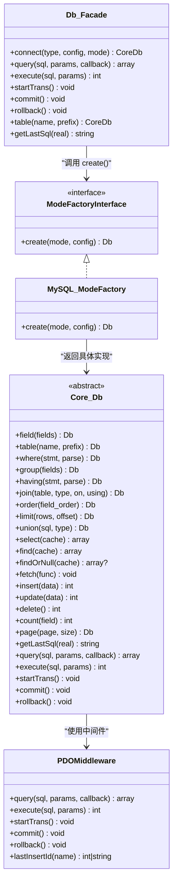
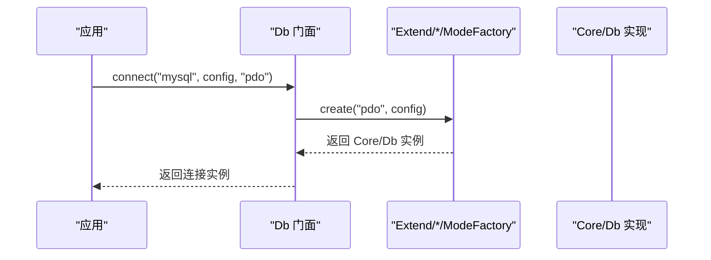
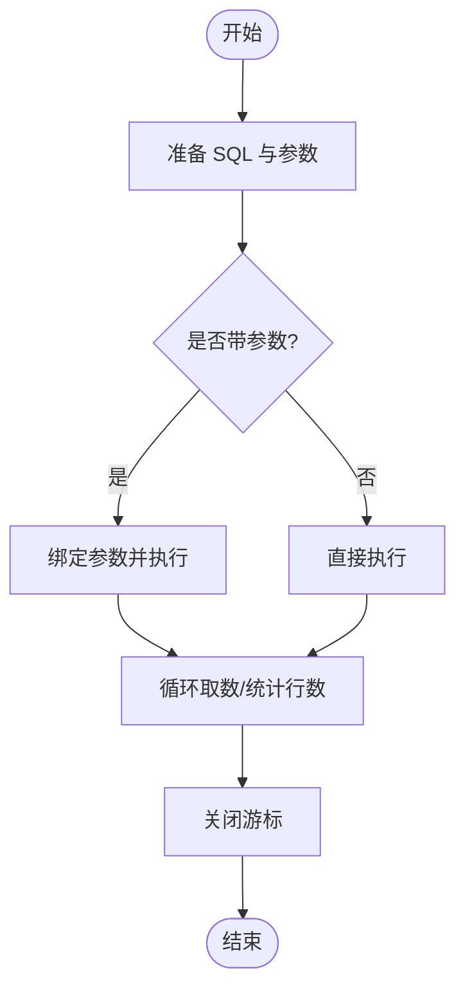
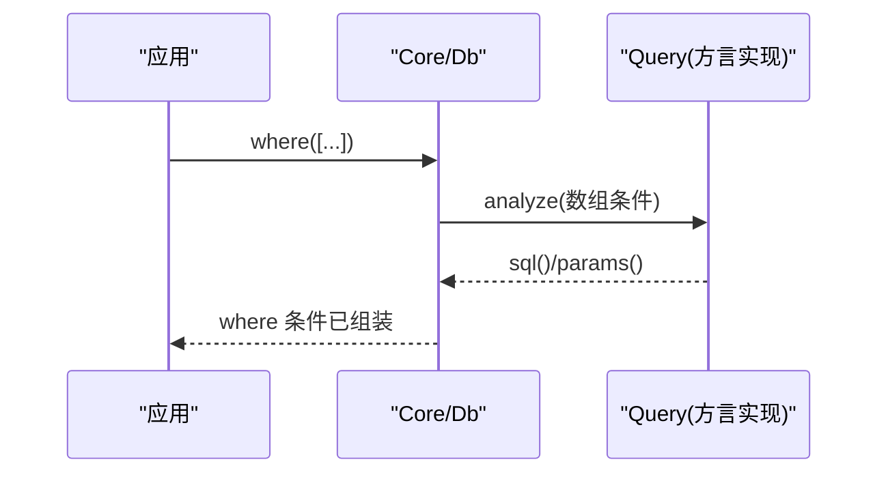
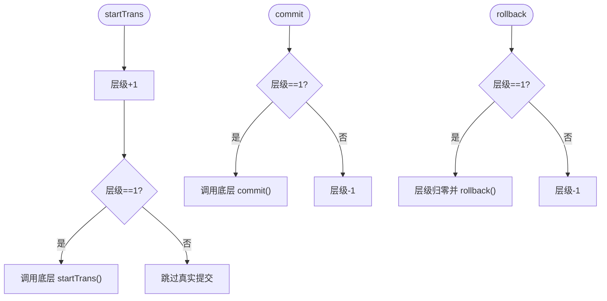
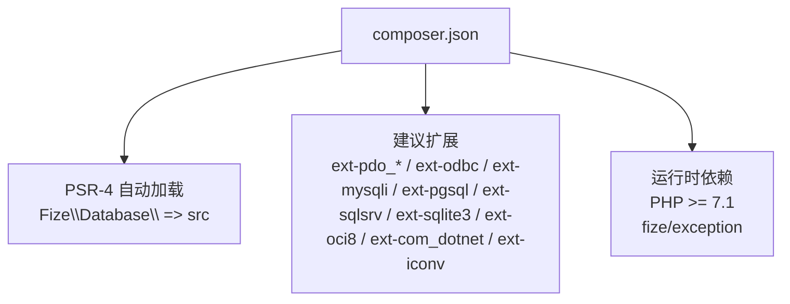

# 项目概述

<cite>
**本文引用的文件**
- [composer.json](file://composer.json)
- [Db.php](file://src/Db.php)
- [Core/Db.php](file://src/Core/Db.php)
- [Core/Feature.php](file://src/Core/Feature.php)
- [Core/ModeFactoryInterface.php](file://src/Core/ModeFactoryInterface.php)
- [Middleware/PDOMiddleware.php](file://src/Middleware/PDOMiddleware.php)
- [Query.php](file://src/Query.php)
- [Extend/MySQL/ModeFactory.php](file://src/Extend/MySQL/ModeFactory.php)
- [Extend/MySQL/Db.php](file://src/Extend/MySQL/Db.php)
- [Extend/Access/Db.php](file://src/Extend/Access/Db.php)
- [Extend/Oracle/Db.php](file://src/Extend/Oracle/Db.php)
- [Extend/PgSQL/Db.php](file://src/Extend/PgSQL/Db.php)
- [Extend/SQLSRV/Db.php](file://src/Extend/SQLSRV/Db.php)
- [Extend/SQLite/Db.php](file://src/Extend/SQLite/Db.php)
- [examples/db_connect.php](file://examples/db_connect.php)
</cite>

## 更新摘要
**所做更改**
- 新增 CME 架构设计详解，包括统一抽象层、工厂模式、中间件模式和策略模式的协同工作机制
- 完善多数据库支持体系说明，涵盖 MySQL、PostgreSQL、Oracle、SQL Server、SQLite、Access 六大数据库类型
- 深化设计理念阐述，突出可移植性、可扩展性和开发体验三大核心优势
- 增加架构总览图和详细组件分析，展示各层次间的依赖关系和交互流程

## 目录
1. [简介](#简介)
2. [CME 架构设计](#cme-架构设计)
3. [多数据库支持体系](#多数据库支持体系)
4. [核心设计理念](#核心设计理念)
5. [项目结构](#项目结构)
6. [架构总览](#架构总览)
7. [详细组件分析](#详细组件分析)
8. [依赖关系分析](#依赖关系分析)
9. [性能考量](#性能考量)
10. [故障排查指南](#故障排查指南)
11. [结论](#结论)
12. [附录](#附录)

## 简介
FizeDatabase 是一个全功能、易于扩展的数据库类库与轻量 ORM 框架，采用创新的 CME（统一抽象层 + 工厂 + 中间件 + 策略）架构设计，旨在提供统一的数据库抽象层，彻底屏蔽不同数据库与驱动（PDO、ODBC、MySQLi 等）之间的差异。通过精心设计的四层架构模式，实现对多种数据库类型与连接模式的无缝统一接入与扩展，既适合初学者快速上手，也为有经验的开发者提供了灵活的定制空间和强大的扩展能力。

### 核心目标
- **统一数据库访问接口**：通过统一抽象层简化跨数据库迁移与多连接管理
- **提供链式查询构造器**：支持数组/对象/原生 SQL 三种条件表达方式，兼顾易用性与性能
- **实现可插拔扩展机制**：通过中间件与模式工厂解耦底层驱动细节，便于扩展新的数据库或驱动

### 主要特性
- **多数据库类型支持**：MySQL、PostgreSQL、Oracle、SQL Server、SQLite、Access 六大数据库类型
- **多连接模式**：PDO、ODBC、MySQLi 等主流连接模式，按需切换
- **事务嵌套控制**：支持嵌套事务计数，避免误提交
- **查询缓存与高性能遍历**：select 结果缓存与回调式 fetch
- **分页与批量插入增强**：针对 MySQL 的分页与批量插入优化

### 技术优势
- **统一抽象层**：核心 Db 抽象类封装通用 SQL 组装与执行流程
- **工厂解耦**：按数据库类型与模式动态创建具体连接实例
- **中间件复用**：PDO 中间件统一处理预处理、执行、事务与异常包装
- **可插拔扩展**：新增数据库或模式只需实现对应接口与工厂

## CME 架构设计

CME 架构是 FizeDatabase 的核心技术基石，通过四个核心组件的协同工作，实现了高度的可移植性和可扩展性。

### 统一抽象层（Core Layer）
核心抽象层位于架构最底层，提供统一的数据库操作接口和 SQL 构建能力。抽象类封装了所有通用的 SQL 组装逻辑，包括字段处理、表名格式化、条件解析、连接构建等核心功能。

### 工厂模式（Factory Pattern）
工厂模式负责根据数据库类型和连接模式动态创建具体的数据库实例。通过统一的工厂接口，实现了"如何连接"与"如何使用"的完全解耦，新增数据库类型或连接模式时只需实现相应的工厂类即可。

### 中间件模式（Middleware Pattern）
中间件模式封装了底层驱动的具体实现细节，提供统一的接口来处理数据库操作。PDO 中间件负责预处理语句、参数绑定、事务管理和异常转换，屏蔽了不同驱动之间的差异。

### 策略模式（Strategy Pattern）
策略模式用于处理不同数据库方言的适配问题。通过特征 trait 和方言适配器，实现了对各种数据库特殊语法的支持，如 MySQL 的 LIMIT 语法、Oracle 的双引号标识符等。

**图示来源**
- [Core/Db.php:13-13](file://src/Core/Db.php#L13-L13)
- [Core/ModeFactoryInterface.php:8-17](file://src/Core/ModeFactoryInterface.php#L8-L17)
- [Middleware/PDOMiddleware.php:12-129](file://src/Middleware/PDOMiddleware.php#L12-L129)
- [Core/Feature.php:10-33](file://src/Core/Feature.php#L10-L33)

## 多数据库支持体系

FizeDatabase 支持六大主流数据库系统，每种数据库都提供了完整的方言适配和连接模式支持。

### MySQL 支持
- **连接模式**：PDO、ODBC、MySQLi 三种模式
- **特色功能**：完整的 LIMIT 语法支持、批量插入优化、REPLACE 语句支持
- **性能优化**：SQL_CALC_FOUND_ROWS 分页、insertAll 批量插入

### PostgreSQL 支持
- **连接模式**：PDO、ODBC 两种模式
- **方言适配**：标准 SQL 语法支持，LIMIT/OFFSET 语法适配
- **特性支持**：完整的事务控制和异常处理

### Oracle 支持
- **连接模式**：PDO、ODBC、OCI 三种模式
- **标识符格式**：双引号表名和字段名格式化
- **方言特性**：NATURAL JOIN 等 Oracle 特有语法支持

### SQL Server 支持
- **连接模式**：PDO、ODBC、ADODB 三种模式
- **版本兼容**：支持新旧版本特性检测
- **分页优化**：OFFSET/FETCH 语法和传统 ROW_NUMBER() 两种分页方式

### SQLite 支持
- **连接模式**：PDO、ODBC、SQLite3 三种模式
- **轻量级特性**：无服务器架构，文件数据库支持
- **方言适配**：SQLite 特有的 REPLACE/TRUNCATE 语法

### Access 支持
- **连接模式**：ODBC、ADODB 两种模式
- **环境要求**：需要安装 AccessDatabaseEngine
- **平台限制**：Windows 平台专用，IIS 需要 32 位支持

**图示来源**
- [Extend/MySQL/ModeFactory.php:36-77](file://src/Extend/MySQL/ModeFactory.php#L36-L77)
- [Extend/MySQL/Db.php:1-246](file://src/Extend/MySQL/Db.php#L1-L246)
- [Extend/PgSQL/Db.php:1-37](file://src/Extend/PgSQL/Db.php#L1-L37)
- [Extend/Oracle/Db.php:1-117](file://src/Extend/Oracle/Db.php#L1-L117)
- [Extend/SQLSRV/Db.php:1-231](file://src/Extend/SQLSRV/Db.php#L1-L231)
- [Extend/SQLite/Db.php:1-69](file://src/Extend/SQLite/Db.php#L1-L69)
- [Extend/Access/Db.php:1-73](file://src/Extend/Access/Db.php#L1-L73)

## 核心设计理念

### 可移植性设计
FizeDatabase 通过统一抽象层和方言适配机制，实现了真正的数据库无关性。开发者可以在不修改业务代码的情况下轻松切换数据库类型，只需调整配置参数即可完成迁移。

### 可扩展性设计
采用插件化架构，新增数据库类型或连接模式的成本极低。只需要实现相应的工厂类和适配器，即可无缝集成到现有框架中。

### 开发体验优化
提供链式 API、智能条件解析、自动参数绑定等功能，大大提升了开发效率。同时保持了对底层 SQL 的完全控制能力。

### 性能优先原则
通过查询缓存、回调遍历、参数预编译等技术手段，在保证易用性的同时最大化性能表现。

## 项目结构

项目采用"核心抽象 + 扩展适配 + 中间件 + 示例"的分层组织方式，每一层都有明确的职责分工：

### 核心层（Core Layer）
- **Core/Db 抽象类**：定义统一的数据库操作接口和 SQL 构建流程
- **Core/Feature 特征**：提供表名/字段名格式化钩子，支持方言适配
- **Core/ModeFactoryInterface 接口**：定义工厂模式的标准接口规范

### 扩展层（Extension Layer）
按数据库类型划分的目录结构，每个类型包含完整的实现：
- **ModeFactory**：工厂类，负责创建具体连接实例
- **Mode**：模式类，定义连接参数和配置
- **Db**：数据库类，实现具体的 SQL 构建和执行
- **Query**：查询器类，处理条件解析和 SQL 生成
- **Feature**：方言适配特征，处理数据库特定语法

### 中间件层（Middleware Layer）
- **Middleware/PDOMiddleware**：PDO 驱动的中间件实现
- **Middleware/ODBCMiddleware**：ODBC 驱动的中间件实现  
- **Middleware/ADODBMiddleware**：ADODB 驱动的中间件实现

### 示例与测试层
- **examples/**：展示基本用法和最佳实践的示例代码
- **tests/**：覆盖各数据库与模式的完整单元测试

**图示来源**
- [Db.php:1-141](file://src/Db.php#L1-L141)
- [Query.php:1-130](file://src/Query.php#L1-L130)
- [Core/Db.php:1-941](file://src/Core/Db.php#L1-L941)
- [Core/ModeFactoryInterface.php:1-18](file://src/Core/ModeFactoryInterface.php#L1-L18)
- [Middleware/PDOMiddleware.php:1-129](file://src/Middleware/PDOMiddleware.php#L1-L129)
- [Extend/MySQL/ModeFactory.php:1-82](file://src/Extend/MySQL/ModeFactory.php#L1-L82)
- [examples/db_connect.php:1-39](file://examples/db_connect.php#L1-L39)

## 架构总览

FizeDatabase 的整体架构围绕"CME（统一抽象 + 工厂 + 中间件 + 方言适配）"展开。Db 门面负责对外 API，核心 Db 抽象类负责 SQL 组装与通用流程，ModeFactory 按类型与模式创建具体实例，Middleware 封装底层驱动交互，Feature 与各数据库扩展类负责方言适配。

**图示来源**
- [Db.php:1-141](file://src/Db.php#L1-L141)
- [Core/Db.php:1-941](file://src/Core/Db.php#L1-L941)
- [Core/ModeFactoryInterface.php:1-18](file://src/Core/ModeFactoryInterface.php#L1-L18)
- [Extend/MySQL/ModeFactory.php:1-82](file://src/Extend/MySQL/ModeFactory.php#L1-L82)
- [Middleware/PDOMiddleware.php:1-129](file://src/Middleware/PDOMiddleware.php#L1-L129)

## 详细组件分析

### 工厂模式：按数据库类型与模式创建连接

工厂模式是 FizeDatabase 的核心设计模式之一，通过统一的接口规范，实现了"如何连接"与"如何使用"的完全解耦。

#### 入口机制
Db 门面的 connect/create 方法根据数据库类型拼接命名空间并调用对应 Extend/*/ModeFactory::create(mode, config)。这种设计使得新增数据库类型变得极其简单。

#### MySQL 模式工厂示例
MySQL 模式工厂支持 mysqli/odbc/pdo 三种模式，通过合并默认配置后按模式分支创建具体 Db 实例，并设置表前缀。每种模式都有其特定的配置参数和连接方式。

#### 优势分析
- **完全解耦**：将"如何连接"与"如何使用"分离
- **易于扩展**：新增数据库或模式只需实现工厂与模式类
- **配置灵活**：支持丰富的连接参数和选项

**图示来源**
- [Db.php:49-56](file://src/Db.php#L49-L56)
- [Extend/MySQL/ModeFactory.php:21-80](file://src/Extend/MySQL/ModeFactory.php#L21-L80)

**章节来源**
- [Db.php:1-141](file://src/Db.php#L1-L141)
- [Extend/MySQL/ModeFactory.php:1-82](file://src/Extend/MySQL/ModeFactory.php#L1-L82)

### 中间件模式：统一底层驱动交互

中间件模式封装了底层驱动的具体实现细节，提供统一的接口来处理数据库操作。PDOMiddleware 作为核心中间件，负责 PDO 预处理、执行、事务与异常转换。

#### 核心功能
- **预处理语句**：统一的 prepare/execute 接口
- **参数绑定**：自动参数绑定和类型处理
- **事务管理**：统一的事务开始、提交、回滚接口
- **异常转换**：将底层异常转换为统一的 DatabaseException

#### 优势特点
- **屏蔽差异**：统一 PDO 细节，提供一致的 API
- **异常处理**：标准化异常包装，便于错误处理
- **资源管理**：自动资源清理和连接管理

**图示来源**
- [Middleware/PDOMiddleware.php:51-93](file://src/Middleware/PDOMiddleware.php#L51-L93)

**章节来源**
- [Middleware/PDOMiddleware.php:1-129](file://src/Middleware/PDOMiddleware.php#L1-L129)

### 策略模式：方言适配与格式化

策略模式用于处理不同数据库方言的适配问题。通过 Feature 特征和方言适配器，实现了对各种数据库特殊语法的支持。

#### 核心机制
- **格式化钩子**：formatTable/formatField 提供表名和字段名格式化
- **方言适配**：各数据库扩展类覆盖特定的格式化逻辑
- **语法兼容**：处理不同数据库的特殊语法需求

#### 典型应用
- **MySQL**：反引号标识符支持
- **Oracle**：双引号标识符支持  
- **Access**：字符串转义和特殊值处理
- **SQL Server**：TOP 语法和 OFFSET/FETCH 语法

**章节来源**
- [Core/Feature.php:1-33](file://src/Core/Feature.php#L1-L33)
- [Extend/MySQL/Db.php:1-246](file://src/Extend/MySQL/Db.php#L1-L246)
- [Extend/Access/Db.php:1-73](file://src/Extend/Access/Db.php#L1-L73)
- [Extend/Oracle/Db.php:1-117](file://src/Extend/Oracle/Db.php#L1-L117)
- [Extend/PgSQL/Db.php:1-37](file://src/Extend/PgSQL/Db.php#L1-L37)
- [Extend/SQLSRV/Db.php:1-231](file://src/Extend/SQLSRV/Db.php#L1-L231)
- [Extend/SQLite/Db.php:1-69](file://src/Extend/SQLite/Db.php#L1-L69)

### 查询构造与条件解析

FizeDatabase 提供了强大的查询构造器，支持数组/对象/原生 SQL 三种条件表达方式，内部通过 Query 对象解析数组条件，统一产出 SQL 与参数。

#### 条件解析流程
- **数组条件**：通过 Query 对象的 analyze 方法解析
- **对象条件**：直接使用 Query 对象进行条件构建
- **原生 SQL**：支持直接传入预处理语句

#### 查询器功能
- **条件组合**：支持 AND/OR 逻辑组合
- **嵌套查询**：支持复杂的嵌套条件结构
- **参数绑定**：自动参数绑定和类型处理

**图示来源**
- [Core/Db.php:335-393](file://src/Core/Db.php#L335-L393)
- [Query.php:70-129](file://src/Query.php#L70-L129)

**章节来源**
- [Core/Db.php:1-941](file://src/Core/Db.php#L1-L941)
- [Query.php:1-130](file://src/Query.php#L1-L130)

### 事务与嵌套控制

FizeDatabase 通过 Db 门面维护事务嵌套层级，startTrans/commit/rollback 根据层级决定是否真正提交或回滚，有效避免了外层误操作。

#### 嵌套事务机制
- **层级跟踪**：维护当前事务嵌套层级
- **条件提交**：只有当层级回到 1 时才真正提交
- **回滚重置**：回滚时将层级重置为 0

#### 事务控制流程

**图示来源**
- [Db.php:84-114](file://src/Db.php#L84-L114)

**章节来源**
- [Db.php:1-141](file://src/Db.php#L1-L141)

### 常用操作与示例路径

#### 连接与查询示例
examples/db_connect.php 展示了默认连接与新连接的创建、链式查询与分页的完整流程。

#### API 路径参考
- **连接与查询**：Db.php:49-68
- **事务控制**：Db.php:84-114  
- **查询构造**：Core/Db.php:228-498
- **条件解析**：Core/Db.php:335-393
- **查询器**：Query.php:70-129

**章节来源**
- [examples/db_connect.php:1-39](file://examples/db_connect.php#L1-L39)
- [Db.php:1-141](file://src/Db.php#L1-L141)
- [Core/Db.php:1-941](file://src/Core/Db.php#L1-L941)
- [Query.php:1-130](file://src/Query.php#L1-L130)

## 依赖关系分析

### Composer 自动加载与建议扩展

项目通过 PSR-4 自动加载规范映射命名空间到 src 目录，建议扩展覆盖了所有主流数据库驱动。

#### 自动加载配置
- **命名空间映射**：Fize\Database\ => src
- **测试映射**：Tests\ => tests

#### 建议扩展列表
- **PDO 扩展**：ext-pdo_* 系列
- **数据库驱动**：ext-mysqli、ext-oci8、ext-sqlsrv、ext-pgsql、ext-sqlite3
- **COM 支持**：ext-com_dotnet（用于 Access）
- **字符编码**：ext-iconv

### 运行时依赖

#### PHP 版本要求
- **最低版本**：PHP >= 7.1.0
- **推荐版本**：PHP >= 7.2.0

#### 核心依赖
- **fize/exception**：统一异常包装和处理
- **测试框架**：phpunit/phpunit ^9.6.34

**图示来源**
- [composer.json:11-46](file://composer.json#L11-L46)

**章节来源**
- [composer.json:1-47](file://composer.json#L1-L47)

## 性能考量

### 查询缓存机制
Core/Db 在 select 中对最终 SQL 进行缓存，避免重复查询相同条件的结果集，特别适合重复查询场景。

### 回调遍历优化
fetch 使用回调逐行处理，减少内存占用，适合大数据集导出或流式处理。

### 参数绑定优化
统一使用问号占位与参数绑定，避免字符串拼接带来的性能与安全问题。

### 方言优化策略
各数据库扩展提供针对性的性能优化，如 MySQL 的 paginate 与 insertAll 等增强功能。

**章节来源**
- [Core/Db.php:700-711](file://src/Core/Db.php#L700-L711)
- [Core/Db.php:668-672](file://src/Core/Db.php#L668-L672)
- [Extend/MySQL/Db.php:187-203](file://src/Extend/MySQL/Db.php#L187-L203)
- [Extend/MySQL/Db.php:237-244](file://src/Extend/MySQL/Db.php#L237-L244)

## 故障排查指南

### SQL 注入与日志
getLastSql(real=true) 可输出最终 SQL 用于日志与调试，但不建议直接执行。

### 异常处理机制
Middleware/PDOMiddleware 将 PDOException 包装为统一的 DatabaseException，便于定位 SQL 与参数。

### 事务问题诊断
检查嵌套层级，确保外层 commit/rollback 正确匹配 startTrans 调用次数。

### 条件解析问题
where/having 支持数组/对象/原生 SQL，若出现语法错误，优先检查数组条件格式与 Query 对象生成。

**章节来源**
- [Core/Db.php:199-206](file://src/Core/Db.php#L199-L206)
- [Middleware/PDOMiddleware.php:69-92](file://src/Middleware/PDOMiddleware.php#L69-L92)
- [Db.php:84-114](file://src/Db.php#L84-L114)
- [Core/Db.php:335-393](file://src/Core/Db.php#L335-L393)

## 结论

FizeDatabase 通过创新的 CME 架构设计，成功实现了对多数据库、多连接模式的无缝支持。其统一抽象层、工厂与中间件模式，以及策略模式的巧妙结合，形成了高度可移植与可扩展的数据库访问方案。

### 核心优势总结
- **架构先进**：CME 四层架构确保了系统的可维护性和扩展性
- **兼容性强**：支持六大主流数据库和多种连接模式
- **开发友好**：链式 API、智能条件解析、事务嵌套控制等特性提升开发效率
- **性能优秀**：查询缓存、回调遍历、参数绑定等优化技术保证运行效率

### 技术价值
FizeDatabase 不仅是一个数据库操作库，更是数据库抽象设计的最佳实践案例。其架构模式和设计理念为其他类似项目提供了宝贵的参考价值。

## 附录

### 支持的数据库类型与连接模式

#### MySQL
- **连接模式**：PDO、ODBC、MySQLi
- **特色功能**：LIMIT 语法、批量插入、REPLACE 语句
- **性能优化**：SQL_CALC_FOUND_ROWS、insertAll

#### PostgreSQL  
- **连接模式**：PDO、ODBC
- **方言特性**：标准 SQL 语法、LIMIT/OFFSET
- **兼容性**：完整的事务和异常处理

#### Oracle
- **连接模式**：PDO、ODBC、OCI
- **标识符格式**：双引号支持
- **方言语法**：NATURAL JOIN 等

#### SQL Server
- **连接模式**：PDO、ODBC、ADODB
- **版本兼容**：新旧版本特性检测
- **分页方式**：OFFSET/FETCH 与 ROW_NUMBER()

#### SQLite
- **连接模式**：PDO、ODBC、SQLite3
- **架构特点**：无服务器、文件数据库
- **方言语法**：REPLACE/TRUNCATE

#### Access
- **连接模式**：ODBC、ADODB
- **环境要求**：AccessDatabaseEngine
- **平台限制**：Windows 专用

**章节来源**
- [Extend/MySQL/ModeFactory.php:36-77](file://src/Extend/MySQL/ModeFactory.php#L36-L77)
- [Extend/MySQL/Db.php:1-246](file://src/Extend/MySQL/Db.php#L1-L246)
- [Extend/PgSQL/Db.php:1-37](file://src/Extend/PgSQL/Db.php#L1-L37)
- [Extend/Oracle/Db.php:1-117](file://src/Extend/Oracle/Db.php#L1-L117)
- [Extend/Access/Db.php:1-73](file://src/Extend/Access/Db.php#L1-L73)
- [Extend/SQLSRV/Db.php:1-231](file://src/Extend/SQLSRV/Db.php#L1-L231)
- [Extend/SQLite/Db.php:1-69](file://src/Extend/SQLite/Db.php#L1-L69)