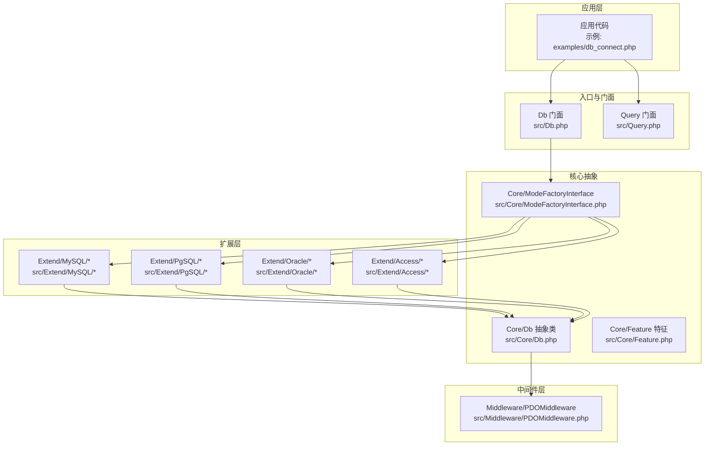
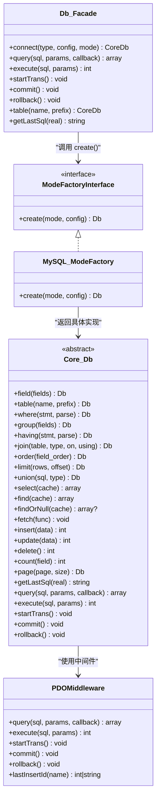
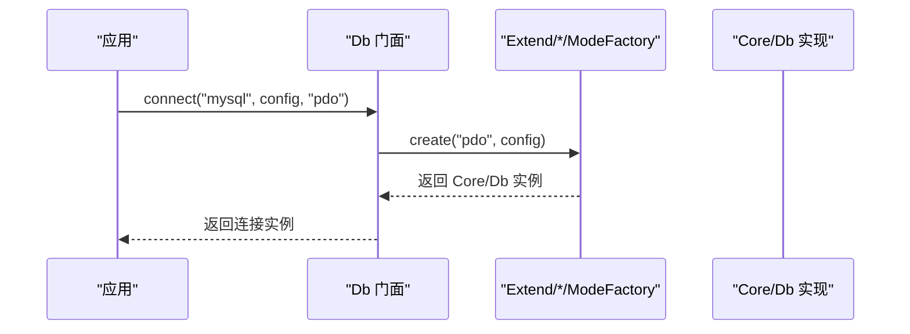
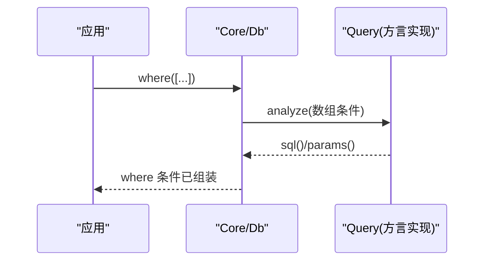
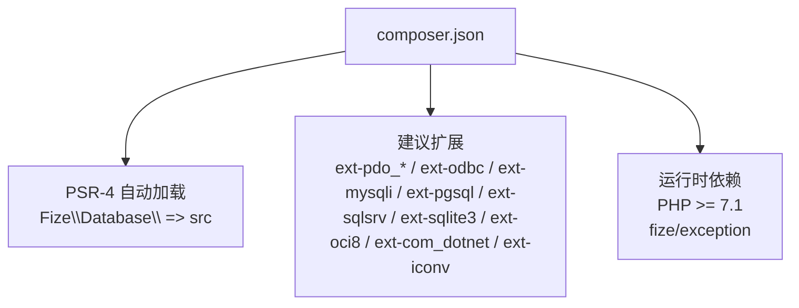

# 项目概述

<cite>
**本文引用的文件**
- [composer.json](file://composer.json)
- [Db.php](file://src/Db.php)
- [Core/Db.php](file://src/Core/Db.php)
- [Core/Feature.php](file://src/Core/Feature.php)
- [Core/ModeFactoryInterface.php](file://src/Core/ModeFactoryInterface.php)
- [Middleware/PDOMiddleware.php](file://src/Middleware/PDOMiddleware.php)
- [Query.php](file://src/Query.php)
- [Extend/MySQL/ModeFactory.php](file://src/Extend/MySQL/ModeFactory.php)
- [Extend/MySQL/Db.php](file://src/Extend/MySQL/Db.php)
- [Extend/Access/Db.php](file://src/Extend/Access/Db.php)
- [Extend/Oracle/Db.php](file://src/Extend/Oracle/Db.php)
- [Extend/PgSQL/Db.php](file://src/Extend/PgSQL/Db.php)
- [examples/db_connect.php](file://examples/db_connect.php)
</cite>

## 目录
1. [简介](#简介)
2. [项目结构](#项目结构)
3. [核心组件](#核心组件)
4. [架构总览](#架构总览)
5. [详细组件分析](#详细组件分析)
6. [依赖关系分析](#依赖关系分析)
7. [性能考量](#性能考量)
8. [故障排查指南](#故障排查指南)
9. [结论](#结论)
10. [附录](#附录)

## 简介
FizeDatabase 是一个全功能、易于扩展的数据库类库与轻量 ORM 框架，旨在提供统一的数据库抽象层，屏蔽不同数据库与驱动（PDO、ODBC、MySQLi 等）之间的差异。它通过工厂模式、中间件模式与策略模式，实现对多种数据库类型与连接模式的统一接入与扩展，既适合初学者快速上手，也为有经验的开发者提供了灵活的定制空间。

- 核心目标
  - 统一数据库访问接口，简化跨数据库迁移与多连接管理。
  - 提供链式查询构造器与常用 CRUD 操作，兼顾易用性与性能。
  - 通过中间件与模式工厂解耦底层驱动细节，便于扩展新的数据库或驱动。

- 主要特性
  - 多数据库类型支持：MySQL、PostgreSQL、Oracle、SQL Server、SQLite、Access 等。
  - 多连接模式：PDO、ODBC、MySQLi 等，按需切换。
  - 链式查询与条件构造器：支持数组/对象/原生 SQL 三种条件表达方式。
  - 事务嵌套与回滚控制：支持嵌套事务计数，避免误提交。
  - 查询缓存与高性能遍历：select 结果缓存与回调式 fetch。
  - 分页与批量插入等增强能力：针对 MySQL 的分页与批量插入等。

- 技术优势
  - 统一抽象层：核心 Db 抽象类封装通用 SQL 组装与执行流程。
  - 工厂解耦：按数据库类型与模式动态创建具体连接实例。
  - 中间件复用：PDO 中间件统一处理预处理、执行、事务与异常包装。
  - 可插拔扩展：新增数据库或模式只需实现对应接口与工厂。

- 与其他数据库方案的对比优势
  - 更高的可移植性：统一接口与条件构造器减少对特定方言的依赖。
  - 更强的扩展性：模式工厂与中间件模式使新增驱动与数据库类型成本低。
  - 更好的开发体验：链式 API、查询缓存、回调遍历、嵌套事务等提升开发效率。

## 项目结构
项目采用“核心抽象 + 扩展适配 + 中间件 + 示例”的分层组织方式：
- 核心层：Core 下的 Db 抽象类、Feature 特征、ModeFactoryInterface 接口，定义统一行为与扩展点。
- 扩展层：Extend 下按数据库类型划分的目录，每个类型包含 ModeFactory、Mode、Db、Query、Feature 等，负责适配具体数据库方言与模式。
- 中间件层：Middleware 下的 PDO/ODBC/ADODB 等中间件，封装底层驱动细节。
- 示例与测试：examples 展示基本用法；tests 覆盖各数据库与模式的单元测试。

图示来源
- [Db.php:1-141](file://src/Db.php#L1-L141)
- [Query.php:1-130](file://src/Query.php#L1-L130)
- [Core/Db.php:1-941](file://src/Core/Db.php#L1-L941)
- [Core/ModeFactoryInterface.php:1-18](file://src/Core/ModeFactoryInterface.php#L1-L18)
- [Middleware/PDOMiddleware.php:1-129](file://src/Middleware/PDOMiddleware.php#L1-L129)
- [Extend/MySQL/ModeFactory.php:1-82](file://src/Extend/MySQL/ModeFactory.php#L1-L82)
- [examples/db_connect.php:1-39](file://examples/db_connect.php#L1-L39)

章节来源
- [composer.json:1-47](file://composer.json#L1-L47)
- [Db.php:1-141](file://src/Db.php#L1-L141)
- [Query.php:1-130](file://src/Query.php#L1-L130)
- [Core/Db.php:1-941](file://src/Core/Db.php#L1-L941)
- [Core/ModeFactoryInterface.php:1-18](file://src/Core/ModeFactoryInterface.php#L1-L18)
- [Middleware/PDOMiddleware.php:1-129](file://src/Middleware/PDOMiddleware.php#L1-L129)
- [Extend/MySQL/ModeFactory.php:1-82](file://src/Extend/MySQL/ModeFactory.php#L1-L82)
- [examples/db_connect.php:1-39](file://examples/db_connect.php#L1-L39)

## 核心组件
- Db 门面与静态 API
  - 提供连接建立、SQL 查询/执行、事务控制、表选择与 SQL 日志等静态入口，内部委派给具体 CoreDb 实例。
- Core/Db 抽象类
  - 定义通用的查询构建流程（field、table、where、group、having、join、order、limit、union 等），并提供 select/find/fetch/value/column/count/page/paginate 等常用方法。
  - 通过抽象方法隔离不同驱动的执行细节，统一参数绑定与 SQL 组装。
- ModeFactoryInterface 与具体工厂
  - 通过 create(mode, config) 动态创建具体数据库实例，按数据库类型与模式（PDO/ODBC/MySQLi 等）返回对应的 Db 实现。
- Middleware/PDOMiddleware
  - 封装 PDO 预处理、执行、事务与异常转换，统一底层交互细节。
- Feature 特征
  - 提供表名/字段名格式化钩子，便于方言适配（如 MySQL 反引号、Oracle 双引号等）。
- Query 门面与查询器
  - 提供 analyze/qMerge/and/or 等静态方法，支持数组条件解析与多条件合并，兼容不同数据库方言。

章节来源
- [Db.php:1-141](file://src/Db.php#L1-L141)
- [Core/Db.php:1-941](file://src/Core/Db.php#L1-L941)
- [Core/ModeFactoryInterface.php:1-18](file://src/Core/ModeFactoryInterface.php#L1-L18)
- [Middleware/PDOMiddleware.php:1-129](file://src/Middleware/PDOMiddleware.php#L1-L129)
- [Core/Feature.php:1-33](file://src/Core/Feature.php#L1-L33)
- [Query.php:1-130](file://src/Query.php#L1-L130)

## 架构总览
FizeDatabase 的整体架构围绕“统一抽象 + 工厂 + 中间件 + 方言适配”展开。Db 门面负责对外 API，核心 Db 抽象类负责 SQL 组装与通用流程，ModeFactory 按类型与模式创建具体实例，Middleware 封装底层驱动交互，Feature 与各数据库扩展类负责方言适配。

图示来源
- [Db.php:1-141](file://src/Db.php#L1-L141)
- [Core/Db.php:1-941](file://src/Core/Db.php#L1-L941)
- [Core/ModeFactoryInterface.php:1-18](file://src/Core/ModeFactoryInterface.php#L1-L18)
- [Extend/MySQL/ModeFactory.php:1-82](file://src/Extend/MySQL/ModeFactory.php#L1-L82)
- [Middleware/PDOMiddleware.php:1-129](file://src/Middleware/PDOMiddleware.php#L1-L129)

## 详细组件分析

### 工厂模式：按数据库类型与模式创建连接
- 入口：Db 门面的 connect/create，根据数据库类型拼接命名空间并调用对应 Extend/*/ModeFactory::create(mode, config)。
- MySQL 模式工厂示例：支持 mysqli/odbc/pdo 三种模式，合并默认配置后按模式分支创建具体 Db 实例，并设置表前缀。
- 优势：将“如何连接”与“如何使用”解耦，新增数据库或模式只需实现工厂与模式类。

图示来源
- [Db.php:49-56](file://src/Db.php#L49-L56)
- [Extend/MySQL/ModeFactory.php:21-80](file://src/Extend/MySQL/ModeFactory.php#L21-L80)

章节来源
- [Db.php:1-141](file://src/Db.php#L1-L141)
- [Extend/MySQL/ModeFactory.php:1-82](file://src/Extend/MySQL/ModeFactory.php#L1-L82)

### 中间件模式：统一底层驱动交互
- PDOMiddleware 封装 PDO 预处理、执行、事务与异常转换，提供 query/execute/startTrans/commit/rollback/lastInsertId 等方法。
- 优点：屏蔽 PDO 细节，统一异常与返回形态，便于替换或扩展其他驱动。

图示来源
- [Middleware/PDOMiddleware.php:51-93](file://src/Middleware/PDOMiddleware.php#L51-L93)

章节来源
- [Middleware/PDOMiddleware.php:1-129](file://src/Middleware/PDOMiddleware.php#L1-L129)

### 策略模式：方言适配与格式化
- Core/Feature 提供 formatTable/formatField 钩子，允许各数据库扩展类覆盖以适配方言（如 MySQL 反引号、Oracle 双引号等）。
- 各数据库扩展类（MySQL/Access/Oracle/PgSQL）在 build/limit/top 等方法中体现方言差异，保证 SQL 生成正确性。

章节来源
- [Core/Feature.php:1-33](file://src/Core/Feature.php#L1-L33)
- [Extend/MySQL/Db.php:1-246](file://src/Extend/MySQL/Db.php#L1-L246)
- [Extend/Access/Db.php:1-73](file://src/Extend/Access/Db.php#L1-L73)
- [Extend/Oracle/Db.php:1-117](file://src/Extend/Oracle/Db.php#L1-L117)
- [Extend/PgSQL/Db.php:1-37](file://src/Extend/PgSQL/Db.php#L1-L37)

### 查询构造与条件解析
- Db::where/having 支持数组/Query 对象/原生 SQL 三种输入，内部通过 Query 对象解析数组条件，统一产出 SQL 与参数。
- Query 门面提供 analyze/qMerge/and/or 等静态方法，便于复杂条件的组合与复用。

图示来源
- [Core/Db.php:335-393](file://src/Core/Db.php#L335-L393)
- [Query.php:70-129](file://src/Query.php#L70-L129)

章节来源
- [Core/Db.php:1-941](file://src/Core/Db.php#L1-L941)
- [Query.php:1-130](file://src/Query.php#L1-L130)

### 事务与嵌套控制
- Db 门面维护事务嵌套层级，startTrans/commit/rollback 根据层级决定是否真正提交或回滚，避免外层误操作。

图示来源
- [Db.php:84-114](file://src/Db.php#L84-L114)

章节来源
- [Db.php:1-141](file://src/Db.php#L1-L141)

### 常用操作与示例路径
- 连接与查询示例：参见 [examples/db_connect.php:1-39](file://examples/db_connect.php#L1-L39)，展示默认连接与新连接的创建、链式查询与分页。
- 常用 API 路径：
  - 连接与查询：[Db.php:49-68](file://src/Db.php#L49-L68)
  - 事务控制：[Db.php:84-114](file://src/Db.php#L84-L114)
  - 查询构造：[Core/Db.php:228-498](file://src/Core/Db.php#L228-L498)
  - 条件解析：[Core/Db.php:335-393](file://src/Core/Db.php#L335-L393)
  - 查询器：[Query.php:70-129](file://src/Query.php#L70-L129)

章节来源
- [examples/db_connect.php:1-39](file://examples/db_connect.php#L1-L39)
- [Db.php:1-141](file://src/Db.php#L1-L141)
- [Core/Db.php:1-941](file://src/Core/Db.php#L1-L941)
- [Query.php:1-130](file://src/Query.php#L1-L130)

## 依赖关系分析
- Composer 自动加载与建议扩展：PSR-4 命名空间映射至 src，建议扩展覆盖 PDO、ODBC、MySQLi、Oracle、SQL Server、SQLite 等。
- 运行时依赖：PHP >= 7.1，fize/exception 用于统一异常包装。
- 测试依赖：phpunit 用于单元测试。

图示来源
- [composer.json:11-46](file://composer.json#L11-L46)

章节来源
- [composer.json:1-47](file://composer.json#L1-L47)

## 性能考量
- 查询缓存：Core/Db 在 select 中对最终 SQL 进行缓存，避免重复查询相同条件的结果集，适合重复查询场景。
- 回调遍历：fetch 使用回调逐行处理，减少内存占用，适合大数据集导出或流式处理。
- 参数绑定：统一使用问号占位与参数绑定，避免字符串拼接带来的性能与安全问题。
- 方言优化：MySQL 扩展提供 paginate 与 insertAll 等增强，减少额外查询与提升批量写入效率。

章节来源
- [Core/Db.php:700-711](file://src/Core/Db.php#L700-L711)
- [Core/Db.php:668-672](file://src/Core/Db.php#L668-L672)
- [Extend/MySQL/Db.php:187-203](file://src/Extend/MySQL/Db.php#L187-L203)
- [Extend/MySQL/Db.php:237-244](file://src/Extend/MySQL/Db.php#L237-L244)

## 故障排查指南
- SQL 注入与日志：getLastSql(real=true) 可输出最终 SQL 用于日志与调试，但不建议直接执行。
- 异常处理：Middleware/PDOMiddleware 将 PDOException 包装为统一的 DatabaseException，便于定位 SQL 与参数。
- 事务问题：检查嵌套层级，确保外层 commit/rollback 正确匹配 startTrans 调用次数。
- 条件解析：where/having 支持数组/对象/原生 SQL，若出现语法错误，优先检查数组条件格式与 Query 对象生成。

章节来源
- [Core/Db.php:199-206](file://src/Core/Db.php#L199-L206)
- [Middleware/PDOMiddleware.php:69-92](file://src/Middleware/PDOMiddleware.php#L69-L92)
- [Db.php:84-114](file://src/Db.php#L84-L114)
- [Core/Db.php:335-393](file://src/Core/Db.php#L335-L393)

## 结论
FizeDatabase 通过统一抽象层、工厂与中间件模式，实现了对多数据库、多连接模式的无缝支持。其链式查询与条件解析、事务嵌套控制、查询缓存与回调遍历等特性，既降低了学习成本，也提升了开发效率与运行性能。配合完善的扩展机制，用户可在不改变上层代码的前提下，灵活切换数据库与驱动，实现高可移植与高可扩展的数据库访问方案。

## 附录
- 支持的数据库类型（按扩展目录可见）
  - MySQL：PDO/ODBC/MySQLi
  - PostgreSQL：PDO/ODBC
  - Oracle：PDO/ODBC/OCI
  - SQL Server：PDO/ODBC/ADODB
  - SQLite：PDO/ODBC/SQLite3
  - Access：ODBC/ADODB（需安装 AccessDatabaseEngine）

章节来源
- [Extend/MySQL/ModeFactory.php:36-77](file://src/Extend/MySQL/ModeFactory.php#L36-L77)
- [Extend/MySQL/Db.php:1-246](file://src/Extend/MySQL/Db.php#L1-L246)
- [Extend/PgSQL/Db.php:1-37](file://src/Extend/PgSQL/Db.php#L1-L37)
- [Extend/Oracle/Db.php:1-117](file://src/Extend/Oracle/Db.php#L1-L117)
- [Extend/Access/Db.php:1-73](file://src/Extend/Access/Db.php#L1-L73)