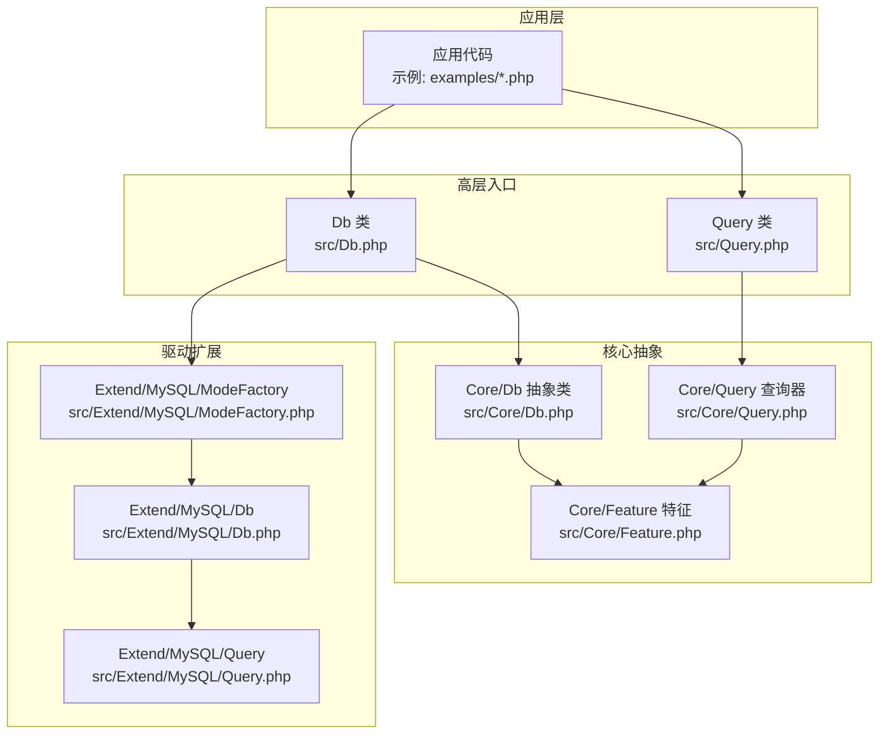
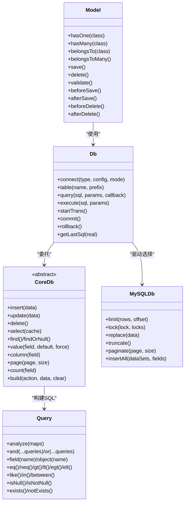
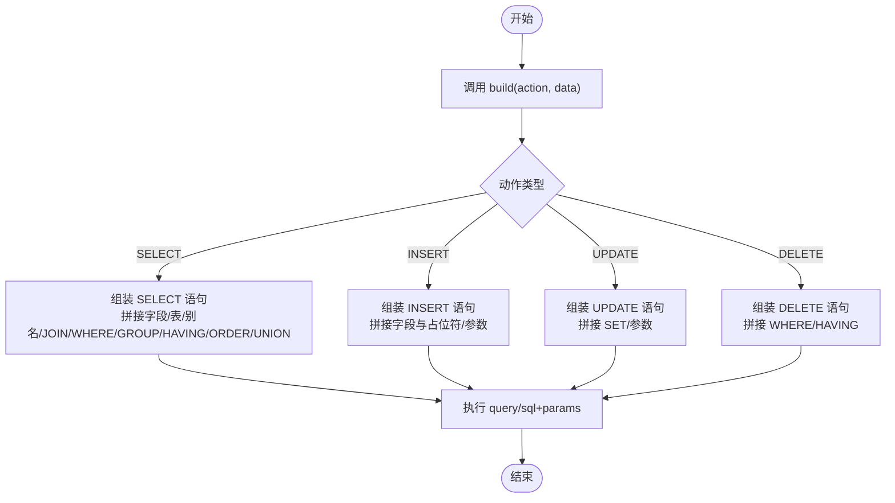
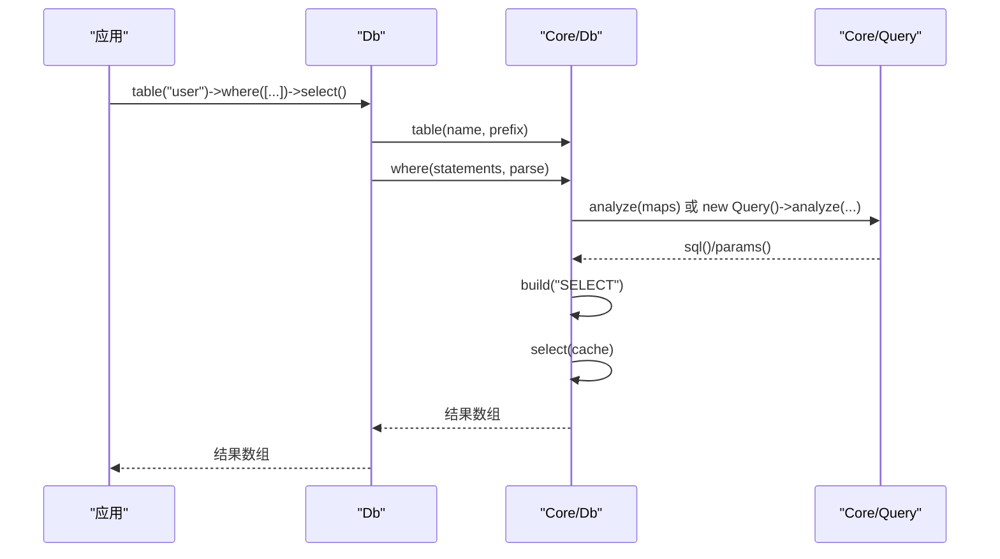
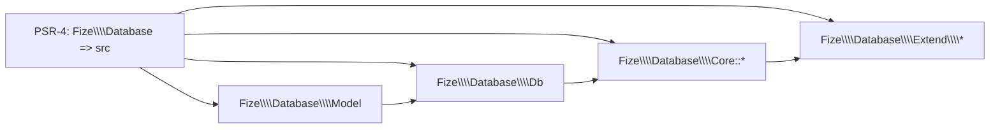

# ORM模型

<cite>
**本文引用的文件**
- [Model.php](file://src/Model.php)
- [Db.php](file://src/Db.php)
- [Core/Db.php](file://src/Core/Db.php)
- [Core/Query.php](file://src/Core/Query.php)
- [Query.php](file://src/Query.php)
- [Core/Feature.php](file://src/Core/Feature.php)
- [Extend/MySQL/Db.php](file://src/Extend/MySQL/Db.php)
- [Extend/MySQL/ModeFactory.php](file://src/Extend/MySQL/ModeFactory.php)
- [Extend/MySQL/Query.php](file://src/Extend/MySQL/Query.php)
- [composer.json](file://composer.json)
- [examples/db_connect.php](file://examples/db_connect.php)
- [examples/db_select.php](file://examples/db_select.php)
- [examples/db_insert.php](file://examples/db_insert.php)
- [examples/db_update.php](file://examples/db_update.php)
- [examples/db_delete.php](file://examples/db_delete.php)
</cite>

## 目录
1. [简介](#简介)
2. [项目结构](#项目结构)
3. [核心组件](#核心组件)
4. [架构总览](#架构总览)
5. [详细组件分析](#详细组件分析)
6. [依赖分析](#依赖分析)
7. [性能考量](#性能考量)
8. [故障排查指南](#故障排查指南)
9. [结论](#结论)
10. [附录](#附录)

## 简介
本文件系统性阐述 FizeDatabase 的 ORM 模型能力与设计理念，重点覆盖：
- Model 类的设计理念与使用方法（模型定义、数据映射、关联关系）
- CRUD 封装（save、delete、validate 等方法的职责边界与调用路径）
- 生命周期钩子、事件处理、数据验证规则的扩展点
- 复杂模型关系（一对一、一对多、多对多）的实现思路与最佳实践
- 性能优化与使用建议

说明：当前仓库中 Model 类仍处于骨架状态，尚未实现具体 ORM 能力；本文基于现有代码结构与扩展机制，给出面向未来的实现蓝图与使用指导。

## 项目结构
FizeDatabase 采用“核心抽象 + 驱动扩展”的分层设计：
- 核心层：Core/Db、Core/Query、Core/Feature 提供通用数据库操作与查询器能力
- 适配层：Db、Query 作为高层入口，负责根据数据库类型动态选择具体驱动
- 驱动层：Extend/<DBType>/* 提供具体数据库方言的实现（如 MySQL、PgSQL、SQLSRV 等）
- 示例层：examples 展示典型用法（连接、查询、插入、更新、删除）

图表来源
- [Db.php:1-141](file://src/Db.php#L1-L141)
- [Query.php:1-130](file://src/Query.php#L1-L130)
- [Core/Db.php:1-800](file://src/Core/Db.php#L1-L800)
- [Core/Query.php:1-621](file://src/Core/Query.php#L1-L621)
- [Core/Feature.php:1-33](file://src/Core/Feature.php#L1-L33)
- [Extend/MySQL/Db.php:1-246](file://src/Extend/MySQL/Db.php#L1-L246)
- [Extend/MySQL/ModeFactory.php:1-82](file://src/Extend/MySQL/ModeFactory.php#L1-L82)
- [Extend/MySQL/Query.php:1-91](file://src/Extend/MySQL/Query.php#L1-L91)

章节来源
- [composer.json:1-47](file://composer.json#L1-L47)
- [Db.php:1-141](file://src/Db.php#L1-L141)
- [Query.php:1-130](file://src/Query.php#L1-L130)
- [Core/Db.php:1-800](file://src/Core/Db.php#L1-L800)
- [Core/Query.php:1-621](file://src/Core/Query.php#L1-L621)
- [Core/Feature.php:1-33](file://src/Core/Feature.php#L1-L33)
- [Extend/MySQL/Db.php:1-246](file://src/Extend/MySQL/Db.php#L1-L246)
- [Extend/MySQL/ModeFactory.php:1-82](file://src/Extend/MySQL/ModeFactory.php#L1-L82)
- [Extend/MySQL/Query.php:1-91](file://src/Extend/MySQL/Query.php#L1-L91)

## 核心组件
- Db 高层入口：提供静态方法快速建立连接、执行 SQL、管理事务、设置表与获取最后 SQL 等能力。它通过“适配器 + 工厂”模式选择具体驱动。
- Core/Db 抽象类：定义 CRUD、条件拼装、SQL 构建、分页、缓存等通用能力，并暴露抽象方法给具体驱动实现。
- Core/Query 查询器：提供数组条件解析、表达式拼装、逻辑组合（AND/OR/XOR）、IN/BETWEEN/LIKE/EXISTS 等丰富语法。
- Extend/<DBType>/*：针对不同数据库方言扩展 Db、Query、ModeFactory，实现差异化行为（如 MySQL 的 LIMIT、LOCK、REPLACE、TRUNCATE、REGEXP 等）。
- Model 骨架：当前仅声明关联关系方法（hasOne、hasMany、belongsTo、belongsToMany），尚未实现具体 ORM 功能。

章节来源
- [Db.php:1-141](file://src/Db.php#L1-L141)
- [Core/Db.php:1-800](file://src/Core/Db.php#L1-L800)
- [Core/Query.php:1-621](file://src/Core/Query.php#L1-L621)
- [Model.php:1-39](file://src/Model.php#L1-L39)

## 架构总览
ORM 模型的实现蓝图（面向未来）：
- Model 类作为实体载体，持有数据映射、验证规则、生命周期钩子、关联关系定义
- 通过 Db/Query 高层入口完成底层 CRUD 与查询构建
- 驱动层负责 SQL 方言差异与性能特性（如 MySQL 的 REPLACE、LOCK、分页策略）
- 事件与验证可通过扩展点接入（例如在 Model 中预留 validate/save/delete 钩子）

图表来源
- [Model.php:1-39](file://src/Model.php#L1-L39)
- [Db.php:1-141](file://src/Db.php#L1-L141)
- [Core/Db.php:1-800](file://src/Core/Db.php#L1-L800)
- [Core/Query.php:1-621](file://src/Core/Query.php#L1-L621)
- [Extend/MySQL/Db.php:1-246](file://src/Extend/MySQL/Db.php#L1-L246)

## 详细组件分析

### Model 类设计与使用
- 关联关系方法：当前提供 hasOne、hasMany、belongsTo、belongsToMany 的方法声明，用于定义模型间关系。这些方法应在 Model 子类中被重写或扩展，以返回具体的关联对象或代理。
- CRUD 封装：建议在 Model 中提供 save、delete、validate 等方法，内部委派给 Db/Query 完成持久化与校验。
- 生命周期钩子：可在 Model 中预留 beforeSave/afterSave/beforeDelete/afterDelete 等钩子，便于在保存或删除前后执行业务逻辑。
- 数据验证：validate 方法用于校验模型属性，可结合查询器的条件能力进行唯一性、范围等规则检查。

章节来源
- [Model.php:1-39](file://src/Model.php#L1-L39)

### Db/Query 高层入口
- Db：负责建立连接、设置表、执行 SQL、管理事务、获取最后 SQL。通过“类型 + 模式”选择具体驱动（如 mysql/pdo、mysql/mysqli、mysql/odbc 等）。
- Query：静态入口，根据数据库类型构造对应方言的查询器，支持数组条件解析与多查询对象组合。

章节来源
- [Db.php:1-141](file://src/Db.php#L1-L141)
- [Query.php:1-130](file://src/Query.php#L1-L130)

### Core/Db 抽象类（CRUD 与 SQL 构建）
- 提供通用 CRUD：insert、update、delete、select、find/findOrNull、value/column、count、page 等
- SQL 构建：build(action, data, clear) 统一组装 SELECT/INSERT/UPDATE/DELETE，并支持 DISTINCT、JOIN、WHERE、GROUP/HAVING、ORDER、UNION 等
- 查询缓存：select 支持缓存最近查询结果，减少重复查询开销
- 分页与统计：count、page、find/findOrNull/value/column 等辅助方法

图表来源
- [Core/Db.php:583-637](file://src/Core/Db.php#L583-L637)
- [Core/Db.php:644-711](file://src/Core/Db.php#L644-L711)

章节来源
- [Core/Db.php:1-800](file://src/Core/Db.php#L1-L800)

### Core/Query 查询器（条件解析与组合）
- 数组条件解析：支持多种表达式（=、<>、>、<、>=、<=、LIKE、IN、BETWEEN、IS NULL、EXISTS、EXP 等），并可指定组合逻辑（AND/OR/XOR）
- 表达式与参数绑定：自动识别字符串与标量，决定是否使用占位符绑定
- 查询对象组合：qAnd/qOr/qMerge 支持复杂条件的组合

图表来源
- [Db.php:124-127](file://src/Db.php#L124-L127)
- [Db.php:335-359](file://src/Db.php#L335-L359)
- [Core/Db.php:335-359](file://src/Core/Db.php#L335-L359)
- [Core/Query.php:521-568](file://src/Core/Query.php#L521-L568)

章节来源
- [Core/Query.php:1-621](file://src/Core/Query.php#L1-L621)
- [Query.php:1-130](file://src/Query.php#L1-L130)

### 驱动扩展（以 MySQL 为例）
- Extend/MySQL/ModeFactory：根据模式（pdo/mysqli/odbc）创建具体连接实例，并设置表前缀
- Extend/MySQL/Db：扩展 LIMIT、LOCK、REPLACE、TRUNCATE、分页（SQL_CALC_FOUND_ROWS + FOUND_ROWS）等 MySQL 特性
- Extend/MySQL/Query：新增 REGEXP/RLIKE 及其否定形式，支持 XOR 组合

章节来源
- [Extend/MySQL/ModeFactory.php:1-82](file://src/Extend/MySQL/ModeFactory.php#L1-L82)
- [Extend/MySQL/Db.php:1-246](file://src/Extend/MySQL/Db.php#L1-L246)
- [Extend/MySQL/Query.php:1-91](file://src/Extend/MySQL/Query.php#L1-L91)

### 使用示例（CRUD 与查询）
- 连接与查询：展示如何初始化连接、设置表、使用数组条件查询、打印最后 SQL
- 插入：演示 insert、insertGetId、getLastSql
- 更新：演示带原样 SQL 的更新（如字段自增）
- 删除：演示带条件删除

章节来源
- [examples/db_connect.php:1-39](file://examples/db_connect.php#L1-L39)
- [examples/db_select.php:1-22](file://examples/db_select.php#L1-L22)
- [examples/db_insert.php:1-29](file://examples/db_insert.php#L1-L29)
- [examples/db_update.php:1-22](file://examples/db_update.php#L1-L22)
- [examples/db_delete.php:1-18](file://examples/db_delete.php#L1-L18)

## 依赖分析
- Composer 自动加载：PSR-4 映射 Fize\Database 到 src，确保 Db/Model/Core/*、Extend/* 均可按命名空间加载
- 依赖关系：Db/Query 依赖 Core/*；驱动层依赖 Core/Feature 进行字段/表名格式化；Db 通过 ModeFactory 选择具体驱动

图表来源
- [composer.json:11-14](file://composer.json#L11-L14)

章节来源
- [composer.json:1-47](file://composer.json#L1-L47)

## 性能考量
- 查询缓存：Core/Db 的 select 支持缓存最近查询结果，避免重复查询相同 SQL
- 参数绑定：Query/Db 在解析条件与插入/更新时使用占位符绑定，降低 SQL 注入风险并提升执行计划复用
- 分页策略：MySQL 驱动提供 SQL_CALC_FOUND_ROWS + FOUND_ROWS 的分页方案，减少二次 COUNT 查询
- 批量插入：MySQL 驱动提供 insertAll，支持批量写入，减少往返次数
- LIMIT 与锁：MySQL 驱动支持 LIMIT 与表级写锁，合理使用可控制资源占用

章节来源
- [Core/Db.php:700-711](file://src/Core/Db.php#L700-L711)
- [Extend/MySQL/Db.php:187-203](file://src/Extend/MySQL/Db.php#L187-L203)
- [Extend/MySQL/Db.php:237-244](file://src/Extend/MySQL/Db.php#L237-L244)
- [Extend/MySQL/Db.php:36-44](file://src/Extend/MySQL/Db.php#L36-L44)

## 故障排查指南
- SQL 注入与安全：避免直接拼接用户输入；优先使用占位符绑定；getLastSql(real) 仅用于日志输出，不可直接执行
- 记录不存在：find 未找到会抛出异常，findOrNull 返回 null；根据业务选择合适的方法
- 事务嵌套：startTrans/commit/rollback 支持嵌套计数，确保正确提交/回滚
- 驱动模式：ModeFactory 仅支持已注册模式，错误模式会抛出异常

章节来源
- [Core/Db.php:199-206](file://src/Core/Db.php#L199-L206)
- [Core/Db.php:733-740](file://src/Core/Db.php#L733-L740)
- [Db.php:84-114](file://src/Db.php#L84-L114)
- [Extend/MySQL/ModeFactory.php:75-77](file://src/Extend/MySQL/ModeFactory.php#L75-L77)

## 结论
- 当前仓库的 Model 类尚为骨架，ORM 能力需在 Model 子类中逐步实现（CRUD、验证、钩子、关联）
- Db/Query 与 Core/Db/Query 提供了完善的 SQL 构建与执行能力，配合驱动扩展可覆盖主流数据库方言
- 建议以 Model 为中心，围绕数据映射、验证规则、生命周期钩子与关联关系进行扩展，形成完整的 ORM 使用体验

## 附录
- 快速上手步骤
  1) 初始化连接：new Db('mysql', $config, 'pdo')
  2) 指定表：Db::table('user')
  3) 设置条件：->where(['name' => ['LIKE', '%值%']])
  4) 执行查询：->select() 或 ->find()/findOrNull()
  5) 执行变更：->insert()/update()/delete()
  6) 查看 SQL：Db::getLastSql(true)

章节来源
- [examples/db_connect.php:14-22](file://examples/db_connect.php#L14-L22)
- [examples/db_select.php:15-21](file://examples/db_select.php#L15-L21)
- [examples/db_insert.php:20-28](file://examples/db_insert.php#L20-L28)
- [examples/db_update.php:15-21](file://examples/db_update.php#L15-L21)
- [examples/db_delete.php:15-17](file://examples/db_delete.php#L15-L17)