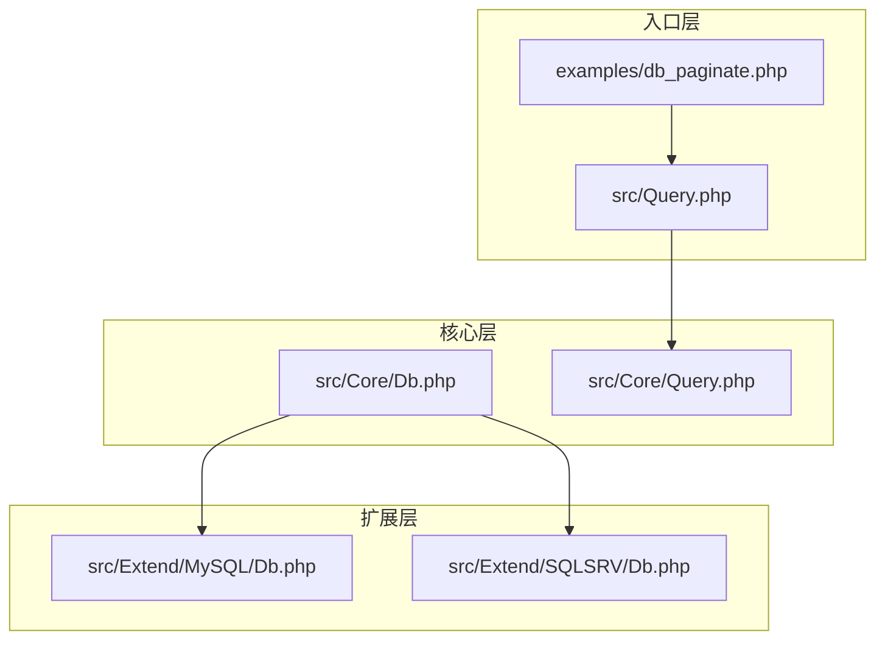
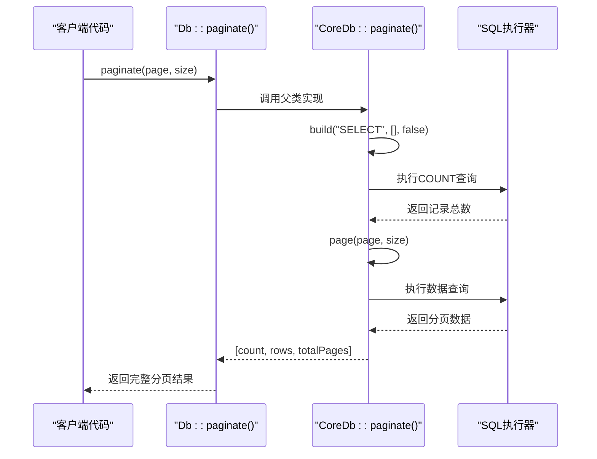
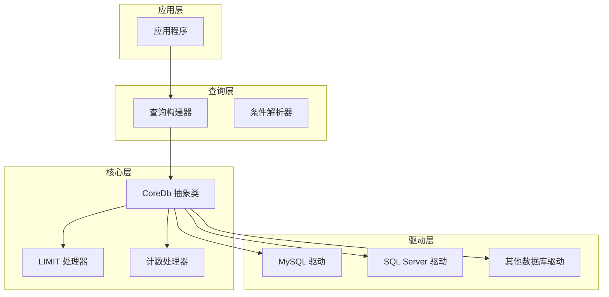
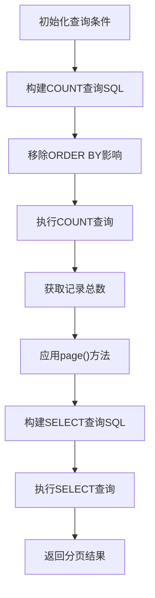
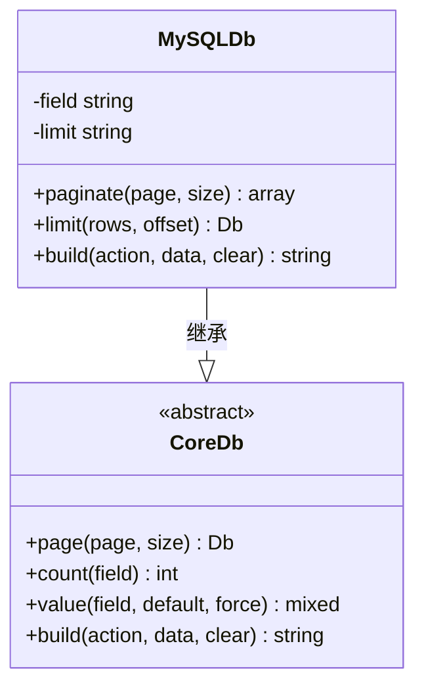
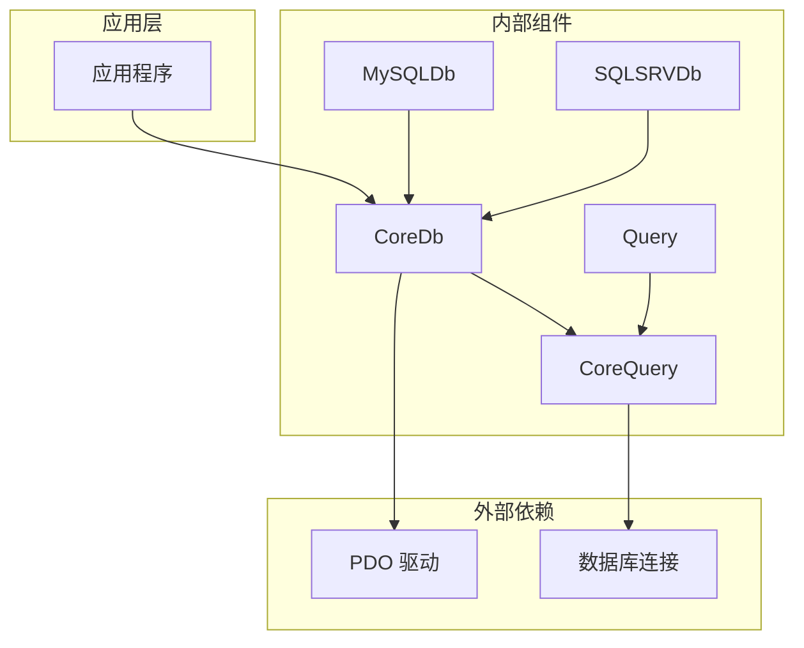
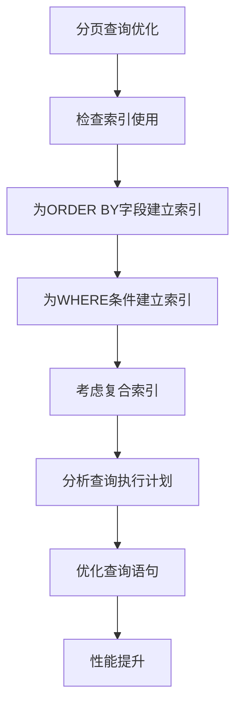

# 分页查询

<cite>
**本文档引用的文件**
- [src/Core/Db.php](file://src/Core/Db.php)
- [src/Extend/MySQL/Db.php](file://src/Extend/MySQL/Db.php)
- [src/Extend/SQLSRV/Db.php](file://src/Extend/SQLSRV/Db.php)
- [src/Core/Query.php](file://src/Core/Query.php)
- [src/Query.php](file://src/Query.php)
- [examples/db_paginate.php](file://examples/db_paginate.php)
</cite>

## 目录
1. [简介](#简介)
2. [项目结构](#项目结构)
3. [核心组件](#核心组件)
4. [架构概览](#架构概览)
5. [详细组件分析](#详细组件分析)
6. [依赖关系分析](#依赖关系分析)
7. [性能考虑](#性能考虑)
8. [故障排除指南](#故障排除指南)
9. [结论](#结论)

## 简介

FizeDatabase 是一个基于 PHP 的数据库访问层框架，提供了强大的分页查询功能。本文档深入介绍了分页查询的实现原理，包括 `page()` 方法的工作机制、页码计算、偏移量处理以及 LIMIT 语句的生成。同时详细说明了分页查询的链式调用模式，以及如何与 `count()` 方法结合实现完整的分页逻辑。

## 项目结构

FizeDatabase 采用模块化设计，主要包含以下关键目录和文件：



**图表来源**
- [src/Core/Db.php:1-941](file://src/Core/Db.php#L1-L941)
- [src/Extend/MySQL/Db.php:1-246](file://src/Extend/MySQL/Db.php#L1-L246)
- [src/Extend/SQLSRV/Db.php:207-230](file://src/Extend/SQLSRV/Db.php#L207-L230)

**章节来源**
- [src/Core/Db.php:1-941](file://src/Core/Db.php#L1-L941)
- [src/Extend/MySQL/Db.php:1-246](file://src/Extend/MySQL/Db.php#L1-L246)
- [src/Extend/SQLSRV/Db.php:207-230](file://src/Extend/SQLSRV/Db.php#L207-L230)

## 核心组件

### 分页查询核心实现

FizeDatabase 的分页查询功能主要由以下核心组件构成：

1. **CoreDb 类** - 提供基础的分页查询方法
2. **MySQLDb 类** - MySQL 特定的分页实现
3. **SQLSRVDb 类** - SQL Server 特定的分页实现
4. **Query 类** - 查询条件构建器

### 分页方法详解

#### page() 方法实现

`page()` 方法是分页查询的核心，负责将页码转换为 LIMIT 语句：

```mermaid
flowchart TD
Start([page() 方法调用]) --> ValidatePage["验证页码参数"]
ValidatePage --> CalcOffset["计算偏移量<br/>offset = (page - 1) * size"]
CalcOffset --> CallLimit["调用 limit() 方法<br/>limit(size, offset)"]
CallLimit --> ReturnThis["返回当前对象<br/>支持链式调用"]
ReturnThis --> End([方法结束])
```

**图表来源**
- [src/Core/Db.php:784-789](file://src/Core/Db.php#L784-L789)

#### paginate() 方法实现

`paginate()` 方法实现了完整的分页逻辑，包括计数查询和数据查询：



**图表来源**
- [src/Core/Db.php:891-908](file://src/Core/Db.php#L891-L908)

**章节来源**
- [src/Core/Db.php:784-789](file://src/Core/Db.php#L784-L789)
- [src/Core/Db.php:891-908](file://src/Core/Db.php#L891-L908)

## 架构概览

FizeDatabase 采用了分层架构设计，确保了良好的可扩展性和维护性：



**图表来源**
- [src/Core/Db.php:1-941](file://src/Core/Db.php#L1-L941)
- [src/Extend/MySQL/Db.php:1-246](file://src/Extend/MySQL/Db.php#L1-L246)
- [src/Extend/SQLSRV/Db.php:207-230](file://src/Extend/SQLSRV/Db.php#L207-L230)

## 详细组件分析

### CoreDb 抽象类分析

CoreDb 是整个分页查询系统的核心抽象类，定义了所有数据库操作的基础接口：

#### 关键属性说明

| 属性名 | 类型 | 描述 |
|--------|------|------|
| `field` | string | SELECT 语句中要返回的字段 |
| `where` | string | WHERE 条件语句 |
| `order` | string | ORDER BY 排序条件 |
| `limit` | string | LIMIT 语句内容 |
| `params` | array | SQL 参数绑定数组 |

#### 分页查询流程



**图表来源**
- [src/Core/Db.php:891-908](file://src/Core/Db.php#L891-L908)

**章节来源**
- [src/Core/Db.php:1-941](file://src/Core/Db.php#L1-L941)

### MySQLDb 特定实现

MySQL 驱动提供了优化的分页查询实现，使用 `SQL_CALC_FOUND_ROWS` 和 `FOUND_ROWS()` 函数：

#### MySQL 分页优势

1. **单次查询优化** - 使用 `SQL_CALC_FOUND_ROWS` 在一次查询中获取数据和总数
2. **性能提升** - 避免了两次独立的 COUNT 查询
3. **准确性保证** - 确保数据查询和计数查询的一致性

#### 实现细节



**图表来源**
- [src/Extend/MySQL/Db.php:11-246](file://src/Extend/MySQL/Db.php#L11-L246)
- [src/Core/Db.php:13-941](file://src/Core/Db.php#L13-L941)

**章节来源**
- [src/Extend/MySQL/Db.php:187-203](file://src/Extend/MySQL/Db.php#L187-L203)

### SQLSRVDb 特定实现

SQL Server 驱动提供了针对 SQL Server 的分页查询优化：

#### SQL Server 分页特点

1. **兼容性处理** - 自动清理不必要的中间字段
2. **版本适配** - 支持不同版本 SQL Server 的特性
3. **性能优化** - 针对 SQL Server 的查询计划优化

**章节来源**
- [src/Extend/SQLSRV/Db.php:216-229](file://src/Extend/SQLSRV/Db.php#L216-L229)

### Query 类分析

Query 类提供了灵活的查询条件构建能力：

#### 条件构建方法

| 方法名 | 功能描述 | 使用场景 |
|--------|----------|----------|
| `eq()` | 等于条件 | `where(['status' => 1])` |
| `gt()` | 大于条件 | `where(['age' => ['>' => 18]])` |
| `like()` | 模糊匹配 | `where(['name' => ['like' => '%张%']])` |
| `in()` | 包含匹配 | `where(['id' => ['in' => [1,2,3]]])` |
| `between()` | 范围查询 | `where(['date' => ['between' => ['2023-01-01','2023-12-31']]])` |

**章节来源**
- [src/Core/Query.php:145-512](file://src/Core/Query.php#L145-L512)

## 依赖关系分析

### 组件依赖图



**图表来源**
- [src/Core/Db.php:1-941](file://src/Core/Db.php#L1-L941)
- [src/Extend/MySQL/Db.php:1-246](file://src/Extend/MySQL/Db.php#L1-L246)
- [src/Extend/SQLSRV/Db.php:207-230](file://src/Extend/SQLSRV/Db.php#L207-L230)

### 关键依赖关系

1. **CoreDb → CoreQuery**: 查询条件解析依赖
2. **MySQLDb → CoreDb**: MySQL 特定实现继承
3. **SQLSRVDb → CoreDb**: SQL Server 特定实现继承
4. **Query → CoreQuery**: 查询构建器依赖

**章节来源**
- [src/Core/Db.php:335-359](file://src/Core/Db.php#L335-L359)
- [src/Extend/MySQL/Db.php:11-246](file://src/Extend/MySQL/Db.php#L11-L246)

## 性能考虑

### 分页查询性能优化策略

#### 1. 索引优化



#### 2. 查询优化技巧

| 优化策略 | 实现方式 | 性能收益 |
|----------|----------|----------|
| 延迟关联 | 使用子查询先筛选再关联 | 显著提升大表分页性能 |
| 覆盖索引 | 查询字段包含在索引中 | 减少回表操作 |
| 分页深度优化 | 使用游标分页替代 OFFSET | 大数据量场景性能提升明显 |

#### 3. 内存管理

- **批量处理**: 对于大量数据的分页，建议使用批量处理策略
- **缓存机制**: 合理使用查询缓存减少重复查询
- **连接池**: 在高并发场景下使用连接池管理数据库连接

## 故障排除指南

### 常见问题及解决方案

#### 1. 分页结果异常

**问题**: 分页查询返回空结果或结果不正确

**解决方案**:
- 检查 WHERE 条件是否正确
- 验证 ORDER BY 字段是否存在
- 确认页码和每页大小参数的有效性

#### 2. 性能问题

**问题**: 大数据量分页查询响应缓慢

**解决方案**:
- 为常用查询字段建立合适的索引
- 考虑使用游标分页替代传统的 OFFSET 方式
- 优化查询条件，避免全表扫描

#### 3. 内存溢出

**问题**: 处理大量数据时出现内存不足

**解决方案**:
- 使用流式处理方式逐条处理数据
- 合理设置每页大小
- 及时释放不再使用的变量

**章节来源**
- [src/Core/Db.php:891-908](file://src/Core/Db.php#L891-L908)

## 结论

FizeDatabase 的分页查询功能通过精心设计的架构和优化的实现，为开发者提供了强大而灵活的分页解决方案。其核心优势包括：

1. **链式调用模式**: 提供流畅的 API 使用体验
2. **多数据库支持**: 统一的接口支持多种数据库系统
3. **性能优化**: 针对不同数据库的特定优化
4. **扩展性强**: 易于添加新的数据库驱动支持

通过合理使用这些功能，开发者可以轻松实现高效、可靠的分页查询，满足各种应用场景的需求。