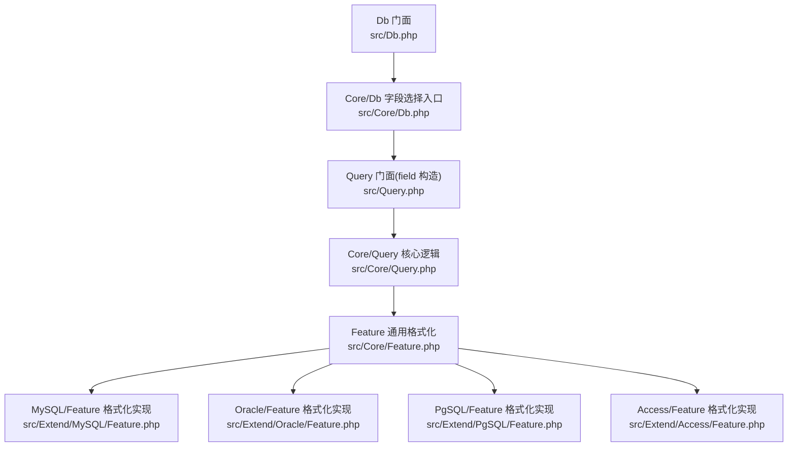
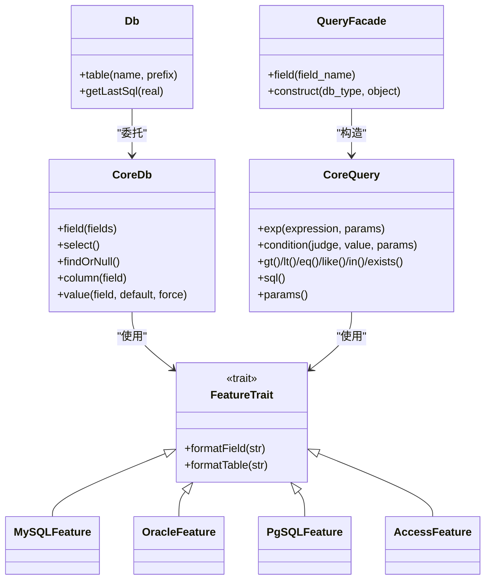
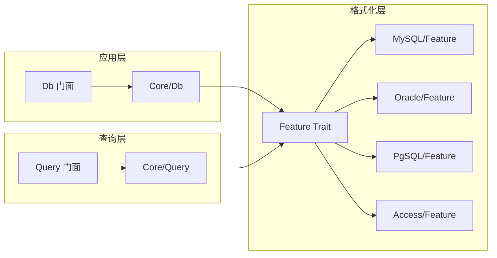

# 字段选择

<cite>
**本文档引用的文件**
- [src/Query.php](file://src/Query.php)
- [src/Core/Query.php](file://src/Core/Query.php)
- [src/Core/Feature.php](file://src/Core/Feature.php)
- [src/Extend/MySQL/Feature.php](file://src/Extend/MySQL/Feature.php)
- [src/Extend/MySQL/Query.php](file://src/Extend/MySQL/Query.php)
- [src/Extend/Oracle/Feature.php](file://src/Extend/Oracle/Feature.php)
- [src/Extend/PgSQL/Feature.php](file://src/Extend/PgSQL/Feature.php)
- [src/Extend/Access/Feature.php](file://src/Extend/Access/Feature.php)
- [src/Core/Db.php](file://src/Core/Db.php)
- [src/Db.php](file://src/Db.php)
- [examples/db_select.php](file://examples/db_select.php)
- [tests/Core/TestQuery.php](file://tests/Core/TestQuery.php)
</cite>

## 目录
1. [简介](#简介)
2. [项目结构](#项目结构)
3. [核心组件](#核心组件)
4. [架构总览](#架构总览)
5. [详细组件分析](#详细组件分析)
6. [依赖关系分析](#依赖关系分析)
7. [性能考量](#性能考量)
8. [故障排查指南](#故障排查指南)
9. [结论](#结论)
10. [附录](#附录)

## 简介
本篇文档聚焦于 FizeDatabase 的“字段选择”能力，系统阐述以下内容：
- field() 方法的多种使用方式与适用场景（字符串直选、数组批量、别名设置）
- 字段格式化规则（标识符引用与转义策略）及不同数据库方言的差异
- 复杂字段选择实践（表达式字段、聚合函数、子查询字段）
- 字段选择对查询性能的影响与优化建议

## 项目结构
围绕字段选择功能，关键代码分布在如下模块：
- 查询器门面与构造：src/Query.php
- 核心查询器与通用逻辑：src/Core/Query.php
- 通用格式化特征：src/Core/Feature.php
- 各数据库方言格式化实现：MySQL/Feature.php、Oracle/Feature.php、PgSQL/Feature.php、Access/Feature.php
- 数据库访问门面与字段选择入口：src/Db.php、src/Core/Db.php
- 示例与测试：examples/db_select.php、tests/Core/TestQuery.php

图表来源
- [src/Db.php:1-141](file://src/Db.php#L1-L141)
- [src/Core/Db.php:219-789](file://src/Core/Db.php#L219-L789)
- [src/Query.php:1-130](file://src/Query.php#L1-L130)
- [src/Core/Query.php:1-621](file://src/Core/Query.php#L1-L621)
- [src/Core/Feature.php:1-33](file://src/Core/Feature.php#L1-L33)
- [src/Extend/MySQL/Feature.php:1-57](file://src/Extend/MySQL/Feature.php#L1-L57)
- [src/Extend/Oracle/Feature.php:1-47](file://src/Extend/Oracle/Feature.php#L1-L47)
- [src/Extend/PgSQL/Feature.php:1-31](file://src/Extend/PgSQL/Feature.php#L1-L31)
- [src/Extend/Access/Feature.php:1-50](file://src/Extend/Access/Feature.php#L1-L50)

章节来源
- [src/Db.php:1-141](file://src/Db.php#L1-L141)
- [src/Core/Db.php:219-789](file://src/Core/Db.php#L219-L789)
- [src/Query.php:1-130](file://src/Query.php#L1-L130)
- [src/Core/Query.php:1-621](file://src/Core/Query.php#L1-L621)
- [src/Core/Feature.php:1-33](file://src/Core/Feature.php#L1-L33)
- [src/Extend/MySQL/Feature.php:1-57](file://src/Extend/MySQL/Feature.php#L1-L57)
- [src/Extend/Oracle/Feature.php:1-47](file://src/Extend/Oracle/Feature.php#L1-L47)
- [src/Extend/PgSQL/Feature.php:1-31](file://src/Extend/PgSQL/Feature.php#L1-L31)
- [src/Extend/Access/Feature.php:1-50](file://src/Extend/Access/Feature.php#L1-L50)

## 核心组件
- Db 门面：对外提供便捷静态方法，内部委托 Core/Db 完成具体操作。
- Core/Db：提供 field() 字段选择入口，支持字符串或数组两种输入；数组时按“别名=>实际字段”的映射进行格式化与拼接。
- Query 门面：提供 field() 静态方法，用于快速构造针对“条件字段”的 Query 对象（与 Core/Db 的字段选择不同维度）。
- Core/Query：通用查询器，负责条件表达式的拼装与参数绑定；其内部通过 formatField 对字段名进行格式化。
- Feature 系列：各数据库方言的 formatField/formatTable 实现，决定字段与表名的引用与转义策略。

章节来源
- [src/Db.php:1-141](file://src/Db.php#L1-L141)
- [src/Core/Db.php:219-789](file://src/Core/Db.php#L219-L789)
- [src/Query.php:1-130](file://src/Query.php#L1-L130)
- [src/Core/Query.php:1-621](file://src/Core/Query.php#L1-L621)
- [src/Core/Feature.php:1-33](file://src/Core/Feature.php#L1-L33)

## 架构总览
字段选择在不同层的职责划分：
- 应用层（Db 门面）：通过 Core/Db 的 field() 接收用户输入，完成字段列表的格式化与拼接。
- 方言层（Feature）：根据数据库类型决定字段名是否加引号、如何处理别名、是否允许表达式等。
- 查询器层（Core/Query）：提供 exp/condition 等方法，支持表达式字段、聚合、子查询等复杂场景。

图表来源
- [src/Db.php:1-141](file://src/Db.php#L1-L141)
- [src/Core/Db.php:219-789](file://src/Core/Db.php#L219-L789)
- [src/Query.php:1-130](file://src/Query.php#L1-L130)
- [src/Core/Query.php:1-621](file://src/Core/Query.php#L1-L621)
- [src/Core/Feature.php:1-33](file://src/Core/Feature.php#L1-L33)
- [src/Extend/MySQL/Feature.php:1-57](file://src/Extend/MySQL/Feature.php#L1-L57)
- [src/Extend/Oracle/Feature.php:1-47](file://src/Extend/Oracle/Feature.php#L1-L47)
- [src/Extend/PgSQL/Feature.php:1-31](file://src/Extend/PgSQL/Feature.php#L1-L31)
- [src/Extend/Access/Feature.php:1-50](file://src/Extend/Access/Feature.php#L1-L50)

## 详细组件分析

### Db::field() 字段选择入口
- 输入支持：
  - 字符串：原样作为 SELECT 子句的一部分（可用于表达式、聚合、子查询等）。
  - 数组：支持“别名=>实际字段”的映射，自动拼接 AS 别名。
- 输出：
  - 将格式化后的字段串保存至 Core/Db 的内部状态，供 select/findOrNull/column/value 等方法使用。
- 关键行为：
  - 数组遍历时，若键为整数则仅格式化字段；若键为字符串则作为别名进行格式化并拼接 AS。
  - 通过 Core/Db 的 formatField 对字段名进行方言化处理。

章节来源
- [src/Core/Db.php:219-244](file://src/Core/Db.php#L219-L244)

### Core/Db 与 Core/Query 的协作
- Core/Db.field() 仅负责字段列表的格式化与拼接。
- 复杂条件（表达式、聚合、子查询）由 Core/Query.exp()/condition() 等方法完成，并通过 Core/Db.where() 等方法接入查询构建流程。

章节来源
- [src/Core/Db.php:219-789](file://src/Core/Db.php#L219-L789)
- [src/Core/Query.php:108-164](file://src/Core/Query.php#L108-L164)

### Query 门面与 Core/Query 的字段选择
- Query::field() 是对 Core/Query::object()/field() 的便捷封装，用于快速构造“条件字段”的 Query 对象。
- Core/Query::field() 会调用 formatField 对字段名进行格式化，随后参与条件表达式的拼装。

章节来源
- [src/Query.php:60-63](file://src/Query.php#L60-L63)
- [src/Core/Query.php:82-85](file://src/Core/Query.php#L82-L85)
- [src/Core/Query.php:66-74](file://src/Core/Query.php#L66-L74)

### 字段格式化规则与方言差异
- 通用规则（Feature Trait）：
  - 若字段为通配符“*”，保持不变。
  - 已带引号的字段名直接返回。
  - 包含空格、括号、SELECT、AS 等关键字或表达式特征的字符串，视为表达式，不做引号包裹。
  - 其他普通字段名按方言添加引号。
- MySQL：
  - 使用反引号包裹字段与表名；表达式与 AS、SELECT、带括号的子句保持原样。
- Oracle：
  - 使用双引号包裹；表达式与 AS、SELECT 保持原样。
- PostgreSQL：
  - 使用双引号包裹；表达式与 AS、SELECT 保持原样。
- Access：
  - 使用方括号包裹；表达式与 AS、SELECT 保持原样。

章节来源
- [src/Core/Feature.php:24-31](file://src/Core/Feature.php#L24-L31)
- [src/Extend/MySQL/Feature.php:32-55](file://src/Extend/MySQL/Feature.php#L32-L55)
- [src/Extend/Oracle/Feature.php:29-45](file://src/Extend/Oracle/Feature.php#L29-L45)
- [src/Extend/PgSQL/Feature.php:21-29](file://src/Extend/PgSQL/Feature.php#L21-L29)
- [src/Extend/Access/Feature.php:29-48](file://src/Extend/Access/Feature.php#L29-L48)

### field() 方法的多种使用方式

#### 字符串直接指定
- 适用于表达式字段、聚合函数、子查询等复杂场景。
- 示例路径：[tests/Core/TestQuery.php:505-522](file://tests/Core/TestQuery.php#L505-L522)

章节来源
- [tests/Core/TestQuery.php:505-522](file://tests/Core/TestQuery.php#L505-L522)

#### 数组格式化
- 支持批量字段选择与别名设置。
- 示例路径：[src/Core/Db.php:230-239](file://src/Core/Db.php#L230-L239)

章节来源
- [src/Core/Db.php:230-239](file://src/Core/Db.php#L230-L239)

#### 别名设置
- 数组键为别名，值为实际字段；格式化后拼接 AS。
- 示例路径：[src/Core/Db.php:236](file://src/Core/Db.php#L236)

章节来源
- [src/Core/Db.php:236](file://src/Core/Db.php#L236)

### 复杂字段选择场景

#### 表达式字段
- 使用字符串直接传入表达式，如函数、运算、条件表达式等。
- 示例路径：[tests/Core/TestQuery.php:505-522](file://tests/Core/TestQuery.php#L505-L522)

章节来源
- [tests/Core/TestQuery.php:505-522](file://tests/Core/TestQuery.php#L505-L522)

#### 聚合函数
- 在字符串中直接书写聚合函数，配合 Core/Query 的 exp/condition 等方法进行参数绑定。
- 示例路径：[tests/Core/TestQuery.php:505-522](file://tests/Core/TestQuery.php#L505-L522)

章节来源
- [tests/Core/TestQuery.php:505-522](file://tests/Core/TestQuery.php#L505-L522)

#### 子查询字段
- 将子查询作为字段表达式传入字符串，或通过 Core/Query 的 exists/notExists 等方法构建条件字段。
- 示例路径：[tests/Core/TestQuery.php:708-745](file://tests/Core/TestQuery.php#L708-L745)

章节来源
- [tests/Core/TestQuery.php:708-745](file://tests/Core/TestQuery.php#L708-L745)

### 字段选择对查询性能的影响与优化建议
- 减少不必要的字段：优先只选择需要的字段，避免使用通配符“*”，降低网络传输与解析开销。
- 控制表达式复杂度：尽量将复杂计算放在应用层或物化视图中，避免在 SELECT 中进行大量函数与子查询。
- 合理使用别名：别名仅用于展示与取值便利，不会改变底层执行计划，但过多别名可能影响可读性。
- 参数化与绑定：对于动态值，优先使用参数绑定，减少 SQL 注入风险并提升缓存命中率。
- 方言差异：不同数据库对引号与标识符的处理不同，确保字段格式化符合目标数据库规范，避免额外的解析成本。

## 依赖关系分析

图表来源
- [src/Db.php:1-141](file://src/Db.php#L1-L141)
- [src/Core/Db.php:219-789](file://src/Core/Db.php#L219-L789)
- [src/Query.php:1-130](file://src/Query.php#L1-L130)
- [src/Core/Query.php:1-621](file://src/Core/Query.php#L1-L621)
- [src/Core/Feature.php:1-33](file://src/Core/Feature.php#L1-L33)
- [src/Extend/MySQL/Feature.php:1-57](file://src/Extend/MySQL/Feature.php#L1-L57)
- [src/Extend/Oracle/Feature.php:1-47](file://src/Extend/Oracle/Feature.php#L1-L47)
- [src/Extend/PgSQL/Feature.php:1-31](file://src/Extend/PgSQL/Feature.php#L1-L31)
- [src/Extend/Access/Feature.php:1-50](file://src/Extend/Access/Feature.php#L1-L50)

## 性能考量
- 字段数量与宽度：字段越多、宽度越大，序列化与网络传输成本越高。建议仅选择必要字段。
- 表达式与函数：在 SELECT 中使用函数与表达式会增加 CPU 与内存消耗，尽量在应用层处理或使用物化视图。
- 子查询：子查询字段可能带来额外的扫描与连接成本，应评估是否可改写为 JOIN 或临时表。
- 参数化：使用参数绑定可提升执行计划复用率，减少编译与优化开销。
- 方言适配：正确的标识符引用可避免因转义或大小写导致的隐式转换，从而减少额外开销。

## 故障排查指南
- 字段名被错误转义：
  - 现象：字段名被加引号导致查询失败或大小写不匹配。
  - 排查：确认字段是否包含空格、括号、SELECT、AS 等特征；若为表达式，应使用字符串直接传入。
  - 参考：各方言的 formatField 实现。
- 别名无效或冲突：
  - 现象：别名无法正确映射或与保留字冲突。
  - 排查：检查别名是否为纯标识符，避免与数据库关键字冲突；必要时使用目标数据库的引号策略。
- 表达式注入或语法错误：
  - 现象：传入字符串表达式导致 SQL 语法错误。
  - 排查：确保表达式语法正确，必要时拆分为多个字段或使用参数绑定。
- 子查询字段异常：
  - 现象：子查询字段导致性能问题或结果不符合预期。
  - 排查：确认子查询独立可执行、返回单值；考虑改写为 JOIN 或物化中间结果。

章节来源
- [src/Extend/MySQL/Feature.php:32-55](file://src/Extend/MySQL/Feature.php#L32-L55)
- [src/Extend/Oracle/Feature.php:29-45](file://src/Extend/Oracle/Feature.php#L29-L45)
- [src/Extend/PgSQL/Feature.php:21-29](file://src/Extend/PgSQL/Feature.php#L21-L29)
- [src/Extend/Access/Feature.php:29-48](file://src/Extend/Access/Feature.php#L29-L48)
- [tests/Core/TestQuery.php:708-745](file://tests/Core/TestQuery.php#L708-L745)

## 结论
- Db::field() 提供了灵活的字段选择能力，既支持简单字符串表达式，也支持数组批量与别名映射。
- Core/Query 与 Query 门面分别覆盖“条件字段”与“查询构建”的不同维度，二者协同完成复杂查询的组装。
- 方言化的 formatField/formatTable 确保字段标识符在不同数据库中得到正确引用与转义。
- 在实践中，应遵循“最小字段集、合理表达式、参数化绑定、避免过度子查询”的原则，以获得更优的性能与可维护性。

## 附录

### 字段选择使用示例路径
- 字符串表达式字段示例：[tests/Core/TestQuery.php:505-522](file://tests/Core/TestQuery.php#L505-L522)
- 子查询字段示例：[tests/Core/TestQuery.php:708-745](file://tests/Core/TestQuery.php#L708-L745)
- 数组批量与别名示例：[src/Core/Db.php:230-239](file://src/Core/Db.php#L230-L239)