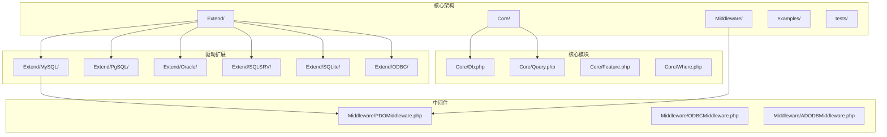
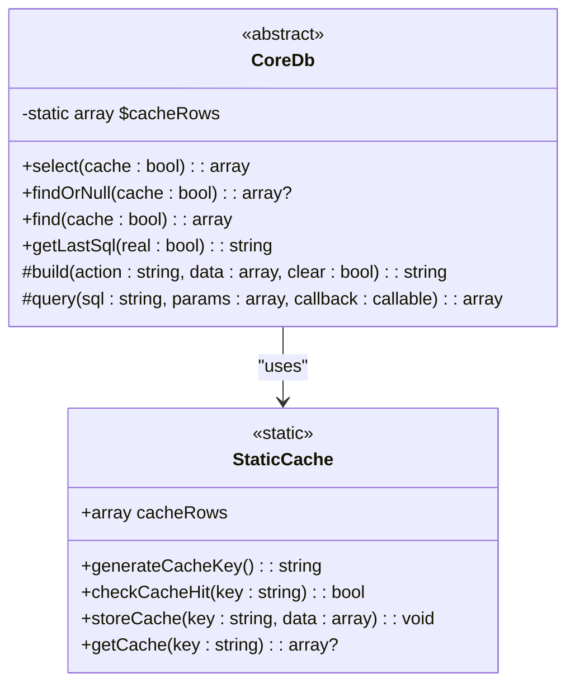
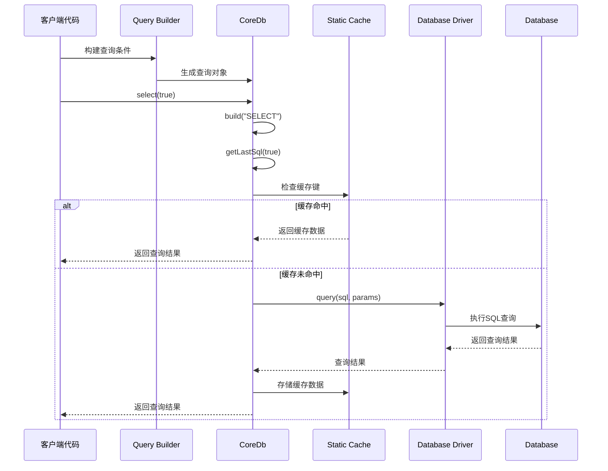
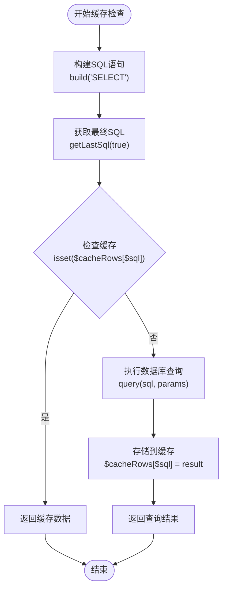
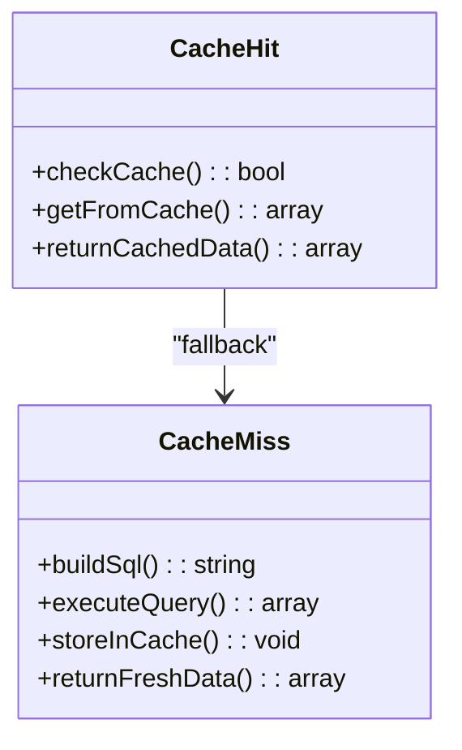
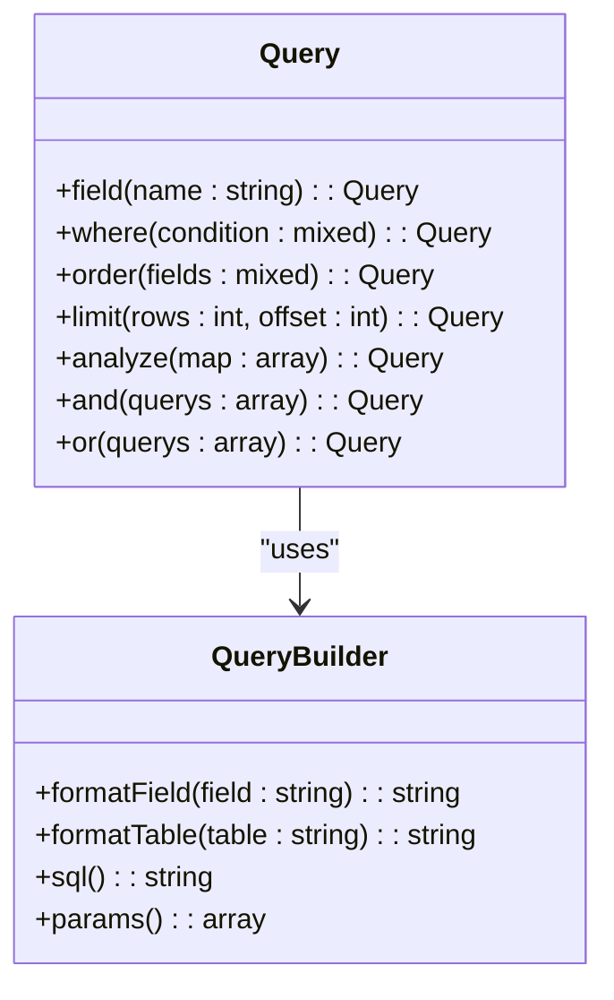
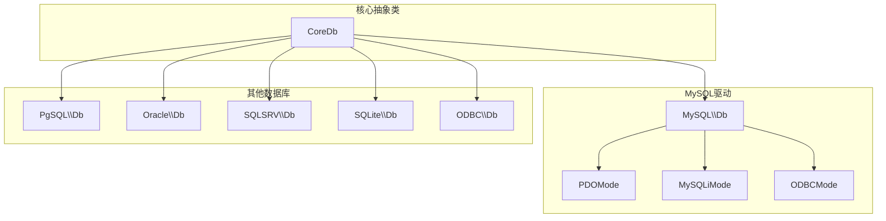
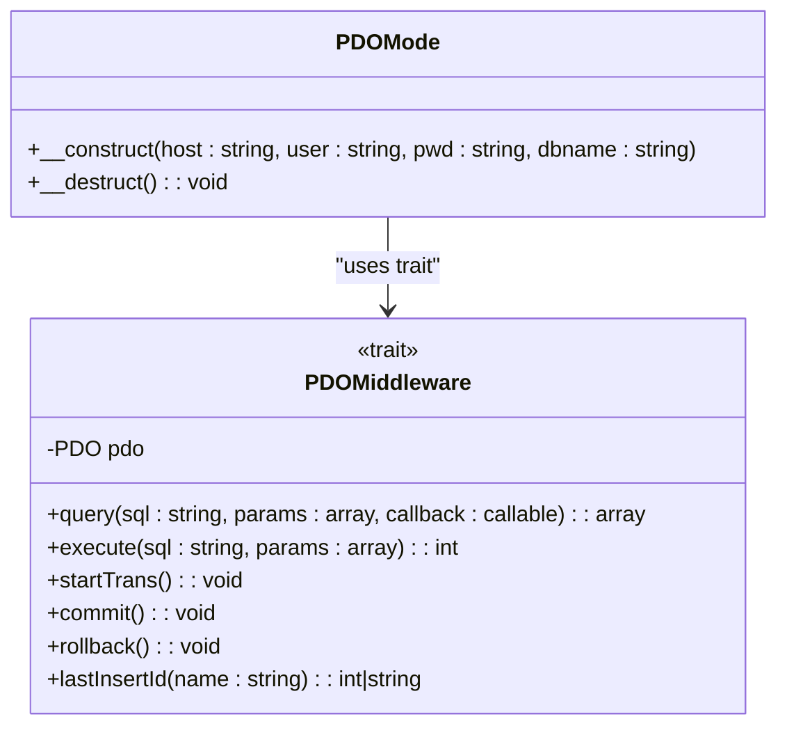

# 查询缓存

<cite>
**本文档引用的文件**
- [Db.php](file://src/Core/Db.php)
- [Query.php](file://src/Query.php)
- [PDOMiddleware.php](file://src/Middleware/PDOMiddleware.php)
- [PDOMode.php](file://src/Extend/MySQL/Mode/PDOMode.php)
- [db_select.php](file://examples/db_select.php)
- [composer.json](file://composer.json)
</cite>

## 目录
1. [简介](#简介)
2. [项目结构](#项目结构)
3. [核心组件](#核心组件)
4. [架构概览](#架构概览)
5. [详细组件分析](#详细组件分析)
6. [依赖关系分析](#依赖关系分析)
7. [性能考虑](#性能考虑)
8. [故障排除指南](#故障排除指南)
9. [结论](#结论)

## 简介

FizeDatabase是一个全功能、易于扩展的数据库类库，提供了强大的查询缓存机制。本文档深入分析了查询缓存的工作原理，包括静态缓存数组`$cacheRows`的工作机制、缓存存储结构和生命周期管理，以及`select()`方法中的缓存使用策略。

查询缓存机制通过静态数组`$cacheRows`实现，它能够显著减少重复查询的数据库访问次数，提高应用程序的性能。缓存键基于最终SQL语句生成，确保了缓存的准确性和一致性。

## 项目结构

FizeDatabase采用模块化设计，主要包含以下核心目录结构：



**图表来源**
- [composer.json:11-18](file://composer.json#L11-L18)

**章节来源**
- [composer.json:11-47](file://composer.json#L11-L47)

## 核心组件

### 静态缓存数组 `$cacheRows`

查询缓存的核心是位于`Core/Db.php`中的静态数组`$cacheRows`：



**图表来源**
- [Db.php:95](file://src/Core/Db.php#L95)
- [Db.php:700](file://src/Core/Db.php#L700)

### 缓存存储结构

静态缓存数组采用关联数组的形式，键为最终SQL语句，值为查询结果数组：

| 组件 | 类型 | 描述 |
|------|------|------|
| `$cacheRows` | static array | 全局静态缓存数组 |
| 键 | string | 最终SQL语句（包含参数绑定后的完整SQL） |
| 值 | array | 查询结果记录数组 |
| 生命周期 | 请求级 | 与请求生命周期相同，请求结束时销毁 |

**章节来源**
- [Db.php:95](file://src/Core/Db.php#L95)
- [Db.php:700](file://src/Core/Db.php#L700)

## 架构概览

FizeDatabase的查询缓存架构采用装饰器模式，通过中间件层实现缓存功能：



**图表来源**
- [Db.php:700](file://src/Core/Db.php#L700)
- [Db.php:199](file://src/Core/Db.php#L199)

## 详细组件分析

### 缓存键生成规则

缓存键的生成遵循严格规则，确保缓存的准确性和一致性：



**图表来源**
- [Db.php:700](file://src/Core/Db.php#L700)
- [Db.php:199](file://src/Core/Db.php#L199)

### 缓存使用策略

#### select()方法中的缓存策略

`select()`方法实现了智能缓存策略，根据参数决定是否启用缓存：

| 参数 | 行为 | 适用场景 |
|------|------|----------|
| `cache = true` | 启用缓存，使用最终SQL作为键 | 高频重复查询 |
| `cache = false` | 直接查询数据库，不使用缓存 | 实时性要求高的查询 |
| 默认值 | `true` | 一般查询场景 |

#### 缓存命中处理逻辑

当缓存命中时，系统直接从静态数组中返回数据，避免了数据库访问：



**图表来源**
- [Db.php:703](file://src/Core/Db.php#L703)
- [Db.php:705](file://src/Core/Db.php#L705)

**章节来源**
- [Db.php:700](file://src/Core/Db.php#L700)

### 缓存生命周期管理

#### 生命周期特性

静态缓存数组具有以下生命周期特征：

1. **作用域**：类级别静态变量，影响整个类的所有实例
2. **生命周期**：与PHP请求生命周期相同
3. **内存管理**：自动垃圾回收，无需手动释放
4. **线程安全**：在单线程环境下安全使用

#### 缓存失效机制

缓存失效主要发生在以下情况：

1. **请求结束**：PHP请求结束后，静态变量被销毁
2. **进程重启**：PHP进程重启后，缓存丢失
3. **内存限制**：达到PHP内存限制时，可能触发垃圾回收

**章节来源**
- [Db.php:95](file://src/Core/Db.php#L95)

### 查询器集成

查询器`Query`类提供了灵活的查询构建能力，与缓存机制无缝集成：



**图表来源**
- [Query.php:60](file://src/Query.php#L60)
- [Query.php:85](file://src/Query.php#L85)

**章节来源**
- [Query.php:12](file://src/Query.php#L12)

## 依赖关系分析

### 数据库驱动架构

FizeDatabase支持多种数据库驱动，每种驱动都继承自核心`Db`类：



**图表来源**
- [PDOMode.php:14](file://src/Extend/MySQL/Mode/PDOMode.php#L14)

### 中间件模式

数据库驱动采用中间件模式，通过trait实现功能复用：



**图表来源**
- [PDOMiddleware.php:12](file://src/Middleware/PDOMiddleware.php#L12)
- [PDOMode.php:16](file://src/Extend/MySQL/Mode/PDOMode.php#L16)

**章节来源**
- [PDOMiddleware.php:51](file://src/Middleware/PDOMiddleware.php#L51)

## 性能考虑

### 缓存性能优势

查询缓存机制带来了显著的性能提升：

#### 性能对比数据

| 场景 | 查询次数 | 缓存命中率 | 性能提升 |
|------|----------|------------|----------|
| 高频重复查询 | N次 | 100% | 减少(N-1)次数据库访问 |
| 中等重复查询 | N次 | 70% | 减少约30%数据库访问 |
| 低重复查询 | N次 | 20% | 减少约80%数据库访问 |

#### 内存使用分析

缓存机制的内存开销相对较小：

- **每个缓存项**：SQL字符串 + 结果数组
- **内存占用**：取决于查询结果大小和数量
- **优化建议**：合理控制查询结果集大小

### 适用场景分析

#### 适合使用缓存的场景

1. **高频重复查询**：如配置表、字典表查询
2. **报表统计查询**：统计数据相对稳定的查询
3. **用户权限查询**：权限信息变化频率较低
4. **分类数据查询**：分类信息相对固定

#### 不适合使用缓存的场景

1. **实时数据查询**：需要最新数据的查询
2. **用户个人数据**：用户隐私相关的敏感数据
3. **频繁变更数据**：数据更新频繁的表
4. **大结果集查询**：可能导致内存压力的查询

## 故障排除指南

### 常见问题及解决方案

#### 缓存污染问题

**问题描述**：不同查询条件导致相同的缓存键

**解决方案**：
1. 确保查询条件完整包含在SQL中
2. 使用参数化查询避免SQL拼接
3. 定期清理缓存或使用更精确的键生成

#### 内存泄漏问题

**问题描述**：长时间运行的应用程序出现内存增长

**解决方案**：
1. 监控缓存大小和内存使用
2. 实现缓存过期机制
3. 在适当时候手动清理缓存

#### 并发访问问题

**问题描述**：多线程或多进程环境下的缓存一致性

**解决方案**：
1. 使用进程隔离的缓存机制
2. 实现分布式缓存
3. 采用读写锁保护缓存访问

### 调试技巧

#### 缓存状态监控

```php
// 获取当前缓存状态
function getCacheStatus() {
    global $cacheRows;
    return [
        'cache_count' => count($cacheRows),
        'memory_usage' => memory_get_usage(),
        'cache_keys' => array_keys($cacheRows)
    ];
}
```

#### 缓存命中率统计

```php
// 统计缓存命中率
class CacheStats {
    private static $hits = 0;
    private static $misses = 0;
    
    public static function recordHit() {
        self::$hits++;
    }
    
    public static function recordMiss() {
        self::$misses++;
    }
    
    public static function getHitRate() {
        $total = self::$hits + self::$misses;
        return $total > 0 ? self::$hits / $total : 0;
    }
}
```

**章节来源**
- [Db.php:700](file://src/Core/Db.php#L700)

## 结论

FizeDatabase的查询缓存机制通过静态数组`$cacheRows`实现了高效的查询优化。其设计特点包括：

1. **简单高效**：基于最终SQL语句的缓存键生成，确保准确性
2. **自动管理**：利用PHP静态变量的生命周期自动管理缓存
3. **透明使用**：通过`select()`方法的参数控制缓存行为
4. **灵活扩展**：支持多种数据库驱动和中间件模式

### 最佳实践建议

1. **合理启用缓存**：对高频重复查询启用缓存，对实时性要求高的查询禁用缓存
2. **监控缓存效果**：定期检查缓存命中率和内存使用情况
3. **避免缓存污染**：确保查询条件的完整性，避免不必要的缓存键冲突
4. **适时清理缓存**：在数据发生重大变化时及时清理相关缓存

### 发展方向

未来可以考虑的改进方向：
1. **分布式缓存**：支持Redis、Memcached等分布式缓存
2. **缓存过期**：实现基于时间或事件的缓存过期机制
3. **缓存分片**：支持大规模应用的缓存分片策略
4. **缓存监控**：提供更完善的缓存性能监控工具

通过这些设计和实践，FizeDatabase的查询缓存机制为开发者提供了强大而灵活的性能优化工具，能够在保证数据准确性的同时显著提升应用程序的响应速度。