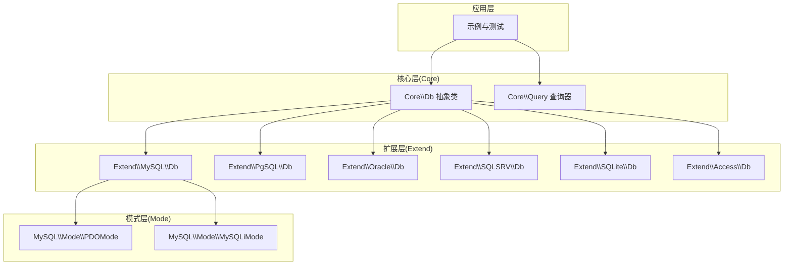
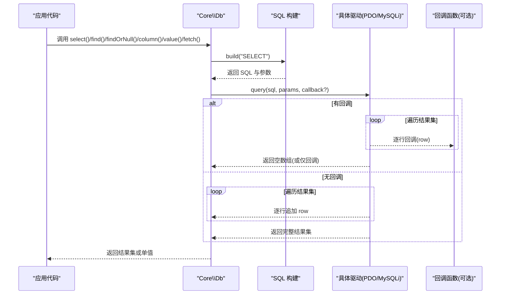
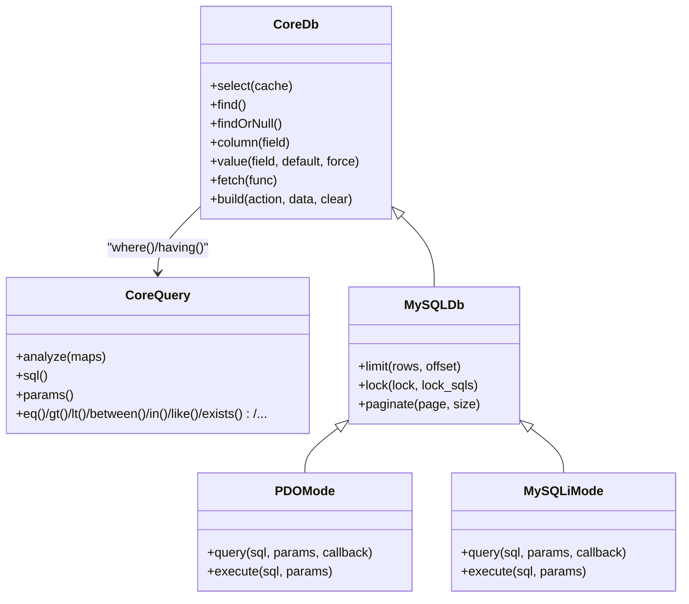

# 结果集处理

<cite>
**本文档引用的文件**
- [src/Db.php](file://src/Db.php)
- [src/Query.php](file://src/Query.php)
- [src/Core/Db.php](file://src/Core/Db.php)
- [src/Core/Query.php](file://src/Core/Query.php)
- [src/Extend/MySQL/Db.php](file://src/Extend/MySQL/Db.php)
- [src/Extend/MySQL/Mode/PDOMode.php](file://src/Extend/MySQL/Mode/PDOMode.php)
- [src/Extend/MySQL/Mode/MySQLiMode.php](file://src/Extend/MySQL/Mode/MySQLiMode.php)
- [examples/db_select.php](file://examples/db_select.php)
- [examples/db_paginate.php](file://examples/db_paginate.php)
- [tests/Core/TestQuery.php](file://tests/Core/TestQuery.php)
</cite>

## 目录
1. [简介](#简介)
2. [项目结构](#项目结构)
3. [核心组件](#核心组件)
4. [架构概览](#架构概览)
5. [详细组件分析](#详细组件分析)
6. [依赖关系分析](#依赖关系分析)
7. [性能考量](#性能考量)
8. [故障排查指南](#故障排查指南)
9. [结论](#结论)
10. [附录](#附录)

## 简介
本章节聚焦于 FizeDatabase 的结果集处理能力，系统阐述以下方法的差异与适用场景：
- select()：执行查询并返回完整结果集（支持缓存）
- find()：获取单条记录，不存在时抛出异常
- findOrNull()：获取单条记录，不存在时返回 null
- column()：按字段提取结果集的某一列，支持流式遍历
- value()：按字段获取单值，支持默认值与强制类型转换
- fetch()：遍历结果集，适合大数据量的流式处理

同时，本文将解释结果集的格式化、类型转换、数据验证与清洗策略，并给出最佳实践建议（内存优化、错误处理、数据清洗）。

## 项目结构
FizeDatabase 采用分层与扩展模式：
- Core 层：抽象数据库与查询器基类，定义通用行为与结果集处理接口
- Extend 层：按数据库类型（MySQL、PgSQL、Oracle、SQLSRV、SQLite、Access）扩展具体实现
- Mode 层：同一数据库类型下的不同连接模式（PDO、MySQLi、ODBC 等）
- 示例与测试：演示查询与分页、验证查询器行为

图表来源
- [src/Core/Db.php:13-140](file://src/Core/Db.php#L13-L140)
- [src/Core/Query.php:13-60](file://src/Core/Query.php#L13-L60)
- [src/Extend/MySQL/Db.php:11-40](file://src/Extend/MySQL/Db.php#L11-L40)
- [src/Extend/MySQL/Mode/PDOMode.php:14-42](file://src/Extend/MySQL/Mode/PDOMode.php#L14-L42)
- [src/Extend/MySQL/Mode/MySQLiMode.php:14-65](file://src/Extend/MySQL/Mode/MySQLiMode.php#L14-L65)

章节来源
- [src/Core/Db.php:13-140](file://src/Core/Db.php#L13-L140)
- [src/Core/Query.php:13-60](file://src/Core/Query.php#L13-L60)
- [src/Extend/MySQL/Db.php:11-40](file://src/Extend/MySQL/Db.php#L11-L40)

## 核心组件
- Core\\Db：定义查询构建、执行、事务、分页、聚合等通用能力；提供 select()/find()/findOrNull()/column()/value()/fetch() 等结果集处理方法
- Core\\Query：条件解析器，支持数组条件、表达式、比较运算、范围、集合、存在性等
- Extend\\MySQL\\Db：MySQL 特定扩展，覆盖 LIMIT、LOCK、分页策略等
- Mode 层：PDO/MySQLi/ODBC 等具体驱动实现，负责 query()/execute() 的底层执行与结果集遍历

章节来源
- [src/Core/Db.php:662-776](file://src/Core/Db.php#L662-L776)
- [src/Core/Query.php:13-120](file://src/Core/Query.php#L13-L120)
- [src/Extend/MySQL/Db.php:36-152](file://src/Extend/MySQL/Db.php#L36-L152)

## 架构概览
FizeDatabase 的结果集处理遵循“查询构建—SQL 生成—驱动执行—结果集遍历/收集”的流程。核心抽象类提供统一接口，具体驱动实现细节由 Mode 层完成。

图表来源
- [src/Core/Db.php:662-776](file://src/Core/Db.php#L662-L776)
- [src/Extend/MySQL/Mode/MySQLiMode.php:115-164](file://src/Extend/MySQL/Mode/MySQLiMode.php#L115-L164)
- [src/Extend/MySQL/Mode/PDOMode.php:14-53](file://src/Extend/MySQL/Mode/PDOMode.php#L14-L53)

## 详细组件分析

### select() 与 find()/findOrNull()
- select(cache=true)：构建 SELECT 语句，执行查询，返回完整结果集；当 cache=true 时，基于最终 SQL 文本进行缓存，避免重复查询
- find()：先 limit(1) 再 select()，若无记录则抛出“记录不存在”异常
- findOrNull()：先 limit(1) 再 select()，若无记录返回 null

适用场景
- 需要完整列表：使用 select()
- 期望单条记录且不存在即报错：使用 find()
- 期望单条记录且不存在返回空：使用 findOrNull()

章节来源
- [src/Core/Db.php:696-740](file://src/Core/Db.php#L696-L740)

### column(field)
- 通过 field() 指定单一字段，使用 fetch() 遍历结果集，收集该字段值形成一维数组
- 适合大数据量列提取，避免加载整行对象

适用场景
- 导出某列数据、去重统计、批量处理特定字段

章节来源
- [src/Core/Db.php:768-776](file://src/Core/Db.php#L768-L776)

### value(field, default=null, force=false)
- 通过 field() 指定单一字段，使用 findOrNull() 获取首行，取该字段值
- 若 force=true 且值可转为数值，强制转换为数字类型
- 支持默认值 fallback

适用场景
- 获取单值（如计数、最小/最大、平均值），配合聚合函数

章节来源
- [src/Core/Db.php:749-761](file://src/Core/Db.php#L749-L761)

### fetch(func)
- 构建 SELECT 语句，执行 query() 并将回调函数传给驱动层
- 驱动逐行调用回调，不累积到内存，适合超大数据量的流式处理
- 与 select() 相比，性能略优，但对外部调用不够友好

适用场景
- 流式处理（导出、清洗、转换、落库）

章节来源
- [src/Core/Db.php:663-672](file://src/Core/Db.php#L663-L672)
- [src/Extend/MySQL/Mode/MySQLiMode.php:115-164](file://src/Extend/MySQL/Mode/MySQLiMode.php#L115-L164)

### 结果集格式化、类型转换与数据验证
- 字段/表名格式化：通过 formatField()/formatTable() 规范标识符，避免 SQL 注入与兼容性问题
- 参数绑定：统一使用问号占位符与参数数组，驱动层进行类型推断与绑定
- 类型转换：value() 支持 force=true 的数值转换
- 数据验证：Query 分析器对数组条件进行严格解析，支持表达式、比较、范围、集合、存在性等，自动处理参数绑定与字符串转义

章节来源
- [src/Core/Db.php:228-244](file://src/Core/Db.php#L228-L244)
- [src/Core/Query.php:145-164](file://src/Core/Query.php#L145-L164)
- [src/Core/Query.php:295-328](file://src/Core/Query.php#L295-L328)

### 示例与用法
- 示例 db_select.php：展示 where()+limit()+select() 的基本用法与 getLastSql() 输出
- 示例 db_paginate.php：展示 paginate() 返回记录数、结果集与总页数

章节来源
- [examples/db_select.php:15-21](file://examples/db_select.php#L15-L21)
- [examples/db_paginate.php:17-21](file://examples/db_paginate.php#L17-L21)

## 依赖关系分析
- Core\\Db 依赖 Core\\Query 进行 where()/having() 条件解析
- Extend\\MySQL\\Db 在 Core\\Db 基础上扩展 LIMIT、LOCK、分页策略
- Mode 层（PDO/MySQLi）实现 query()/execute()，负责结果集遍历与回调

图表来源
- [src/Core/Db.php:662-776](file://src/Core/Db.php#L662-L776)
- [src/Core/Query.php:521-568](file://src/Core/Query.php#L521-L568)
- [src/Extend/MySQL/Db.php:36-152](file://src/Extend/MySQL/Db.php#L36-L152)
- [src/Extend/MySQL/Mode/PDOMode.php:14-53](file://src/Extend/MySQL/Mode/PDOMode.php#L14-L53)
- [src/Extend/MySQL/Mode/MySQLiMode.php:115-164](file://src/Extend/MySQL/Mode/MySQLiMode.php#L115-L164)

## 性能考量
- 流式处理优先：大数据量场景优先使用 fetch()，通过回调逐行处理，避免将全部结果集载入内存
- 缓存策略：select(cache=true) 基于最终 SQL 文本缓存结果集，减少重复查询开销
- 分页与聚合：使用 paginate() 获取总数与分页数据；聚合函数（count/sum/min/max/avg）结合 value() 获取单值，减少结果集体积
- 参数绑定：统一使用问号占位符与参数数组，避免拼接字符串带来的性能与安全问题

章节来源
- [src/Core/Db.php:696-740](file://src/Core/Db.php#L696-L740)
- [src/Core/Db.php:891-908](file://src/Core/Db.php#L891-L908)
- [src/Core/Db.php:796-845](file://src/Core/Db.php#L796-L845)

## 故障排查指南
- 记录不存在异常：find() 在无记录时抛出“记录不存在”异常，应捕获并处理
- SQL 日志：getLastSql(real=true) 可输出最终 SQL（已替换参数），便于调试
- 查询器条件解析：使用 Query.analyze() 时，确保数组格式正确；必要时使用 sql()/params() 检查生成的 SQL 与绑定参数
- 驱动错误：MySQLiMode/MySQLiMode 在 prepare/execute 失败时抛出异常，需捕获并定位 SQL 与参数问题

章节来源
- [src/Core/Db.php:733-740](file://src/Core/Db.php#L733-L740)
- [src/Core/Db.php:199-206](file://src/Core/Db.php#L199-L206)
- [src/Core/Query.php:521-568](file://src/Core/Query.php#L521-L568)
- [src/Extend/MySQL/Mode/MySQLiMode.php:115-164](file://src/Extend/MySQL/Mode/MySQLiMode.php#L115-L164)

## 结论
FizeDatabase 的结果集处理以 Core\\Db 为核心，提供 select()/find()/findOrNull()/column()/value()/fetch() 等方法，覆盖从完整列表到单值提取、从缓存到流式的多种场景。配合 Core\\Query 的强大条件解析与驱动层的统一执行，既保证了易用性，也兼顾了性能与安全性。在大数据量场景下，优先采用 fetch() 进行流式处理，并结合分页与聚合函数优化内存占用与响应时间。

## 附录

### 方法对比与使用建议
- select()：需要完整结果集时使用；开启缓存可减少重复查询
- find()/findOrNull()：需要单条记录；前者无记录抛异常，后者返回 null
- column()：提取单列数据，适合导出与统计
- value()：获取单值并可强制类型转换，适合计数与聚合
- fetch()：大数据量流式处理首选，避免内存峰值

章节来源
- [src/Core/Db.php:696-776](file://src/Core/Db.php#L696-L776)