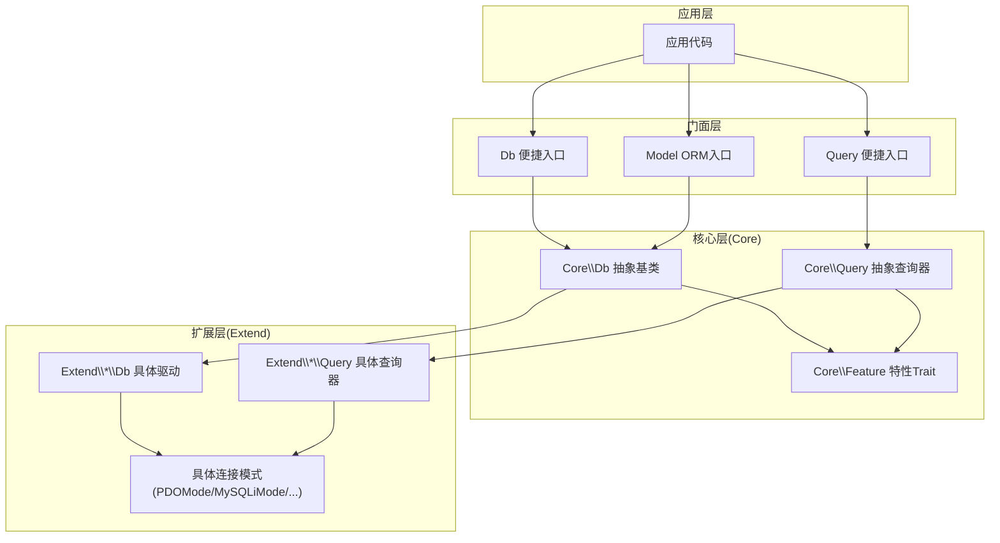
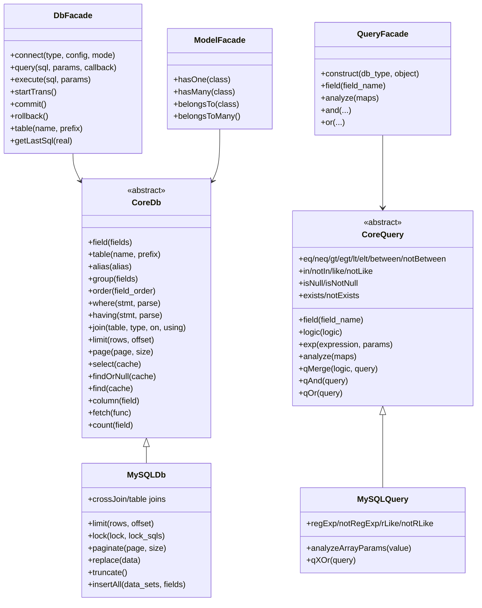
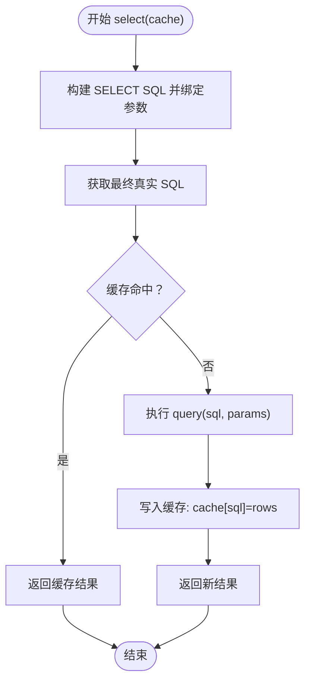
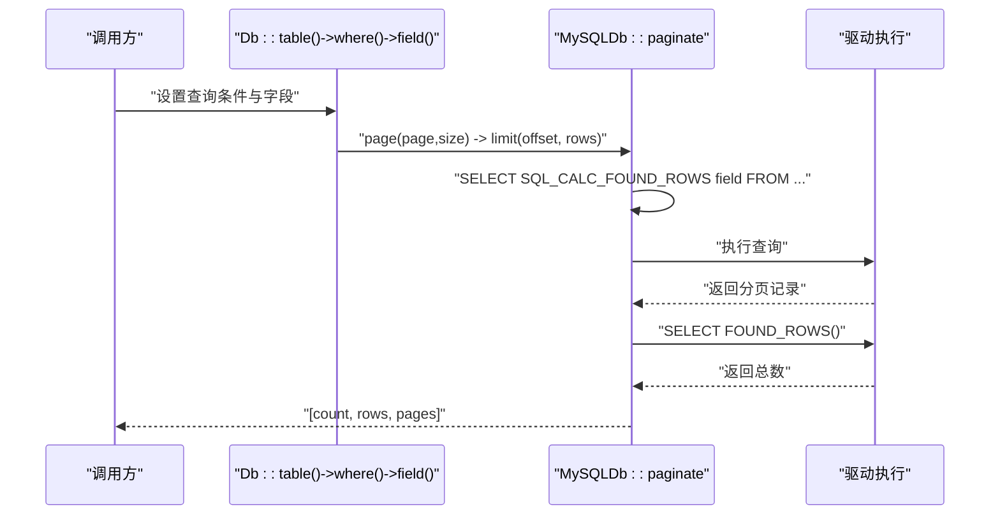
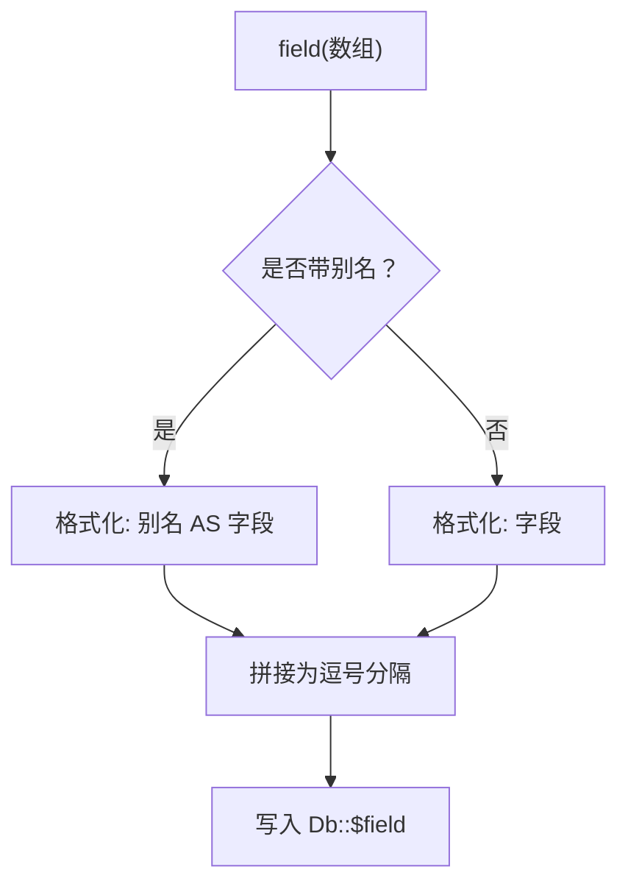
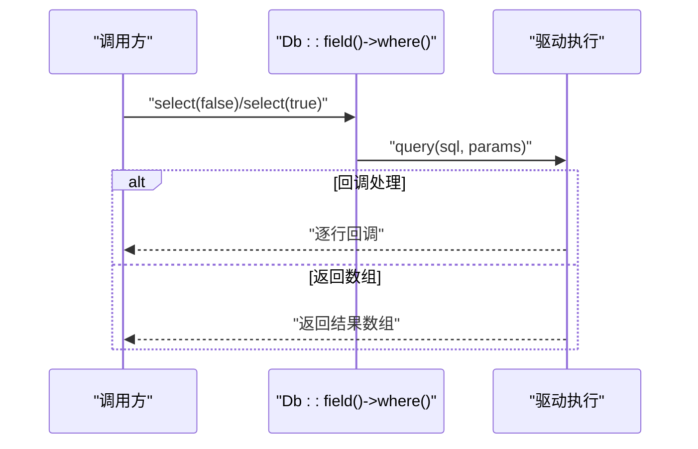
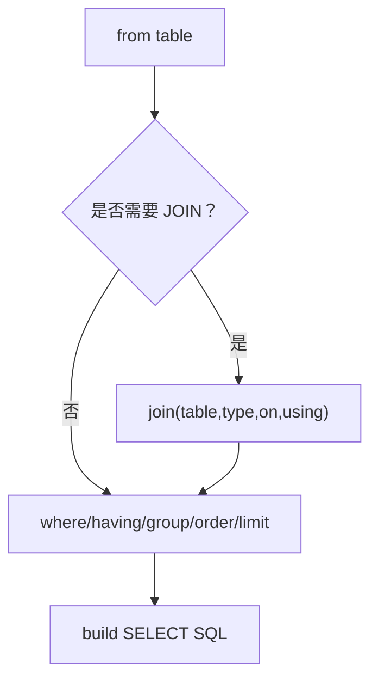
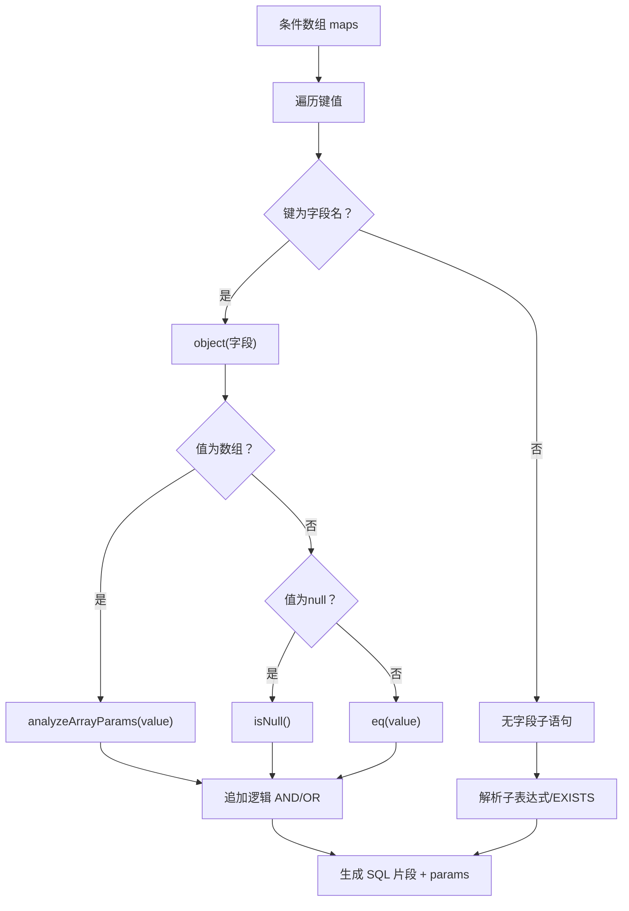
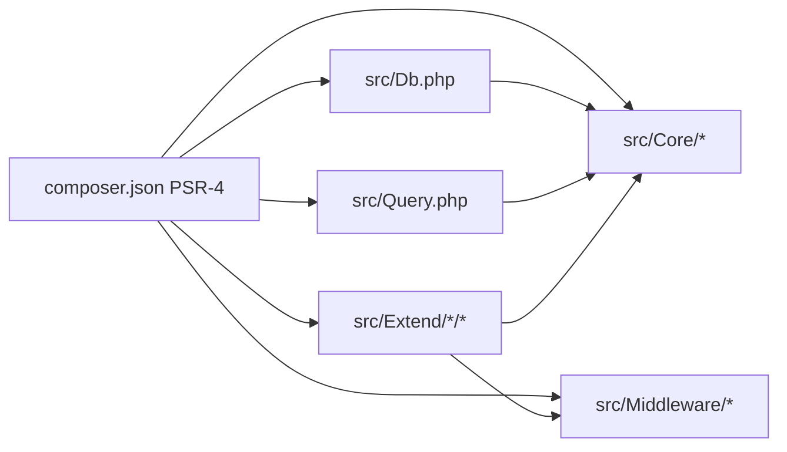

# 高级功能

<cite>
**本文档引用的文件**
- [src/Db.php](file://src/Db.php)
- [src/Query.php](file://src/Query.php)
- [src/Model.php](file://src/Model.php)
- [src/Core/Db.php](file://src/Core/Db.php)
- [src/Core/Query.php](file://src/Core/Query.php)
- [src/Core/Feature.php](file://src/Core/Feature.php)
- [src/Extend/MySQL/Db.php](file://src/Extend/MySQL/Db.php)
- [src/Extend/MySQL/Query.php](file://src/Extend/MySQL/Query.php)
- [src/Extend/MySQL/Mode/MySQLiMode.php](file://src/Extend/MySQL/Mode/MySQLiMode.php)
- [src/Extend/MySQL/Mode/PDOMode.php](file://src/Extend/MySQL/Mode/PDOMode.php)
- [examples/db_select.php](file://examples/db_select.php)
- [examples/db_paginate.php](file://examples/db_paginate.php)
- [composer.json](file://composer.json)
</cite>

## 目录
1. [简介](#简介)
2. [项目结构](#项目结构)
3. [核心组件](#核心组件)
4. [架构总览](#架构总览)
5. [详细组件分析](#详细组件分析)
6. [依赖关系分析](#依赖关系分析)
7. [性能考量](#性能考量)
8. [故障排查指南](#故障排查指南)
9. [结论](#结论)
10. [附录](#附录)

## 简介
本文件系统性阐述 FizeDatabase 的高级功能与实现原理，覆盖查询缓存、分页查询、字段选择、结果集处理与转换、ORM 模型类使用、关联查询、数据验证与过滤、性能优化与内存管理、以及大数据量处理最佳实践，并提供复杂查询优化、批量数据处理与数据导出等高级场景的实现思路与参考路径。

## 项目结构
FizeDatabase 采用分层+扩展的架构设计：
- 核心层（Core）：抽象数据库与查询器基类、通用特性 Trait、通用查询构建逻辑
- 扩展层（Extend）：按数据库类型划分，如 MySQL、PgSQL、Oracle、SQLSRV、SQLite、Access，每类包含 ModeFactory、Mode、Db、Query 等
- 门面层（Facade）：Db、Query、Model 三个静态/便捷入口，面向应用层
- 中间件层（Middleware）：PDO/ODBC/ADODB 的适配中间件，供扩展层复用
- 示例与测试：examples 提供典型用法；tests 提供单元测试骨架

图表来源
- [src/Db.php:1-141](file://src/Db.php#L1-L141)
- [src/Query.php:1-130](file://src/Query.php#L1-L130)
- [src/Model.php:1-39](file://src/Model.php#L1-L39)
- [src/Core/Db.php:1-941](file://src/Core/Db.php#L1-L941)
- [src/Core/Query.php:1-621](file://src/Core/Query.php#L1-L621)
- [src/Core/Feature.php:1-33](file://src/Core/Feature.php#L1-L33)
- [src/Extend/MySQL/Db.php:1-246](file://src/Extend/MySQL/Db.php#L1-L246)
- [src/Extend/MySQL/Query.php:1-91](file://src/Extend/MySQL/Query.php#L1-L91)
- [src/Extend/MySQL/Mode/PDOMode.php:1-53](file://src/Extend/MySQL/Mode/PDOMode.php#L1-L53)
- [src/Extend/MySQL/Mode/MySQLiMode.php:1-251](file://src/Extend/MySQL/Mode/MySQLiMode.php#L1-L251)

章节来源
- [composer.json:1-47](file://composer.json#L1-L47)
- [src/Db.php:1-141](file://src/Db.php#L1-L141)
- [src/Query.php:1-130](file://src/Query.php#L1-L130)
- [src/Model.php:1-39](file://src/Model.php#L1-L39)
- [src/Core/Db.php:1-941](file://src/Core/Db.php#L1-L941)
- [src/Core/Query.php:1-621](file://src/Core/Query.php#L1-L621)
- [src/Core/Feature.php:1-33](file://src/Core/Feature.php#L1-L33)
- [src/Extend/MySQL/Db.php:1-246](file://src/Extend/MySQL/Db.php#L1-L246)
- [src/Extend/MySQL/Query.php:1-91](file://src/Extend/MySQL/Query.php#L1-L91)
- [src/Extend/MySQL/Mode/PDOMode.php:1-53](file://src/Extend/MySQL/Mode/PDOMode.php#L1-L53)
- [src/Extend/MySQL/Mode/MySQLiMode.php:1-251](file://src/Extend/MySQL/Mode/MySQLiMode.php#L1-L251)

## 核心组件
- 门面 Db：提供静态便捷方法，封装连接创建、事务控制、表选择、SQL 获取等
- 门面 Query：提供静态工厂方法，按数据库类型构造具体查询器，支持条件数组解析、AND/OR 组合
- 核心 Db：抽象 SQL 构建、字段选择、WHERE/HAVING、JOIN、GROUP/ORDER、LIMIT/Lock、分页、缓存、结果集遍历与转换
- 核心 Query：抽象条件表达式、比较运算、IN/BETWEEN/EXISTS/LIKE/NULL 等，支持数组解析与组合
- 特性 Trait Feature：提供表/字段格式化钩子，便于扩展层定制
- 具体驱动与模式：以 MySQL 为例，Db/Query 由扩展层实现，连接模式包括 PDOMode、MySQLiMode 等

章节来源
- [src/Db.php:1-141](file://src/Db.php#L1-L141)
- [src/Query.php:1-130](file://src/Query.php#L1-L130)
- [src/Core/Db.php:1-941](file://src/Core/Db.php#L1-L941)
- [src/Core/Query.php:1-621](file://src/Core/Query.php#L1-L621)
- [src/Core/Feature.php:1-33](file://src/Core/Feature.php#L1-L33)
- [src/Extend/MySQL/Db.php:1-246](file://src/Extend/MySQL/Db.php#L1-L246)
- [src/Extend/MySQL/Query.php:1-91](file://src/Extend/MySQL/Query.php#L1-L91)

## 架构总览
FizeDatabase 通过“门面层 + 核心层 + 扩展层 + 模式层”的分层设计，实现了：
- 统一的门面 API，屏蔽底层差异
- 可插拔的数据库驱动与连接模式
- 可扩展的查询器与条件解析
- 面向对象的 ORM 入口（Model）

图表来源
- [src/Db.php:1-141](file://src/Db.php#L1-L141)
- [src/Query.php:1-130](file://src/Query.php#L1-L130)
- [src/Model.php:1-39](file://src/Model.php#L1-L39)
- [src/Core/Db.php:1-941](file://src/Core/Db.php#L1-L941)
- [src/Core/Query.php:1-621](file://src/Core/Query.php#L1-L621)
- [src/Extend/MySQL/Db.php:1-246](file://src/Extend/MySQL/Db.php#L1-L246)
- [src/Extend/MySQL/Query.php:1-91](file://src/Extend/MySQL/Query.php#L1-L91)

## 详细组件分析

### 查询缓存机制
- 缓存键：基于“最终真实 SQL（含绑定参数替换后的 SQL）”作为缓存键
- 缓存位置：静态数组缓存，按 SQL 字符串索引存储结果集
- 触发条件：select() 默认开启缓存；find/findOrNull 可按需关闭缓存
- 清理策略：生命周期结束或手动重建连接时，静态缓存不会被自动清空，需谨慎使用

图表来源
- [src/Core/Db.php:695-740](file://src/Core/Db.php#L695-L740)

章节来源
- [src/Core/Db.php:695-740](file://src/Core/Db.php#L695-L740)

### 分页查询实现原理
- 模拟分页：Core 层提供 page(page, size) 将页码转换为 limit(rows, offset)
- 完整分页（MySQL 扩展）：MySQLDb 提供 paginate(page, size)，内部使用 SQL_CALC_FOUND_ROWS 与 FOUND_ROWS() 获取总数，返回 [总数, 结果集, 总页数]
- 场景建议：大数据量分页优先使用“游标/延迟关联”等优化策略，避免 deep pagination

图表来源
- [src/Core/Db.php:778-800](file://src/Core/Db.php#L778-L800)
- [src/Extend/MySQL/Db.php:180-203](file://src/Extend/MySQL/Db.php#L180-L203)

章节来源
- [src/Core/Db.php:778-800](file://src/Core/Db.php#L778-L800)
- [src/Extend/MySQL/Db.php:180-203](file://src/Extend/MySQL/Db.php#L180-L203)
- [examples/db_paginate.php:1-22](file://examples/db_paginate.php#L1-L22)

### 字段选择的灵活性
- 支持字符串原样传入与数组格式化；数组支持“别名 => 实际字段”的映射
- 支持 distinct、alias、group/order 等组合
- 结果集层面提供 column(field) 直接提取某一列

图表来源
- [src/Core/Db.php:228-244](file://src/Core/Db.php#L228-L244)

章节来源
- [src/Core/Db.php:228-244](file://src/Core/Db.php#L228-L244)

### 结果集处理与转换
- select(cache)：默认缓存；find/findOrNull：单条记录；find 抛异常
- fetch(callable)：逐行回调，适合大结果集流式处理，减少内存峰值
- column(field)：提取单列数组
- value(field, default, force)：取单一值并可强制为数字

图表来源
- [src/Core/Db.php:668-761](file://src/Core/Db.php#L668-L761)

章节来源
- [src/Core/Db.php:668-761](file://src/Core/Db.php#L668-L761)

### ORM 模型类使用方法
- Model 当前为占位实现，提供 hasOne/hasMany/belongsTo/belongsToMany 等方法签名，尚未提供具体 ORM 行为
- 建议：结合 CoreDb/Query 与具体扩展驱动，自行扩展 Model，实现字段映射、关联查询、生命周期钩子等

章节来源
- [src/Model.php:1-39](file://src/Model.php#L1-L39)

### 关联查询的实现
- JOIN 支持 INNER/LEFT/RIGHT/CROSS/OUTER 等变体，支持 ON/USING
- MySQL 扩展额外提供 crossJoin/leftOuterJoin/rightOuterJoin/straightJoin
- 可与 where/having/group/order/limit 等组合使用

图表来源
- [src/Core/Db.php:408-463](file://src/Core/Db.php#L408-L463)
- [src/Extend/MySQL/Db.php:73-109](file://src/Extend/MySQL/Db.php#L73-L109)

章节来源
- [src/Core/Db.php:408-463](file://src/Core/Db.php#L408-L463)
- [src/Extend/MySQL/Db.php:73-109](file://src/Extend/MySQL/Db.php#L73-L109)

### 数据验证与过滤
- Query 提供丰富条件方法：=、!=、<>、<、<=、>、>=、BETWEEN、IN、LIKE、IS NULL/NOT NULL、EXISTS/NOT EXISTS、正则匹配（MySQL）
- 支持数组解析：统一的 analyze(maps) 将数组映射为条件链，支持组合逻辑 AND/OR
- 自动参数绑定：避免 SQL 注入，字符串值根据内容决定是否使用占位符

图表来源
- [src/Core/Query.php:383-567](file://src/Core/Query.php#L383-L567)
- [src/Extend/MySQL/Query.php:60-89](file://src/Extend/MySQL/Query.php#L60-L89)

章节来源
- [src/Core/Query.php:383-567](file://src/Core/Query.php#L383-L567)
- [src/Extend/MySQL/Query.php:60-89](file://src/Extend/MySQL/Query.php#L60-L89)

### 高级使用场景与示例路径
- 复杂查询优化：利用 Query 的 AND/OR 组合与数组解析，拆分复杂条件，必要时使用原生表达式 exp() 与参数绑定
- 批量数据处理：使用 MySQLDb::insertAll 批量插入；使用 Db::fetch 流式回调处理超大结果集
- 数据导出：结合 field() 与 fetch()，按需读取并输出 CSV/Excel

示例参考路径
- [examples/db_select.php:1-22](file://examples/db_select.php#L1-L22)
- [examples/db_paginate.php:1-22](file://examples/db_paginate.php#L1-L22)

章节来源
- [examples/db_select.php:1-22](file://examples/db_select.php#L1-L22)
- [examples/db_paginate.php:1-22](file://examples/db_paginate.php#L1-L22)
- [src/Extend/MySQL/Db.php:212-244](file://src/Extend/MySQL/Db.php#L212-L244)
- [src/Core/Db.php:668-672](file://src/Core/Db.php#L668-L672)

## 依赖关系分析
- Composer 自动加载 PSR-4：Fize\Database\ → src
- 扩展层按数据库类型组织，ModeFactory 动态创建具体模式实例
- 中间件层（PDO/ODBC/ADODB）为扩展层提供统一的 PDO/Statement 接口适配
- 门面层 Db/Query 通过反射式类名拼装，调用对应扩展层实现

图表来源
- [composer.json:11-14](file://composer.json#L11-L14)
- [src/Db.php:1-141](file://src/Db.php#L1-L141)
- [src/Query.php:1-130](file://src/Query.php#L1-L130)

章节来源
- [composer.json:1-47](file://composer.json#L1-L47)
- [src/Db.php:1-141](file://src/Db.php#L1-L141)
- [src/Query.php:1-130](file://src/Query.php#L1-L130)

## 性能考量
- 查询缓存：select 默认缓存，适用于重复查询；注意缓存键为“最终真实 SQL”，不同参数即不同缓存
- 流式处理：大结果集优先使用 fetch 回调，避免一次性加载至内存
- 分页优化：MySQL 的 paginate 使用 SQL_CALC_FOUND_ROWS + FOUND_ROWS，适合中小规模分页；超大规模建议游标/延迟关联
- 参数绑定：Query 自动判断字符串是否需要占位符，避免注入同时减少拼接开销
- 连接模式：PDO 模式为推荐；MySQLi 模式支持多语句与丰富的连接选项
- 字段裁剪：仅 select 必要字段，配合 index 与覆盖索引

[本节为通用性能指导，无需特定文件引用]

## 故障排查指南
- SQL 日志：getDb::getLastSql(real) 输出最终 SQL，便于定位问题
- 异常类型：DataNotFoundException 用于 find() 未找到记录时抛出
- 事务嵌套：Db 提供嵌套计数，确保正确提交/回滚
- 驱动错误：MySQLiMode 在 prepare/execute 失败时抛出异常，检查 DSN、凭据与网络

章节来源
- [src/Core/Db.php:199-206](file://src/Core/Db.php#L199-L206)
- [src/Db.php:84-114](file://src/Db.php#L84-L114)
- [src/Extend/MySQL/Mode/MySQLiMode.php:115-164](file://src/Extend/MySQL/Mode/MySQLiMode.php#L115-L164)

## 结论
FizeDatabase 通过清晰的分层与可扩展设计，提供了统一的查询构建、灵活的条件过滤、完善的分页与缓存能力，并为 ORM 扩展预留了空间。结合流式处理、参数绑定与连接模式选择，可在保证安全性的同时获得良好性能表现。

## 附录
- 门面 API 参考
  - Db：connect、query、execute、startTrans、commit、rollback、table、getLastSql
  - Query：construct、field、analyze、and、or
  - Model：预留关联方法
- 核心能力参考
  - CoreDb：field、table、alias、group、order、where、having、join、limit、page、select、find、findOrNull、column、fetch、count
  - CoreQuery：比较/集合/逻辑/表达式/数组解析/组合

章节来源
- [src/Db.php:1-141](file://src/Db.php#L1-L141)
- [src/Query.php:1-130](file://src/Query.php#L1-L130)
- [src/Model.php:1-39](file://src/Model.php#L1-L39)
- [src/Core/Db.php:1-941](file://src/Core/Db.php#L1-L941)
- [src/Core/Query.php:1-621](file://src/Core/Query.php#L1-L621)