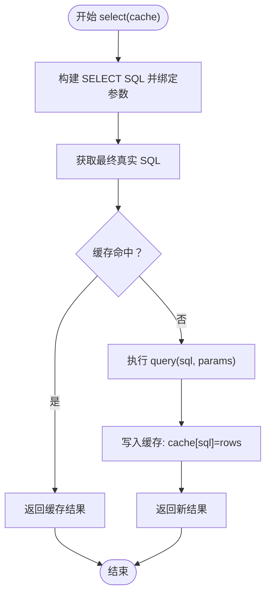
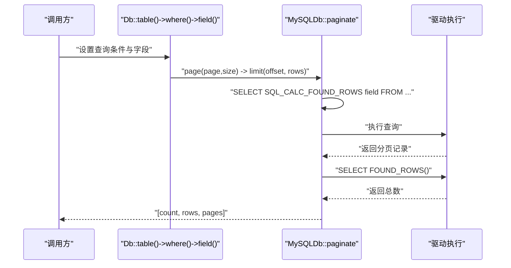
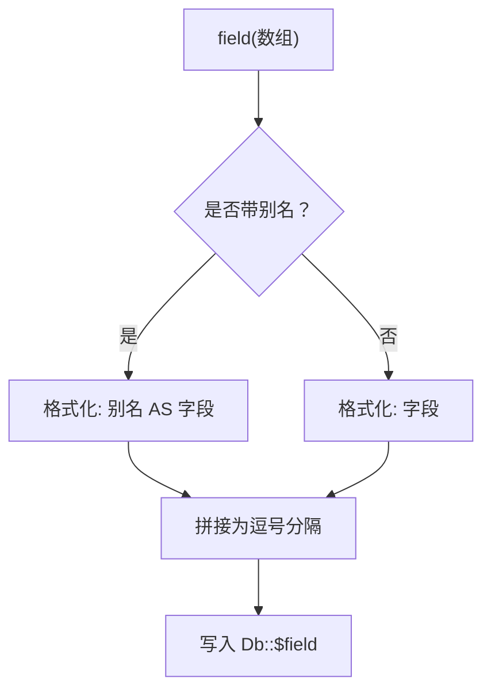
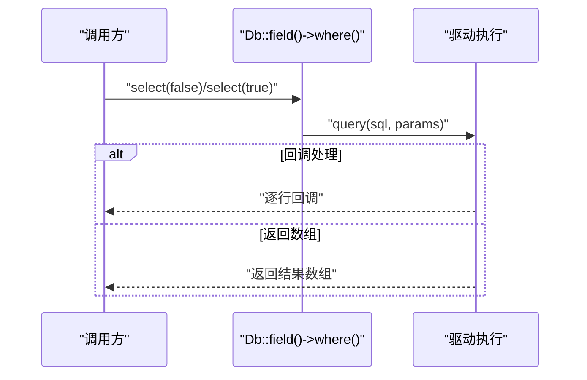
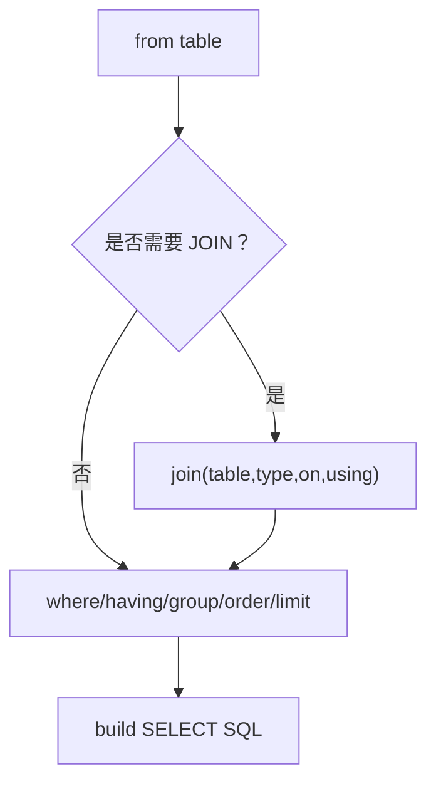

# 高级功能

FizeDatabase 提供了查询缓存、分页查询、字段选择、结果集处理、ORM 模型入口等高级功能。

## 查询缓存机制

- **缓存键**：基于"最终真实 SQL（含绑定参数替换后的 SQL）"作为缓存键
- **缓存位置**：静态数组缓存，按 SQL 字符串索引存储结果集
- **触发条件**：select() 默认开启缓存；find/findOrNull 可按需关闭缓存
- **清理策略**：静态缓存不会被自动清空，需谨慎使用



### 使用方式

```php
// 默认开启缓存
$result = Db::table('users')->select();

// 关闭缓存
$result = Db::table('users')->select(false);
```

## 分页查询实现

### 模拟分页（Core 层）

Core 层提供 `page(page, size)` 将页码转换为 limit(rows, offset)。

### 完整分页（MySQL 扩展）

MySQLDb 提供 `paginate(page, size)`，内部使用 SQL_CALC_FOUND_ROWS 与 FOUND_ROWS() 获取总数，返回 `[总数, 结果集, 总页数]`。



### 使用方式

```php
// 简单分页
Db::table('users')->page(1, 20)->select();

// 完整分页（MySQL）
list($total, $rows, $pages) = Db::table('users')->paginate(1, 20);
```

> 大数据量分页优先使用"游标/延迟关联"等优化策略，避免 deep pagination。

## 字段选择的灵活性

- 支持字符串原样传入与数组格式化
- 数组支持"别名 => 实际字段"的映射
- 支持 distinct、alias、group/order 等组合
- 结果集层面提供 `column(field)` 直接提取某一列



## 结果集处理与转换

| 方法 | 说明 |
|------|------|
| select(cache) | 列表查询，默认缓存 |
| find() | 单条记录，未找到抛异常 |
| findOrNull() | 单条记录，未找到返回 null |
| fetch(callable) | 逐行回调，适合大结果集流式处理 |
| column(field) | 提取单列数组 |
| value(field, default, force) | 取单一值并可强制为数字 |



## ORM 模型类

Model 当前为占位实现，提供以下方法签名：

| 方法 | 说明 |
|------|------|
| hasOne(class) | 一对一关联 |
| hasMany(class) | 一对多关联 |
| belongsTo(class) | 反向关联 |
| belongsToMany() | 多对多关联 |

建议结合 CoreDb/Query 与具体扩展驱动，自行扩展 Model，实现字段映射、关联查询、生命周期钩子等。

## 关联查询

JOIN 支持 INNER/LEFT/RIGHT/CROSS/OUTER 等变体，支持 ON/USING。

MySQL 扩展额外提供：crossJoin/leftOuterJoin/rightOuterJoin/straightJoin。

可与 where/having/group/order/limit 等组合使用。



## 数据验证与过滤

Query 提供丰富条件方法：

- =、!=、<>、<、<=、>、>=
- BETWEEN、IN、LIKE
- IS NULL/NOT NULL
- EXISTS/NOT EXISTS
- 正则匹配（MySQL）

支持数组解析：统一的 `analyze(maps)` 将数组映射为条件链，支持组合逻辑 AND/OR。自动参数绑定避免 SQL 注入。

## 高级使用场景

### 复杂查询优化

利用 Query 的 AND/OR 组合与数组解析，拆分复杂条件，必要时使用原生表达式 exp() 与参数绑定。

### 批量数据处理

使用 MySQLDb::insertAll 批量插入；使用 Db::fetch 流式回调处理超大结果集。

### 数据导出

结合 field() 与 fetch()，按需读取并输出 CSV/Excel。

## 门面 API 参考

### Db 门面

| 方法 | 说明 |
|------|------|
| connect | 创建连接 |
| query | 执行查询 |
| execute | 执行更新 |
| startTrans | 开启事务 |
| commit | 提交事务 |
| rollback | 回滚事务 |
| table | 选择表 |
| getLastSql | 获取最后 SQL |

### Query 门面

| 方法 | 说明 |
|------|------|
| construct | 构造查询器 |
| field | 指定字段 |
| analyze | 解析数组条件 |
| and/or | 逻辑组合 |

### CoreDb 核心能力

| 方法 | 说明 |
|------|------|
| field/table/alias | 字段/表/别名 |
| group/order | 分组/排序 |
| where/having | 条件 |
| join/limit/page | JOIN/限制/分页 |
| select/find/findOrNull | 查询 |
| column/fetch/count | 列/遍历/计数 |