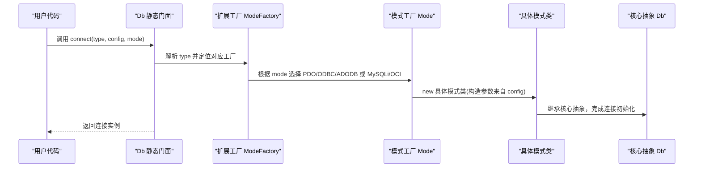
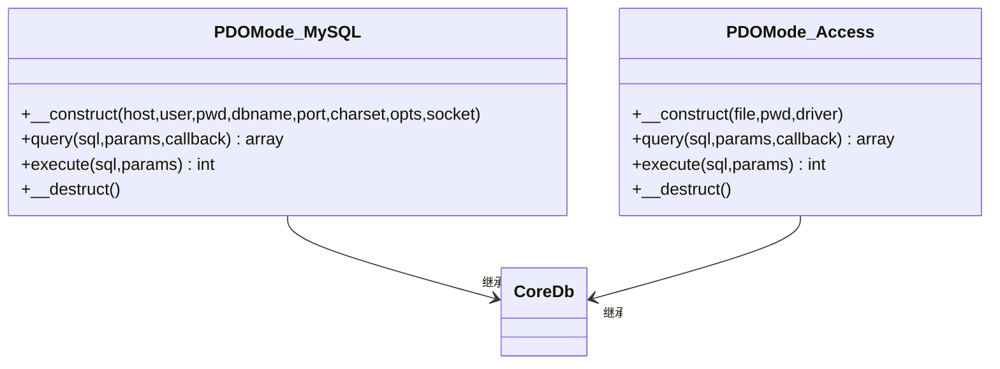
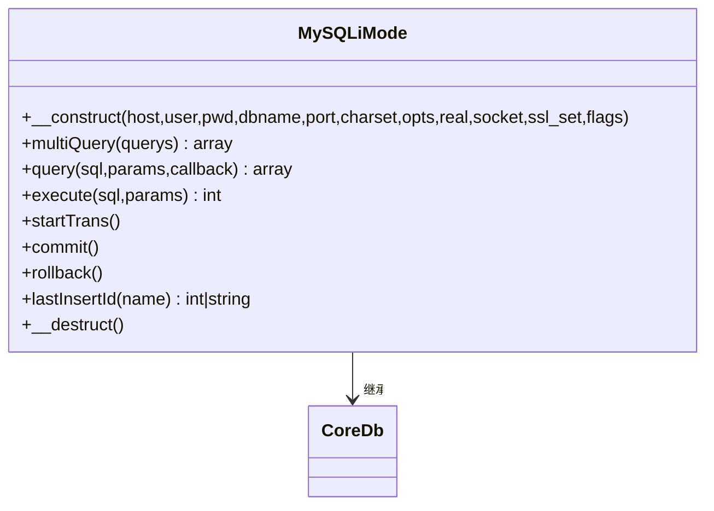
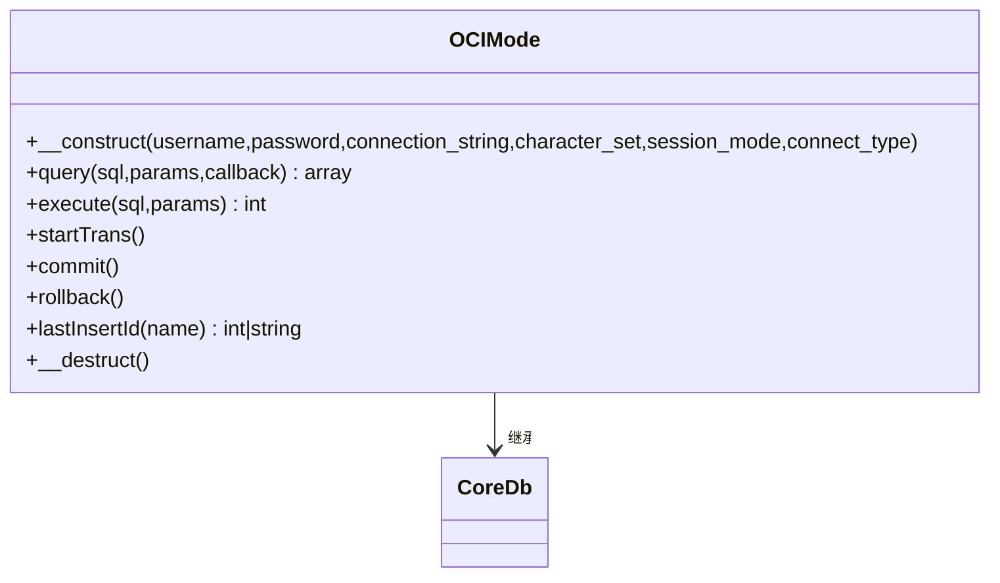

# 连接管理

FizeDatabase 通过"核心抽象 + 扩展适配 + 工厂模式"的分层设计，实现了对 PDO、ODBC、ADODB 等多种连接模式的统一接入与差异化实现。

## 连接管理流程



## 核心组件

- **Db 静态门面**：对外提供统一入口，内部通过扩展工厂创建具体连接实例；封装事务计数、表名与前缀设置、SQL 组装与执行等通用能力
- **Core/Db 抽象类**：定义 query/execute/startTrans/commit/rollback 等抽象方法，以及查询构建器与缓存机制
- **ModeFactory**：按数据库类型聚合，负责解析模式参数，合并默认配置，调用 Mode 工厂方法创建具体连接
- **Mode 工厂方法**：集中暴露 PDO/ODBC/ADODB 或 MySQLi/OCI 等构造函数，屏蔽底层差异
- **具体模式类**：实现 PDO/ODBC/ADODB/MySQLi/OCI 等连接与执行细节

## 连接工厂与模式选择

工厂根据 type 与 mode，合并默认配置，调用 Mode 工厂方法创建连接。若 mode 未显式指定，采用各数据库扩展的默认模式（如 MySQL 默认 PDO，Access 默认 ADODB）。

不同数据库扩展的参数差异：

| 数据库 | 特有参数 |
|--------|----------|
| MySQL | port、charset、opts、socket、ssl_set、flags |
| Oracle | session_mode、connect_type |
| Access | driver、password、file |
| SQL Server | driver、charset |
| PostgreSQL | pconnect、connect_type |

工厂创建连接后统一设置表前缀，便于后续查询构建。

## PDO 模式（推荐）

MySQL/PgSQL/SQL Server/Access 等均提供 PDO 实现，具备跨平台、预处理语句、字符集控制等优势。



**生命周期**：构造时建立连接，析构时释放资源；查询/执行过程中进行 prepare/execute/fetch，异常时抛出统一数据库异常。

## ODBC 模式

适用场景：通用性较强，适合通过 ODBC 驱动访问多种数据库。

- Access 的 ODBC 连接通过 Microsoft Access Driver 驱动实现，需注意字符集转换与参数绑定
- SQL Server 的 ODBC 连接同样需要正确设置驱动与字符集
- 生命周期与 PDO 类似，异常统一处理

## ADODB 模式（Access）

通过 OLE DB Provider 连接 Access 数据库，支持密码保护与驱动选择。

**特殊点**：Access 的 lastInsertId 通过查询 `@@IDENTITY` 获取，与标准 PDO 不同。

## MySQLi 模式

通过 MySQLi 扩展直接连接 MySQL，支持 real_connect、SSL、套接字、选项等。



**特殊点**：
- 多语句查询非标准用法
- 事务通过 begin_transaction/commit/rollback 控制
- lastInsertId 通过 stmt->insert_id 获取

## Oracle OCI 模式

通过 OCI 扩展连接 Oracle，支持连接串、字符集、会话模式与连接类型。



**特殊点**：
- 查询/执行中将 `?` 占位符转换为 `:$n` 绑定变量
- 事务通过 OCI_NO_AUTO_COMMIT/OCI_COMMIT_ON_SUCCESS 控制
- lastInsertId 需要指定序列名

## 连接生命周期与资源释放

| 模式 | 构造 | 析构 |
|------|------|------|
| PDO/ODBC/ADODB | 建立连接 | 释放资源 |
| MySQLi | real_connect | kill(thread_id) 与 close |
| OCI | 创建 OCI 对象 | 释放 |

## 事务管理

Db 静态门面维护事务嵌套层级，startTrans/commit/rollback 仅在最外层触发实际事务操作，避免重复提交或回滚。各具体模式类实现 startTrans/commit/rollback。

## 选择建议

| 模式 | 推荐场景 |
|------|----------|
| PDO | 大多数数据库的首选，跨平台与生态优势明显 |
| MySQLi | 需极致性能或特定 MySQL 特性时评估采用 |
| ODBC | 通用桥接场景，通过驱动桥接多种数据库 |
| ADODB | Access 文件数据库 |
| OCI | Oracle 企业级部署 |

## 故障排除

- **连接失败**：检查 ModeFactory 默认模式与传入 mode 是否匹配；确认 config 参数齐全
- **字符集问题**：Access 的 PDO 模式涉及 UTF-8 与 GBK 转换，确保 SQL 与参数正确编码
- **事务异常**：确认嵌套事务计数与实际提交/回滚时机
- **资源泄漏**：确保具体模式类的析构被调用，避免连接未释放

## 配置示例

### MySQL（PDO）

```php
$config = [
    'host'     => 'localhost',
    'user'     => 'root',
    'password' => '123456',
    'dbname'   => 'test_db',
    'port'     => 3306,
    'charset'  => 'utf8mb4',
    'prefix'   => 'pre_'
];
new Db('mysql', $config, 'pdo');
```

### Oracle（OCI）

```php
$config = [
    'username'         => 'system',
    'password'         => 'oracle',
    'connection_string' => 'localhost/XE',
    'character_set'    => 'AL32UTF8'
];
new Db('oracle', $config, 'oci');
```

### Access（ADODB）

```php
$config = [
    'file'     => 'C:/data/test.mdb',
    'password' => '',
    'driver'   => 'Microsoft Access Driver (*.mdb, *.accdb)'
];
new Db('access', $config, 'adodb');
```
