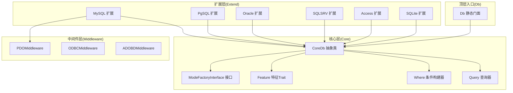
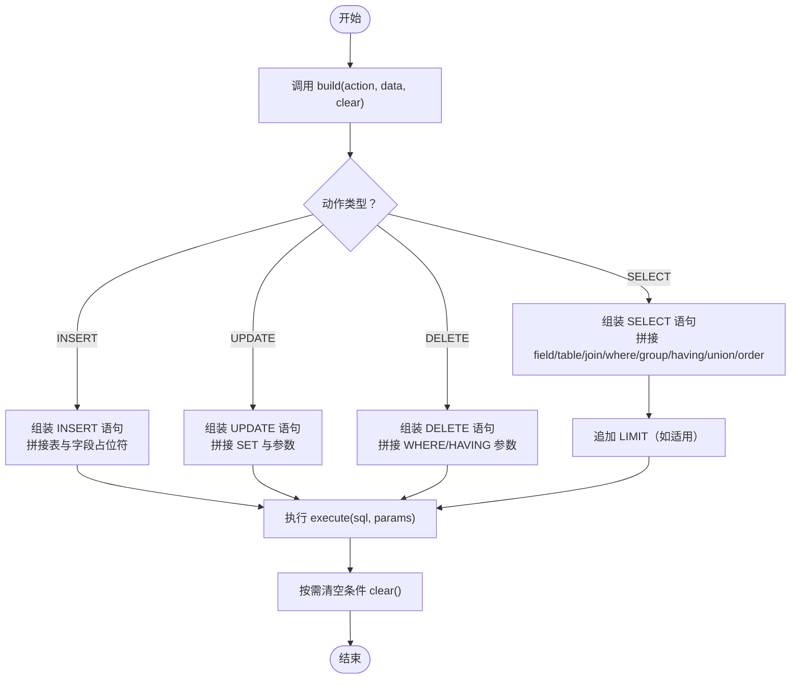
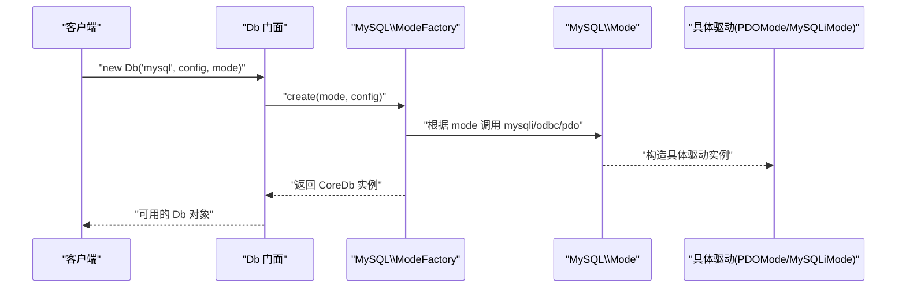
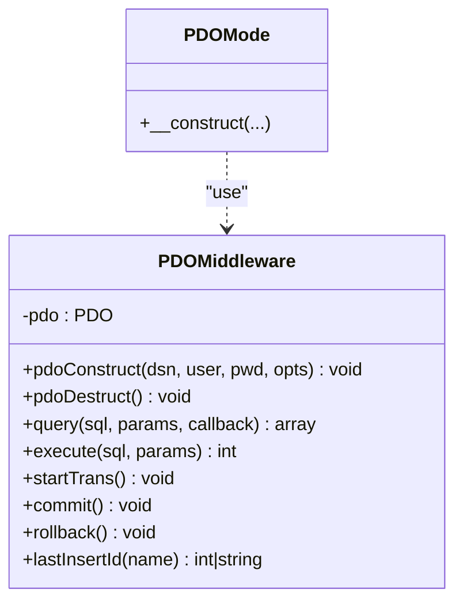
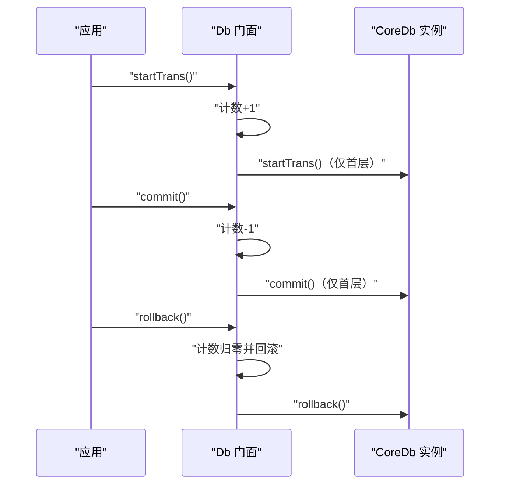

# 核心概念

FizeDatabase 的核心设计围绕"抽象 + 工厂 + 中间件 + 门面"的组合实现，为多种数据库提供统一的访问接口。

## 分层架构

项目采用"核心层 + 扩展层 + 中间件层"的分层组织方式：

- **核心层（Core）**：定义通用抽象、查询构建器、特征项等
- **扩展层（Extend）**：按数据库类型划分，提供具体驱动与工厂
- **中间件层（Middleware）**：封装底层驱动能力（如 PDO）
- **顶层入口（Db）**：对外提供静态便捷接口与连接生命周期管理



## 核心组件一览

| 组件 | 职责 |
|------|------|
| 抽象数据库 CoreDb | 统一定义 CRUD、事务、LIMIT、缓存、链式条件、SQL 构建等能力，屏蔽具体驱动差异 |
| 查询构建器 CoreQuery | 将数组/对象条件解析为 SQL 片段与参数，支持 AND/OR 组合、表达式、IN/BETWEEN/LIKE/EXISTS 等 |
| 条件构建器 CoreWhere | 提供与 Query 类似的组合能力（兼容旧接口），便于直接拼装复杂 WHERE |
| 特征 Trait CoreFeature | 提供表名/字段名格式化钩子，供不同数据库方言定制 |
| 工厂接口 CoreModeFactoryInterface | 约束扩展层工厂创建行为 |
| 顶层门面 Db | 静态入口，负责连接初始化、事务嵌套计数、转发调用至 CoreDb |
| 中间件 PDOMiddleware | 封装 PDO 能力，提供 query/execute/事务/自增 ID 等 |

## 数据库抽象层 CoreDb

CoreDb 是整个框架的核心，统一定义了数据库操作的完整接口：

- **SQL 构建**：统一的 SQL 语句构建机制，支持 SELECT/INSERT/UPDATE/DELETE
- **条件处理**：支持多种 WHERE 条件和 JOIN 操作
- **CRUD 操作**：标准的增删改查方法
- **缓存机制**：查询结果缓存优化
- **链式调用**：field/group/order/join/union/where/having/alias 等链式方法



### 设计要点

- 使用 Feature Trait 提供表/字段格式化钩子，便于方言适配
- 将"条件组装"与"SQL 构建"解耦，where/having 支持数组/Query/原生 SQL 三种输入
- clear/build 分离，避免重复拼接，提高可维护性
- select 支持简单缓存，基于最终 SQL 文本缓存结果集

## 查询构建器 CoreQuery

CoreQuery 采用流式接口（Fluent Interface）设计，所有条件方法返回 `$this`，支持链式调用。

### 条件构建能力

| 谓词类型 | 方法 |
|----------|------|
| 比较 | eq/neq/gt/egt/lt/elt |
| 区间 | between/notBetween |
| 集合 | in/notIn |
| 模糊匹配 | like/notLike |
| 空值判断 | isNull/isNotNull |
| 子查询 | exists/notExists |
| 表达式 | exp() 直接拼接 |

### 组合模式

- **qMerge/qAnd/qOr**：将多个 Query 对象组合为复合条件
- **analyze**：将数组条件映射为链式调用，支持多级数组语法和自动推断组合逻辑

```mermaid
sequenceDiagram
participant Client as "客户端"
participant Db as "CoreDb::where"
participant Q as "CoreQuery::analyze"
participant SQL as "SQL/参数"
Client->>Db : "where(数组/Query/原生SQL, 参数)"
alt 传入数组
Db->>Q : "new Query(); analyze(数组)"
Q-->>Db : "sql()/params()"
else 传入 Query 对象
Db->>Q : "直接读取 sql()/params()"
else 传入原生SQL
Db->>Db : "保存SQL与参数"
end
Db-->>Client : "$this（链式）"
```

## Feature Trait 机制

Feature Trait 提供两个格式化钩子：

- **formatTable(str)**：格式化表名
- **formatField(str)**：格式化字段名

在扩展层（如 MySQL/PG/Oracle）可通过继承 CoreDb 并覆写 Feature 钩子实现差异化格式化，实现方言适配。

## 工厂模式

### 模式工厂接口

`ModeFactoryInterface` 约束 `create(mode, config)` 返回 Db 实例。

### MySQL 扩展工厂示例

MySQL 的 ModeFactory 根据 mode（pdo/odbc/mysqli）与 config 创建具体连接：



## 中间件模式

### PDOMiddleware

封装 PDO 的 prepare/execute/fetch/事务/自增 ID 等，统一异常包装为 DatabaseException：



## 顶层门面 Db

提供静态方法：connect/query/execute/startTrans/commit/rollback/table/getLastSql。

### 事务嵌套

通过静态计数 `transactionNestingLevel` 控制嵌套事务的开启与提交/回滚时机：



## 使用建议

- 优先使用 PDO 模式，具备更好的跨数据库一致性与生态支持
- 条件构建优先使用数组/Query，复杂场景再使用原生 SQL
- 合理利用缓存与 LIMIT，避免一次性拉取大量数据
- 正确管理事务嵌套，避免并发与一致性问题
