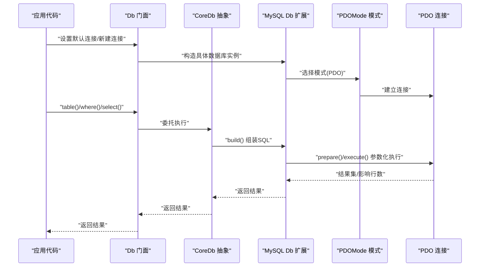
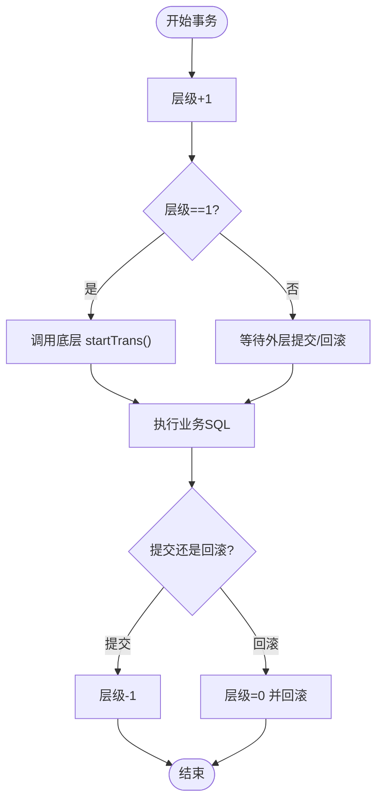

# 数据操作

FizeDatabase 提供了统一、安全、高性能的数据操作 API，覆盖 CRUD（创建、读取、更新、删除）的完整实现。

## 调用链路



## CRUD 基础 API

### 插入（Create）

```php
// 单条插入：返回受影响行数
Db::table('users')->insert([
    'name'  => '张三',
    'email' => 'zhangsan@example.com'
]);

// 插入并返回自增 ID
$id = Db::table('users')->insertGetId([
    'name'  => '张三',
    'email' => 'zhangsan@example.com'
]);

// 批量插入（MySQL 扩展）
Db::table('users')->insertAll([
    ['name' => '张三', 'email' => 'a@example.com'],
    ['name' => '李四', 'email' => 'b@example.com']
]);
```

### 查询（Read）

```php
// 列表查询
$users = Db::table('users')->where(['status' => 1])->limit(10)->select();

// 单条查询：未找到抛出 DataNotFoundException
$user = Db::table('users')->where(['id' => 1])->find();

// 单条查询：未找到返回 null
$user = Db::table('users')->where(['id' => 1])->findOrNull();

// 单值查询
$name = Db::table('users')->where(['id' => 1])->value('name');

// 某列数组
$emails = Db::table('users')->column('email');

// 计数
$count = Db::table('users')->where(['status' => 1])->count();

// 分页查询（MySQL 扩展）
list($total, $rows, $pages) = Db::table('users')->paginate(1, 20);
```

### 更新（Update）

```php
// 条件更新
Db::table('users')
    ->where(['id' => 1])
    ->update(['name' => '王五']);

// 原样 SQL 表达式
Db::table('users')
    ->where(['id' => 1])
    ->update(['login_count' => ['login_count + 1']]);
```

### 删除（Delete）

```php
Db::table('users')->where(['id' => 1])->delete();
```

## 查询器与条件构建

### 链式条件

```php
use Fize\Database\Query;

// 比较条件
$query = (new Query('mysql'))->field('age')->gt(18);

// 组合条件
$query = Query::qAnd(
    (new Query('mysql'))->field('status')->eq(1),
    (new Query('mysql'))->field('age')->gt(18)
);
```

### 数组条件

```php
// where 支持数组条件
Db::table('users')->where([
    'name' => '张三',
    'age'  => ['>', 18]
])->select();
```

### 表达式与函数

```php
// 原生表达式
$query = (new Query('mysql'))->field('price')->exp('* ?', [1.1]);

// 子查询
$query = (new Query('mysql'))->exists('SELECT 1 FROM orders WHERE orders.user_id = users.id');
```

## 参数绑定与预处理语句

- **统一占位符**：问号 `?`，由 CoreDb/Query 在构建 SQL 时自动拼接与参数收集
- **自动转义与安全**：参数绑定确保 SQL 注入防护
- **表达式安全**：exp() 支持参数绑定；字符串值在必要时会被加引号处理

## 事务处理与嵌套



```php
use Fize\Database\Db;

Db::startTrans();
try {
    Db::table('users')->insert(['name' => '张三']);
    Db::table('logs')->insert(['action' => 'create_user']);
    Db::commit();
} catch (\Exception $e) {
    Db::rollback();
    throw $e;
}
```

## 批量操作

- **批量插入**：MySQL 扩展提供 `insertAll()`，支持多组数据一次提交，减少往返次数
- **数据验证**：建议在业务层对输入进行校验；查询器在 condition/exp/in/between 等处对字符串值进行安全判定与绑定

## 数据类型处理

- **字段与表名格式化**：Feature trait 提供 formatField/formatTable 钩子，扩展层可按数据库方言实现差异化处理
- **值类型处理**：parseValue 将布尔、字符串、NULL 等类型安全化

## 错误处理

- CoreDb 抛出 `DatabaseException`
- Db::find() 未找到记录抛出 `DataNotFoundException`
- 建议在业务层捕获并记录异常

## API 一览（按功能分类）

### 连接与门面

| 方法 | 说明 |
|------|------|
| Db::connect(type, config, mode?) | 创建连接 |
| Db::table(name, prefix?) | 选择表 |
| Db::getLastSql(real?) | 获取最后执行的 SQL |

### 查询

| 方法 | 说明 |
|------|------|
| Db::query(sql, params?, callback?) | 执行查询 |
| Db::execute(sql, params?) | 执行更新 |
| select(cache?) | 查询列表 |
| find() / findOrNull() | 查询单条 |
| value(field, default?, force?) | 查询单值 |
| column(field) | 查询某列 |
| count(field?) | 计数 |

### 条件与查询器

| 方法 | 说明 |
|------|------|
| where(statements, parse?) | WHERE 条件 |
| having(statements, parse?) | HAVING 条件 |
| field(fields) | 指定字段 |
| group(fields) | GROUP BY |
| order(...) | ORDER BY |
| join/table/alias/limit/page/union | 其他查询构建 |

### 事务

| 方法 | 说明 |
|------|------|
| Db::startTrans() | 开启事务 |
| Db::commit() | 提交事务 |
| Db::rollback() | 回滚事务 |

## 性能建议

- **查询缓存**：CoreDb::select() 支持基于最终 SQL 的结果缓存
- **分页**：MySQL 扩展 paginate() 使用 SQL_CALC_FOUND_ROWS 与 FOUND_ROWS()
- **批量插入**：insertAll() 一次性提交多组数据
- **避免不必要的字符串拼接**：优先使用参数绑定与表达式构建