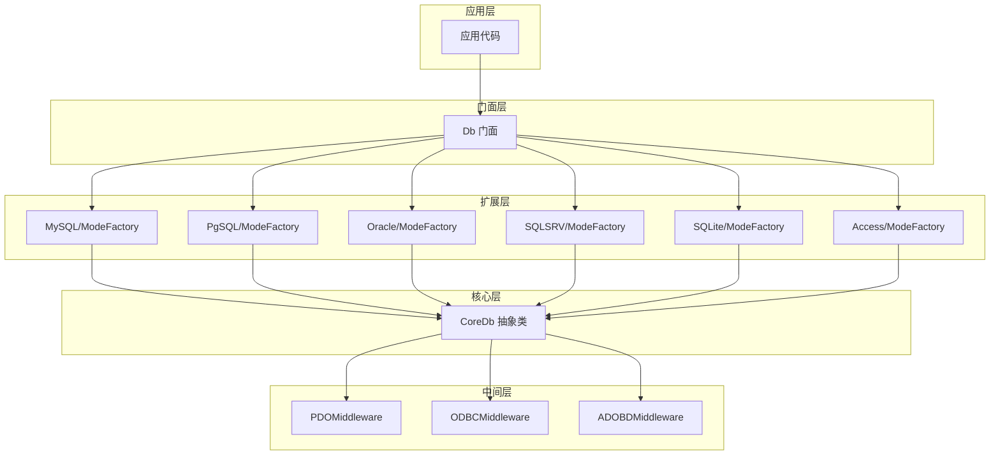
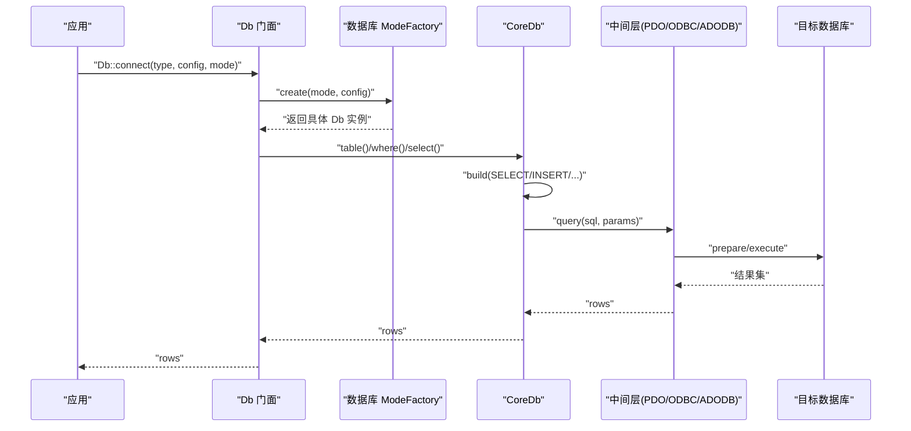

# 数据库驱动

FizeDatabase 支持 MySQL、PostgreSQL、Oracle、SQL Server、SQLite、Access 六类数据库，每类数据库通过不同的连接模式（PDO、ODBC、ADODB 等）提供灵活的接入方式。

## 架构总览

项目采用"核心抽象 + 扩展驱动 + 中间层"的分层设计：

## 典型查询调用链路

## MySQL

| 项目 | 说明 |
|------|------|
| 支持模式 | pdo（推荐）、mysqli（传统扩展）、odbc（通用适配） |
| 关键配置 | host、user、password、dbname、port、charset、prefix、opts、socket、ssl_set、flags |
| 特殊功能 | SSL 连接参数、Socket 连接（非 Windows） |
| 推荐模式 | pdo |

**注意事项**：
- 不同模式的 DSN/连接字符串差异较大，需严格按模式配置
- SSL 参数不完整可能导致连接失败
- 字符集与排序规则不一致可能引发乱码

## PostgreSQL

| 项目 | 说明 |
|------|------|
| 支持模式 | pdo（推荐）、pgsql（原生命令字符串）、odbc（通用适配） |
| 关键配置 | host、user、password、dbname、port、charset、prefix、pconnect、connect_type、opts |
| 特殊功能 | pgsql 模式使用连接字符串、支持持久连接 pconnect |
| 默认端口 | 5432 |

**注意事项**：
- pgsql 模式与 pdo 的 DSN/连接字符串差异显著
- 从 pgsql 切换到 pdo，需统一使用 DSN 方式

## Oracle

| 项目 | 说明 |
|------|------|
| 支持模式 | pdo（推荐）、oci（原生扩展）、odbc（通用适配） |
| 关键配置 | host、username、password、dbname、port、charset、prefix、session_mode、connect_type、opts |
| 特殊功能 | oci 模式支持 session_mode 与 connect_type、支持 SID/主机串组合 |

**注意事项**：
- oci 与 pdo 的连接参数差异较大
- 字符集与 NLS_LANG 需保持一致

## SQL Server

| 项目 | 说明 |
|------|------|
| 支持模式 | pdo（推荐）、sqlsrv（原生扩展）、adodb（Windows COM）、odbc（通用适配） |
| 关键配置 | host、user、password、dbname、port、charset、prefix、new_feature、driver、opts |
| 特殊功能 | sqlsrv 模式支持 charset、new_feature 标记 |

**注意事项**：
- Windows 环境可考虑 adodb；跨平台优先 pdo/sqlsrv
- Windows 环境 COM 初始化可能失败

## SQLite

| 项目 | 说明 |
|------|------|
| 支持模式 | pdo（推荐）、sqlite3（原生扩展）、odbc（通用适配） |
| 关键配置 | file、prefix、encryption_key、busy_timeout、flags、driver |
| 特殊功能 | 支持加密密钥 encryption_key、支持 busy_timeout 控制忙等待 |

**注意事项**：
- sqlite3 模式适合轻量场景；生产环境建议使用 pdo 并开启 WAL
- 注意文件权限和加密密钥

## Access

| 项目 | 说明 |
|------|------|
| 支持模式 | adodb（Windows COM）、pdo（通过 ODBC 驱动）、odbc（通用适配） |
| 关键配置 | file、password、prefix、driver |
| 特殊功能 | adodb 模式通过 COM 驱动访问 Access |

**注意事项**：
- 仅限 Windows 环境
- 建议迁移至 SQLite 或 MySQL

## 通用中间层

### PDO 中间层

统一 prepare/execute/fetch 流程，开启异常模式，提供事务与 lastInsertId 封装。适合跨数据库的通用方案。

### ODBC 中间层

通过 ODBC 驱动执行 SQL，注意返回类型多为字符串，需在应用层做类型转换。适合无原生扩展的环境。

### ADODB 中间层

Windows 环境通过 COM 访问数据库，适合 Access 等。需确保 COM 可用与编码设置正确。

## 通用性能建议

- 优先使用 PDO 模式，便于切换与统一管理
- 大结果集遍历使用回调方式减少内存占用
- 合理设置字符集与排序规则，避免额外转换开销
- 事务批处理时注意嵌套事务计数与回滚点

## 故障排查

| 问题 | 排查方向 |
|------|----------|
| 连接失败 | 检查 host/port/dbname/user/password 是否正确；确认对应扩展已安装 |
| 字符集问题 | 统一设置 charset，确保数据库默认字符集一致 |
| Windows COM 失败 | 确认 COM 可用（Access/ADODB） |
| 结果类型异常 | ODBC 返回多为字符串，需在应用层做类型转换 |
| SQL 调试 | 使用 `getLastSql(real=true)` 输出真实 SQL 与绑定参数 |
