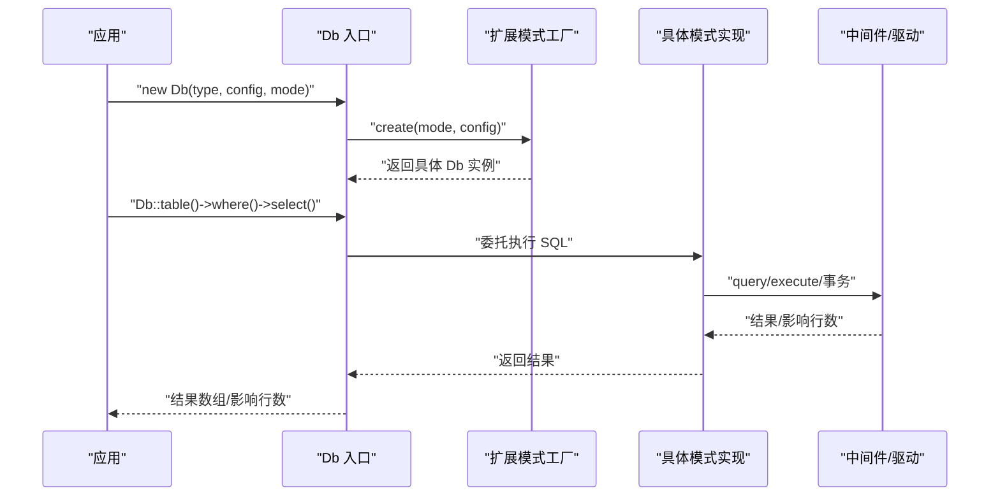

# 扩展开发

本指南面向希望基于 FizeDatabase 框架进行扩展开发的工程师，讲解如何开发自定义数据库驱动、扩展连接模式、创建自定义中间件。

## 扩展点架构

FizeDatabase 的扩展点主要集中在"扩展 Db + 模式工厂 + 模式实现 + 中间件"四层：



## 设计原则

| 原则 | 说明 |
|------|------|
| 单一职责 | 核心 Db 负责 SQL 组装与通用 CRUD；扩展 Db 负责方言特性；模式实现负责具体驱动；中间件负责通用交互 |
| 开闭原则 | 通过模式工厂与扩展 Db，新增数据库类型无需修改核心 |
| 接口契约 | 模式工厂必须实现 create(mode, config)；扩展 Db 必须实现核心抽象的抽象方法 |
| 可插拔 | 中间件以 trait 形式复用，降低耦合 |

## 命名约定与代码结构

- **命名空间**：扩展目录遵循 `Fize\Database\Extend\<Type>\...` 结构
- **类名与文件**：扩展 Db 类名为 Db；模式工厂为 ModeFactory；模式实现为具体模式类
- **中间件**：以 Middleware 命名空间下的 trait 封装通用能力
- **配置项**：模式工厂内部合并默认配置

## 扩展开发步骤

### 步骤一：创建扩展目录与核心类

在 `src/Extend/<NewType>/` 下创建 Db 抽象类，继承 Core/Db 并 use Core/Feature：

```php
<?php
namespace Fize\Database\Extend\NewDB;

use Fize\Database\Core\Db as CoreDb;
use Fize\Database\Core\Feature;

class Db extends CoreDb
{
    use Feature;

    // 如需方言特性，覆写 build/clear 或新增方法
}
```

### 步骤二：实现模式工厂

创建 ModeFactory，实现 ModeFactoryInterface::create：

```php
<?php
namespace Fize\Database\Extend\NewDB;

use Fize\Database\Core\ModeFactoryInterface;

class ModeFactory implements ModeFactoryInterface
{
    public static function create(string $mode, array $config)
    {
        // 合并默认配置
        $config = array_merge([
            'host'     => 'localhost',
            'port'     => 5432,
            'charset'  => 'utf8',
            'prefix'   => '',
        ], $config);

        // 按模式分支创建具体模式实例
        switch ($mode) {
            case 'pdo':
                return Mode::pdo(...);
            default:
                throw new \Exception("不支持的模式: {$mode}");
        }
    }
}
```

### 步骤三：实现具体模式

选择一种或多种模式（如 PDO/ODBC/OCI 等），模式类继承扩展 Db，使用中间件 trait 或直接实现核心抽象方法：

```php
<?php
namespace Fize\Database\Extend\NewDB\Mode;

use Fize\Database\Extend\NewDB\Db;
use Fize\Database\Middleware\PDOMiddleware;

class PDOMode extends Db
{
    use PDOMiddleware;

    public function __construct($host, $user, $pwd, $dbname, $port, $charset, $opts = [])
    {
        $dsn = "newdb:host={$host};dbname={$dbname};port={$port};charset={$charset}";
        $this->pdoConstruct($dsn, $user, $pwd, $opts);
    }

    public function __destruct()
    {
        $this->pdoDestruct();
    }
}
```

### 步骤四：可选的中间件

- 若使用 PDO，可复用 PDOMiddleware trait，封装 prepare/execute/fetch/事务
- 若使用原生驱动，直接实现核心抽象方法

### 步骤五：在入口中接入

入口 Db 通过拼接命名空间调用扩展模式工厂：

```php
// 应用代码中直接使用
new Db('newdb', $config, 'pdo');
```

## 扩展示例

### 示例一：新增数据库类型（NewDB）

1. 新建目录：`src/Extend/NewDB/`
2. 在 NewDB/ 下创建：
   - `Db.php`（继承 Core/Db）
   - `ModeFactory.php`（实现 create）
   - `Mode.php`（静态工厂方法）
   - `Mode/PDOMode.php`（具体模式实现）
3. 在各模式实现类中实现 query/execute/startTrans/commit/rollback/lastInsertId 等核心方法
4. 在入口 Db 中即可通过 `Db::connect('newdb', $config, 'pdo')` 使用

### 示例二：为现有 MySQL 增加新模式

1. 在 `Extend/MySQL/Mode/` 下新增 `MyDrvMode.php`，继承 Extend/MySQL/Db
2. 在 `MyDrvMode::__construct` 中初始化自研驱动
3. 实现 query/execute/startTrans/commit/rollback/lastInsertId
4. 在 Extend/MySQL/ModeFactory 中增加 case 分支，返回 MyDrvMode 实例

### 示例三：创建自定义中间件

1. 在 Middleware/ 下新增 `RetryLogMiddleware.php`，定义 trait
2. 在需要的模式实现类中 `use` 该 trait
3. 在 trait 中封装 prepare/execute 的重试与日志记录逻辑

## 与核心框架的集成

- 入口 Db 通过命名空间拼接自动发现扩展工厂，保持对核心的最小侵入
- 扩展 Db 通过继承 Core/Db 保证 CRUD/事务/SQL 组装行为一致
- 模式工厂与模式实现解耦，便于版本升级与替换
- 中间件以 trait 复用，避免重复实现

## 依赖说明

- **自动加载**：PSR-4 命名空间映射至 src 目录
- **运行时依赖**：PHP >= 7.1；各类扩展（PDO/ODBC/MySQLi/OCI/SQLSRV/PGSQL/SQLite3 等）
- **开发依赖**：PHPUnit 用于测试

## 测试方法

- **单元测试**：使用 PHPUnit，覆盖模式工厂创建、分页、批量插入等关键路径
- **示例验证**：通过 examples/db_connect.php 验证基本连接与查询流程

## 发布与维护

- **版本管理**：遵循语义化版本，变更核心接口时注意向后兼容
- **文档同步**：随扩展新增完善 README 与示例
- **兼容矩阵**：在 composer.json 中明确 PHP 版本与扩展建议