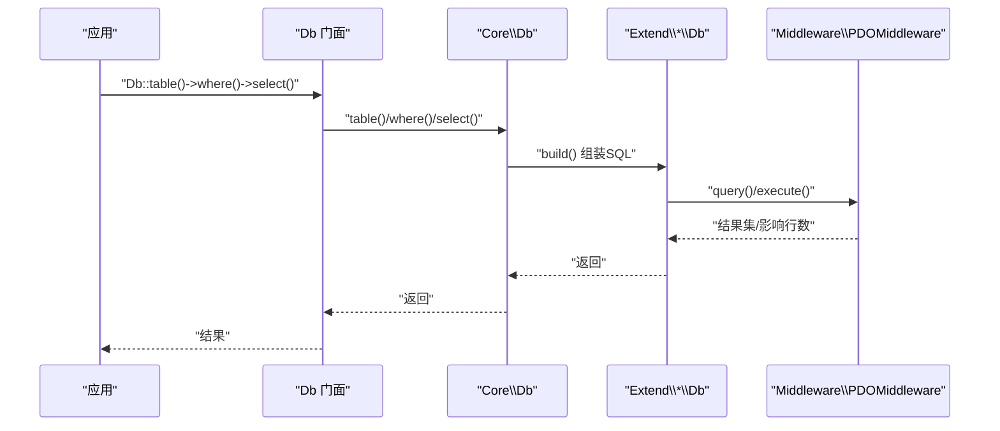
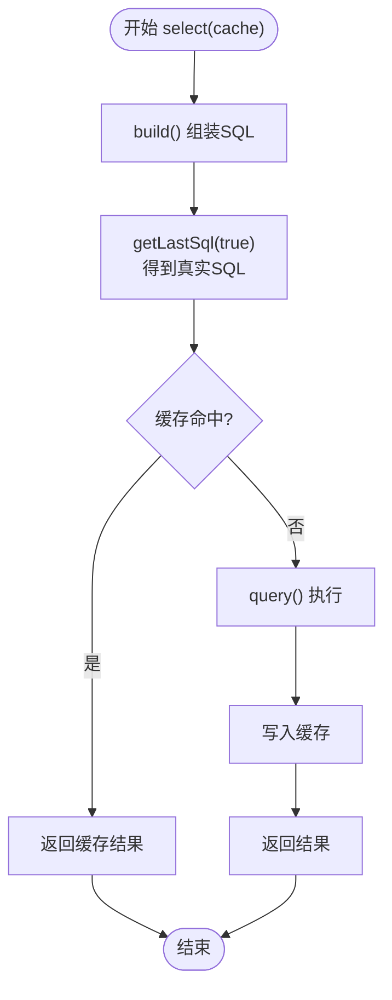

# 性能优化

FizeDatabase 通过抽象核心、扩展方言与中间层适配，提供了清晰的性能优化路径。本章系统讲解查询优化技巧、缓存策略、大数据量处理与内存管理、并发访问优化等。

## 调用链路



## 查询优化技巧

### 使用查询器构建条件

避免手写 SQL 漏洞与重复解析成本，通过 analyze/condition/in/like/between 等方法自动处理参数绑定与 SQL 片段拼接。

```php
// 推荐：使用查询器
Db::table('users')->where(['status' => 1, 'age' => ['>', 18]])->select();

// 避免：手写 SQL
Db::query("SELECT * FROM users WHERE status = 1 AND age > 18");
```

### 合理使用查询子句

- 使用 distinct 去重
- 使用 field 指定必要字段，避免 SELECT *
- 合理使用 order、group、having、join
- 使用 limit/page 控制返回规模

### 拆分复杂条件

将复杂条件拆分为多个 Query 对象并通过 qMerge/qAnd/qOr 合并，降低 SQL 字符串拼接开销。

## 缓存策略

Core\\Db::select 提供基于"最终 SQL 文本"的进程内缓存：



### 缓存建议

- 对热点查询开启缓存（默认已开启）
- 对动态参数较多的查询谨慎使用缓存，必要时自定义缓存键
- 大事务或频繁写入场景下，考虑在事务边界清理缓存或禁用缓存
- 使用 `select(false)` 关闭缓存

## 连接池配置与模式选择

- **推荐优先使用 PDO 模式**，具备更好的跨平台与生态兼容性
- PDO 中间层提供 prepare/execute/fetch、事务、异常转换，确保一致性与可维护性
- MySQL 支持多种模式：mysqli、odbc、pdo，ModeFactory 提供统一创建入口
- Access/SQLite/PgSQL/SQLSRV/Oracle 等扩展均遵循相同模式工厂与中间层适配思路

## 大数据量处理与内存管理

### 流式遍历

使用 fetch + 回调逐行遍历，避免一次性加载全部结果集，降低内存峰值：

```php
Db::table('large_table')->fetch(function($row) {
    // 逐行处理
    processRow($row);
});
```

### 分页策略

- Core\\Db::page 与扩展 Db::paginate 提供分页能力
- MySQL 扩展使用 SQL_CALC_FOUND_ROWS 与 FOUND_ROWS() 快速统计总数
- 超大规模建议使用游标/延迟关联

### 批量写入

MySQL 扩展提供 insertAll，支持批量 INSERT，减少网络往返与解析成本：

```php
Db::table('users')->insertAll([
    ['name' => '张三', 'email' => 'a@example.com'],
    ['name' => '李四', 'email' => 'b@example.com'],
    // ... 更多数据
]);
```

## 并发访问优化

### 事务嵌套与隔离

Db 门面提供 startTrans/commit/rollback 与嵌套计数，避免重复提交/回滚。

### 连接复用

ModeFactory 统一创建连接，配合应用侧连接池（如 PHP-FPM/进程池）复用连接。

### 锁定策略

MySQL 扩展提供 lock/straight_join/cross_join 等高级 JOIN 与锁定语句，谨慎使用以避免阻塞。

```php
// 排他锁
Db::table('products')->lock(true)->where(['id' => 1])->select();
```

## 方言差异与优化建议

| 数据库 | 特有优化 |
|--------|----------|
| MySQL | 支持 TRUNCATE、REPLACE、LOCK、STRAIGHT_JOIN；建议使用 LIMIT 与索引覆盖查询 |
| Access | 通过 top/limit 模拟分页，注意字符串转义与 TOP 语法 |
| PgSQL/SQLSRV/SQLite/Oracle | 通过各自的 ModeFactory/Mode/Db 扩展实现，遵循统一抽象与中间层适配 |

## 性能最佳实践总结

### 查询优化

- 使用查询器链式构建，避免字符串拼接
- 优先使用参数绑定，减少 SQL 注入风险与解析成本
- 控制返回字段（避免 SELECT *），必要时使用 EXPLAIN 分析执行计划

### 连接与事务

- 优先使用 PDO 模式，结合连接池减少握手开销
- 合理使用事务，避免长事务占用锁资源
- 嵌套事务时注意计数，确保只在最外层提交/回滚

### 缓存

- 对热点查询启用缓存，注意缓存键稳定性
- 写多读少场景谨慎缓存，必要时在写入后失效相关缓存

### 大数据与内存

- 使用 fetch + 回调逐行处理，避免一次性拉取
- 分页查询时使用 SQL_CALC_FOUND_ROWS/FOUND_ROWS() 或 COUNT(*) 优化
- 批量写入使用 insertAll 减少往返

### 监控与分析

- 使用 `Db::getLastSql(true)` 输出真实 SQL，结合数据库慢查询日志定位问题
- 在中间层捕获异常并记录上下文，辅助定位性能瓶颈