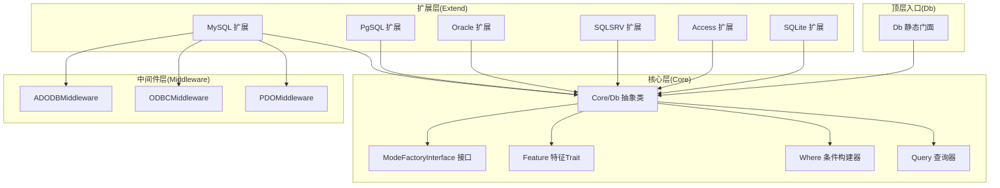

# 项目概述

## 项目介绍

FizeDatabase 是一个全功能的 PHP 数据库类库与轻量 ORM 框架，致力于为开发者提供统一、灵活、高效的数据库访问体验。

- **Composer 包名**：`fize/database`
- **最低 PHP 版本**：7.1（建议 7.2+）
- **运行时依赖**：`fize/exception ^2.0.0`

## 核心特性

### CME 分层架构

采用 **Core-Middleware-Extend (CME)** 三层架构：

- **核心层 (Core)**：定义通用抽象接口与公共能力，包括 Db 抽象类、Query 查询器、Where 条件构建器、Feature 特征 Trait、ModeFactoryInterface 工厂接口
- **中间件层 (Middleware)**：封装底层驱动能力，屏蔽不同扩展间的差异，包括 PDOMiddleware、ODBCMiddleware、ADODBMiddleware
- **扩展层 (Extend)**：按数据库类型划分子包，每个子包包含各自的 Db、Feature、Query、ModeFactory、Mode 等组件

### 多数据库支持

| 数据库 | 支持的连接模式 |
|--------|---------------|
| MySQL | PDO、MySQLi、ODBC |
| PostgreSQL | PDO、PgSQL（原生）、ODBC |
| Oracle | PDO、OCI（原生）、ODBC |
| SQL Server | PDO、SQLSRV（原生）、ADODB、ODBC |
| SQLite | PDO、SQLite3（原生）、ODBC |
| Access | PDO（ODBC桥接）、ODBC、ADODB |

### 链式查询构建器

- 流式接口（Fluent Interface）：所有条件方法返回 `$this`，支持链式调用
- 组合模式：qMerge/qAnd/qOr 将多个 Query 对象组合为复合条件
- 丰富的条件表达式：=、<>、<、<=、>、>=、LIKE、IN、NOT IN、BETWEEN、EXISTS、IS NULL 等
- 数组条件解析：自动推断组合逻辑（AND/OR），兼容多种简写形式

### 设计模式

- **工厂模式**：ModeFactoryInterface 约束工厂创建行为，各驱动实现具体连接创建逻辑
- **中间件模式**：Trait 将连接与执行的横切逻辑下沉，各数据库方言仅聚焦差异化实现
- **策略模式**：通过 Mode 选择器根据配置动态选择连接模式

## 架构设计



### 核心组件职责

| 组件 | 职责 |
|------|------|
| Db 静态门面 | 静态入口，负责连接初始化、事务嵌套计数、转发调用至 CoreDb |
| Core/Db 抽象类 | 统一 CRUD、事务、LIMIT、缓存、链式条件、SQL 构建与参数绑定 |
| Core/Query | 将数组/对象条件解析为 SQL 片段与参数，支持 AND/OR 组合 |
| Core/Where | 提供与 Query 类似的组合能力，便于直接拼装复杂 WHERE |
| Core/Feature | 提供表名/字段名格式化钩子，供不同数据库方言定制 |
| Core/ModeFactoryInterface | 约束扩展层工厂创建行为 |
| PDOMiddleware | 封装 PDO 能力，提供 query/execute/事务/自增 ID 等 |
| ODBCMiddleware | 封装 ODBC 能力，提供连接/执行/事务等 |
| ADODBMiddleware | 封装 ADODB COM 能力，提供连接/执行/事务等 |

## 设计理念

### 分离关注点

- 抽象类负责"如何拼装 SQL"，具体驱动负责"如何执行 SQL"
- 条件组装与 SQL 构建解耦，where/having 支持数组/Query/原生 SQL 三种输入
- clear/build 分离，避免重复拼接，提高可维护性

### 特性组合优于继承

- 扩展类可同时 use 多个特性（Trait），形成"功能 + 方言"的复合能力
- 相比多重继承，Trait 更灵活，避免"钻石问题"
- Feature Trait 将"方言差异"收敛到格式化层，保持上层接口稳定

### 统一异常处理

- 中间件层将底层异常统一包装为 `DatabaseException`，携带 SQL 与参数信息
- 便于日志记录与问题定位

### 安全优先

- 统一使用问号占位符与参数绑定，避免字符串拼接引发的注入风险
- Query 在条件解析时对字符串与表达式进行安全化处理

## 数据库支持

### 连接模式对比

| 连接模式 | 说明 | 推荐场景 |
|----------|------|---------|
| PDO | PHP 标准数据库抽象层，跨平台一致性最好 | 通用推荐 |
| 原生扩展 | 数据库特定 PHP 扩展（mysqli/oci8/sqlsrv/sqlite3/pgsql） | 高性能或特殊特性需求 |
| ODBC | 通用数据库连接标准 | 无原生扩展可用时 |
| ADODB | Windows COM/ADO 方式 | Access 等历史系统 |

### 环境要求

```json
{
    "require": {
        "php": "^7.1",
        "fize/exception": "^2.0.0"
    },
    "suggest": {
        "ext-pdo": "需使用PDO模式时安装",
        "ext-mysqli": "需使用MySQL的mysqli模式时安装",
        "ext-oci8": "需使用Oracle的OCI模式时安装",
        "ext-pgsql": "需使用PostgreSQL的pgsql模式时安装",
        "ext-sqlsrv": "需使用SQL Server的SQLSRV模式时安装",
        "ext-sqlite3": "需使用SQLite的原生模式时安装",
        "ext-odbc": "需使用ODBC模式时安装"
    }
}
```
