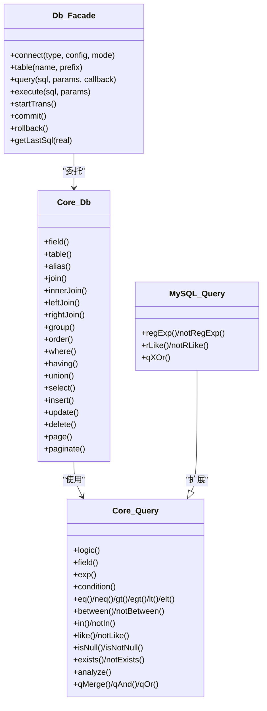
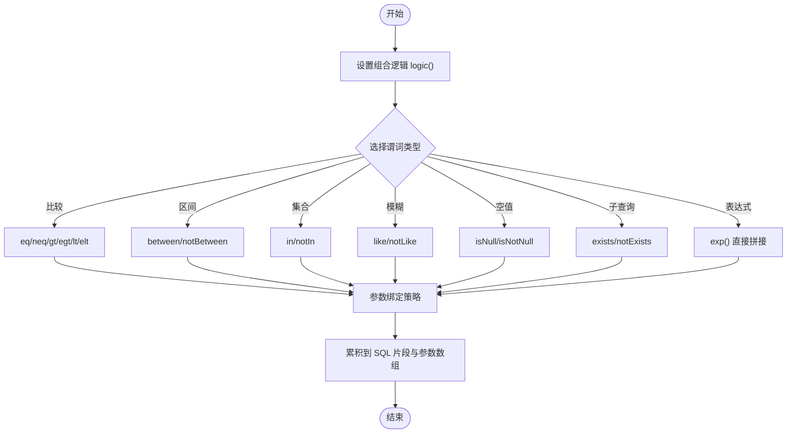
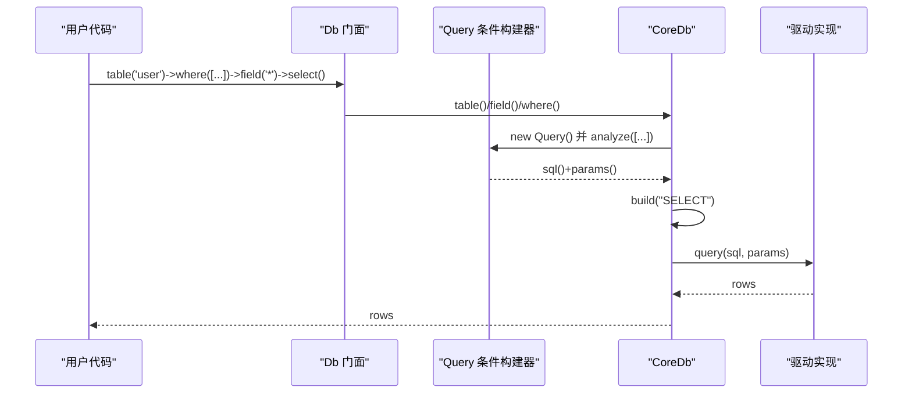

# 查询构建器

FizeDatabase 提供了统一、安全、可扩展的链式查询构建能力，覆盖 SELECT、INSERT、UPDATE、DELETE 的链式构建，以及条件构建器（Query）的多种谓词支持。

## 架构设计

查询构建器采用"门面 + 抽象 + 方言扩展"的分层设计：

## 条件构建器 CoreQuery

### 组合逻辑

- 通过 `logic()` 设置 AND/OR，默认 AND
- `qMerge/qAnd/qOr` 将多个 Query 对象按逻辑组合

### 谓词支持

| 类型 | 方法 | 说明 |
|------|------|------|
| 比较 | eq/neq/gt/egt/lt/elt | 等于/不等于/大于/大于等于/小于/小于等于 |
| 区间 | between/notBetween | BETWEEN 范围查询 |
| 集合 | in/notIn | IN 集合查询 |
| 模糊匹配 | like/notLike | LIKE 模糊匹配 |
| 空值判断 | isNull/isNotNull | NULL 判断 |
| 子查询 | exists/notExists | EXISTS 子查询 |
| 表达式 | exp() | 直接拼接表达式并绑定参数 |

### 条件构建流程

### 数组解析 analyze()

`analyze()` 将数组条件映射为链式调用，支持多级数组语法和自动推断组合逻辑（AND/OR），兼容多种简写形式。

### 参数绑定策略

字符串值根据是否包含敏感字符决定是否使用占位符绑定，避免 SQL 注入。

## 方言扩展：MySQL Query

在 CoreQuery 基础上新增：
- **正则匹配**：regExp/notRegExp/rLike/notRLike
- **XOR 组合**：qXOr()

## SQL 组装与执行

### 字段与别名

- `field()`：指定查询字段，支持字符串原样传入与数组格式化
- `alias()`：设置表别名

### JOIN 查询

| 方法 | 说明 |
|------|------|
| join(table, type, on, using) | 通用 JOIN |
| innerJoin(table, on) | INNER JOIN |
| leftJoin(table, on) | LEFT JOIN |
| rightJoin(table, on) | RIGHT JOIN |

MySQL 扩展额外提供：crossJoin/leftOuterJoin/rightOuterJoin/straightJoin

### 分组与排序

- `group(fields)`：GROUP BY
- `order(field_order)`：ORDER BY

### 条件

- `where(stmt, parse)`：WHERE 条件，支持数组、Query 对象、原生 SQL 三种输入
- `having(stmt, parse)`：HAVING 条件

### 聚合函数

- `count(field)`：计数
- `sum/min/max/avg`：求和/最小/最大/平均

### 分页

- `page(page, size)`：将页码转换为 limit
- `paginate(page, size)`（MySQL）：使用 SQL_CALC_FOUND_ROWS 与 FOUND_ROWS() 获取总数，返回 [总数, 结果集, 总页数]

### 查询执行流程

## 与原生 SQL 的关系

- `Query::analyze()` 将数组条件映射为链式调用，最终由 CoreDb::build() 拼装为完整 SQL
- `CoreDb::getRealSql()` 将预处理 SQL 与绑定参数拼接为最终 SQL，用于日志输出
- `where()/having()` 支持直接传入原生 SQL 与参数数组，实现与原生 SQL 的无缝衔接

## API 快速索引

### 条件构建

| 方法 | 说明 |
|------|------|
| logic() | 设置组合逻辑 AND/OR |
| field() | 指定当前比较字段 |
| exp() | 直接拼接表达式 |
| eq/neq/gt/egt/lt/elt | 比较操作 |
| between/notBetween | 区间操作 |
| in/notIn | 集合操作 |
| like/notLike | 模糊匹配 |
| isNull/isNotNull | 空值判断 |
| exists/notExists | 子查询 |
| analyze() | 数组条件解析 |
| qMerge/qAnd/qOr | 条件组合 |

### 查询操作

| 方法 | 说明 |
|------|------|
| field() | 指定查询字段 |
| table() | 指定查询表 |
| alias() | 设置别名 |
| join/innerJoin/leftJoin/rightJoin | JOIN 查询 |
| group() | GROUP BY |
| order() | ORDER BY |
| where()/having() | 条件设置 |
| union/unionAll/unionDistinct | UNION 查询 |
| select/find/findOrNull | 查询结果 |
| value/column/count | 聚合查询 |
| page/paginate | 分页 |
| limit | 限制行数 |

### 写入操作

| 方法 | 说明 |
|------|------|
| insert() | 插入数据 |
| insertGetId() | 插入并返回自增 ID |
| insertAll() | 批量插入（MySQL） |
| update() | 更新数据 |
| delete() | 删除数据 |

## 性能建议

- 使用 where()/having() 的数组条件或 Query 对象，避免手写复杂 SQL
- 优先使用参数绑定（?）而非字符串拼接
- 分页时先 COUNT 再取数据，避免 ORDER BY 对 COUNT 的干扰
- 大批量插入使用 insertAll() 减少多次往返
- 合理使用 field() 指定字段，避免 SELECT *
- 使用 limit()/page() 控制返回行数

## 故障排查

| 问题 | 解决方法 |
|------|----------|
| SQL 注入 | 确保传入字符串值被正确识别为绑定参数或原样写入 |
| 条件解析异常 | 数组条件需遵循约定格式；analyze() 支持多参数与组合逻辑 |
| 日志与调试 | 使用 `Db::getLastSql(true)` 查看最终 SQL |
| 事务嵌套 | startTrans/commit/rollback 支持嵌套计数，确保成对调用 |