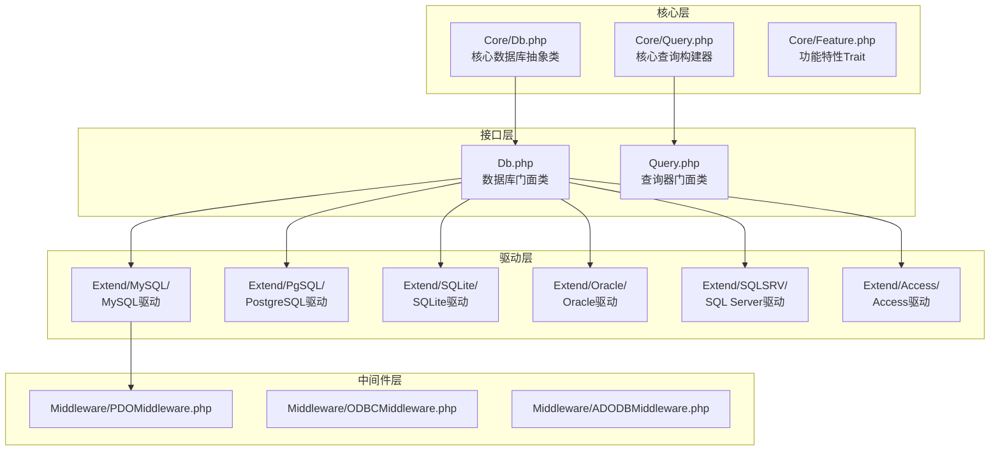
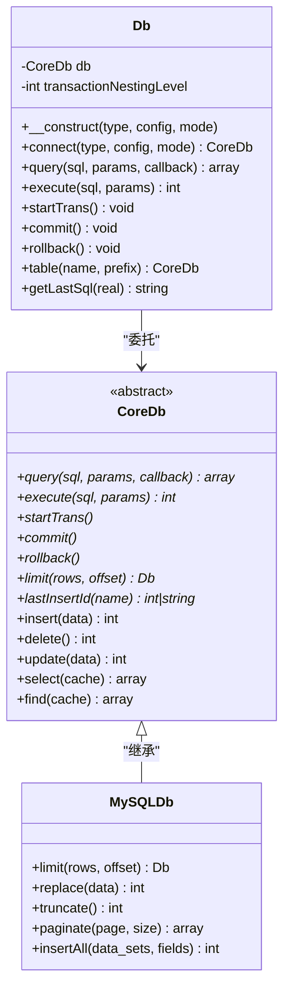
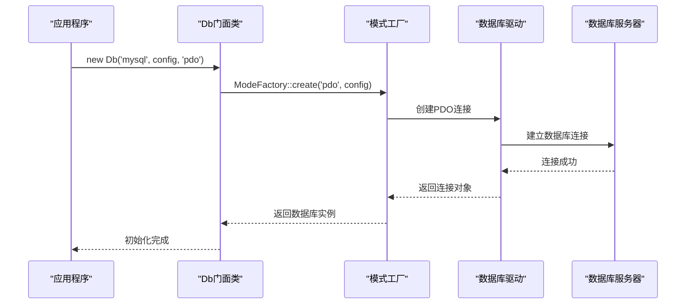
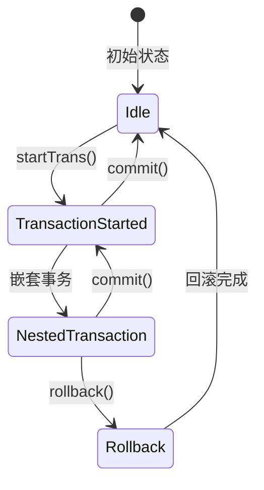

# 快速开始

## 安装

通过 Composer 安装 FizeDatabase：

```bash
composer require fize/database
```

## 环境要求

- **PHP 版本**：>= 7.1.0（推荐 >= 7.2.0）
- **必需依赖**：`fize/exception ^2.0.0`

### PHP 扩展

根据目标数据库选择安装对应扩展：

| 扩展 | 用途 |
|------|------|
| PDO | 所有数据库驱动的基础（推荐） |
| MySQLi | MySQL 连接支持 |
| ODBC | ODBC 兼容数据库支持 |
| oci8 | Oracle 数据库支持 |
| pgsql | PostgreSQL 数据库支持 |
| sqlite3 | SQLite 数据库支持 |
| sqlsrv | SQL Server 数据库支持 |

## 项目结构

FizeDatabase 采用清晰的分层架构设计：



## 快速连接

### 最简单的连接示例

```php
<?php
require_once "vendor/autoload.php";

use Fize\Database\Db;

// 基本连接配置
$config = [
    'host'     => 'localhost',
    'user'     => 'root',
    'password' => '123456',
    'dbname'   => 'test_db'
];

// 创建数据库连接
new Db('mysql', $config);

// 执行查询
$result = Db::table('users')->select();
```

### 基本 CRUD 操作

```php
<?php
require_once "vendor/autoload.php";

use Fize\Database\Db;

$config = [
    'host'     => 'localhost',
    'user'     => 'root',
    'password' => '123456',
    'dbname'   => 'test_db'
];

new Db('mysql', $config);

// 插入数据
$insertData = [
    'name' => '张三',
    'email' => 'zhangsan@example.com'
];
Db::table('users')->insert($insertData);

// 查询数据
$users = Db::table('users')
    ->where(['name' => '张三'])
    ->select();

// 更新数据
Db::table('users')
    ->where(['name' => '张三'])
    ->update(['email' => 'newemail@example.com']);

// 删除数据
Db::table('users')
    ->where(['name' => '张三'])
    ->delete();
```

## 配置参数说明

### 基础连接参数

| 参数 | 说明 |
|------|------|
| host | 数据库服务器地址 |
| user | 数据库用户名 |
| password | 数据库密码 |
| dbname | 数据库名称 |

### 可选配置参数

| 参数 | 说明 |
|------|------|
| port | 数据库端口号 |
| charset | 字符集设置 |
| prefix | 表前缀 |
| opts | PDO 连接选项 |
| socket | Unix Socket 路径（MySQL） |
| ssl_set | SSL 连接设置（MySQL） |
| flags | 连接标志（MySQLi） |

## 支持的数据库类型

| 数据库 | 连接模式 |
|--------|----------|
| MySQL | PDO、MySQLi、ODBC |
| PostgreSQL | PDO、PgSQL、ODBC |
| SQLite | PDO、SQLite3、ODBC |
| Oracle | PDO、OCI、ODBC |
| SQL Server | PDO、SQLSRV、ODBC、ADODB |
| Access | PDO、ODBC、ADODB |

## 架构概览

FizeDatabase 采用了典型的三层架构设计，通过工厂模式和中间件机制实现松耦合：



### 数据库连接流程



### 事务处理机制

FizeDatabase 支持嵌套事务处理，通过计数器管理事务层级：



## 最佳实践

### 连接管理
- 使用门面类进行全局连接管理
- 合理设置连接超时时间
- 在应用结束时及时释放连接

### 查询优化
- 使用参数绑定防止 SQL 注入
- 合理使用索引提高查询性能
- 避免 N+1 查询问题

### 错误处理
- 捕获并处理数据库异常
- 记录详细的错误日志
- 使用 `Db::getLastSql(true)` 审核最终 SQL
