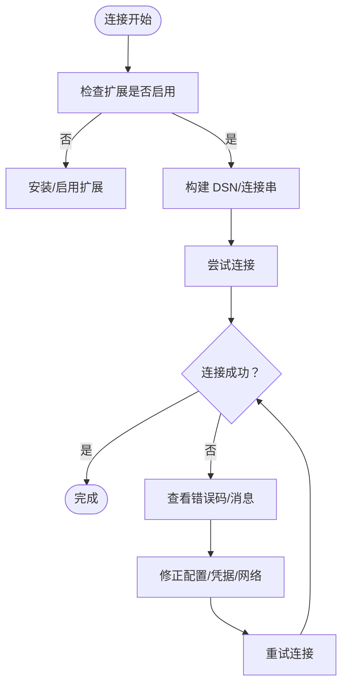

# 故障排除

本指南提供系统化的故障排除方法，覆盖安装、配置、连接、查询、事务及跨数据库类型问题。

## 安装与环境准备

### PHP 版本要求

确保 PHP 版本满足 composer.json 中的最低要求（>= 7.1.0，推荐 >= 7.2.0）。

### 扩展建议

根据目标数据库与模式启用相应扩展：

| 扩展 | 用途 |
|------|------|
| PDO | 所有数据库驱动的基础 |
| MySQLi | MySQL 连接 |
| ODBC | ODBC 兼容数据库 |
| oci8 | Oracle 数据库 |
| pgsql | PostgreSQL 数据库 |
| sqlite3 | SQLite 数据库 |
| sqlsrv | SQL Server 数据库 |

若缺少扩展，连接将失败或出现未定义行为。

### 自动加载

确认 `vendor/autoload.php` 正确引入，PSR-4 命名空间映射正常。

## 配置错误定位

- **数据库类型与模式**：确保 type 与 mode 在对应扩展目录下存在且受支持。例如 MySQL 支持 mysqli/pdo/odbc
- **默认配置合并**：模式工厂会合并默认配置，检查端口、字符集、前缀、选项等是否符合预期
- **DSN/连接串**：PDO/ODBC 需要正确的 DSN/连接串；MySQLi 支持 real_connect 与 SSL 参数

## 连接失败排查



### PDO 连接异常

检查用户名、密码、主机、端口、数据库名、字符集、选项；确认 PDO 扩展已启用。

### MySQLi 连接异常

检查 real_connect/ssl_set/flags/socket 等参数；关注 errno/error 输出。

### ODBC 连接异常

确认驱动名称、服务器、数据库、端口、字符集；不同平台驱动名称可能不同。

### Oracle/SQL Server/PgSQL

参考对应驱动的连接方法与错误处理。

## 查询异常处理

### 非法 SQL 动作

build() 对不支持的动作抛出异常，检查 SQL 动作是否为 DELETE/INSERT/REPLACE/SELECT/UPDATE。

### 参数绑定

确保问号占位符与绑定参数一一对应；字符串值需正确转义或使用占位符绑定。

### 查询器条件

使用数组条件时，注意组合逻辑与字段名；IN/BETWEEN/LIKE 等谓词的参数类型与占位符混用问题。

## 事务与并发问题

### 嵌套事务

Db 门面维护事务嵌套计数，仅在最外层开始/提交/回滚；避免错误嵌套导致提前回滚。

```php
Db::startTrans();     // 层级 = 1，真正开启事务
try {
    Db::startTrans(); // 层级 = 2，仅增加计数
    // 业务操作...
    Db::commit();     // 层级 = 1，仅减少计数
    Db::commit();     // 层级 = 0，真正提交
} catch (\Exception $e) {
    Db::rollback();   // 层级归零并回滚
}
```

### 常见事务问题

| 问题 | 原因 | 解决方法 |
|------|------|----------|
| 未提交/未回滚 | 业务逻辑异常分支未调用 rollback | 在 try/catch 中确保异常时回滚 |
| 嵌套层级错误 | commit/rollback 未成对出现 | 确保每层 startTrans 都有对应 commit/rollback |
| 驱动差异 | 不同驱动的事务行为略有不同 | 在测试环境验证 |

## 跨数据库类型特定问题

### MySQL

- **PDO**：检查 DSN、字符集、选项；确保 ERRMODE_EXCEPTION 已设置
- **MySQLi**：real_connect/ssl_set/flags/socket 参数；多语句查询需谨慎
- **ODBC**：驱动名称与平台相关；lastInsertId 使用特定 SQL

### PostgreSQL

- ODBC 模式：参考测试用例验证事务与回滚行为
- PgSQL 驱动：支持错误严重级别、socket、trace、事务状态等特性

### Oracle

- OCI 连接与错误：connect/error 方法返回错误信息
- 支持持久连接、TAF 回调、LOB 操作等

### SQL Server

- ODBC 模式：参考测试用例验证事务与回滚行为

### SQLite

- 注意文件权限和加密密钥

### Access

- 仅限 Windows 环境
- 注意字符串转义策略
- ADODB/ODBC 需正确配置驱动

## 调试方法与工具

### 日志分析

使用 `Db::getLastSql(true)` 获取真实 SQL，核对参数绑定与拼接是否正确。

> 注意：该 SQL 存在注入风险，仅用于日志输出，不建议直接执行。

### 错误追踪

PDO 中间件将底层异常包装为数据库异常，包含 SQL 与参数，便于定位。检查异常消息与错误码，结合 DSN/凭据/网络进行排查。

### 性能诊断

- 使用查询缓存减少重复查询
- 对大结果集采用回调式遍历
- 分页查询结合统计查询，避免全表扫描

### 示例与测试

- 使用 examples 下的最小示例快速复现问题
- 参考各数据库模式的测试用例，验证事务、回滚、连接等行为

## 常见问题清单

| 类别 | 现象 | 排查方向 |
|------|------|----------|
| 安装问题 | 类未找到/自动加载失败 | 确认 vendor/autoload.php 引入；PSR-4 命名空间映射 |
| 配置错误 | 连接超时/认证失败/字符集乱码 | 核对 host/port/user/password/dbname/charset/socket/driver |
| 连接失败 | PDO/MySQLi/ODBC 报错 | 扩展是否启用；DSN/连接串是否正确；防火墙/端口 |
| 查询异常 | 参数不匹配/非法动作/结果为空 | 核对占位符与参数数量；检查 SQL 动作；使用查询器数组条件规范 |
| 事务问题 | 嵌套事务回滚提前/提交失败 | 检查嵌套计数；确保同一连接上下文 |
| 跨数据库 | 驱动名称不匹配/行为差异 | 核对驱动名称与平台；参考对应测试用例 |

## 获取帮助

- **GitHub Issues**：在仓库中提交问题，附带最小可复现示例与环境信息
- **示例与测试**：参考 examples 与 tests 目录，快速验证问题与修复方案
- **扩展与版本**：根据 composer.json 的建议依赖，确保所需扩展已安装并启用